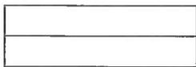
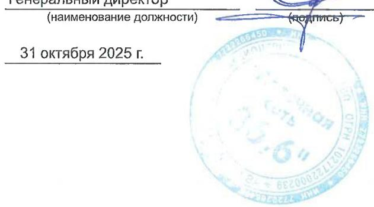

# Бухгалтерская отчетность за январь - сентябрь 2025 г.

Организация: Публичное акционерное общество "АПТЕЧНАЯ СЕТЬ 36,6" по ОКПО 59055031   
Идентификационный номер налогоплательщика ИHH 7722266450   
Организационно-правовая форма Публичные акционерные общества по ОКОПФ 12247   
Форма собственности Частная собственность по ОКФС 16

Адрес в пределах места нахождения   
109125, Город Москва, вн.тер.г. муниципальный округ Текстильщики, ул Саратовская, д. 18/10, помеЩ.1, ком. 1,   
этаж 1, офис 1

Бухгалтерская отчетность подлежит обязательному аудиту

Наименование аудиторской организации, проводившей обязательный аудит

Идентификационный номер налогоплательщика аудиторской организации ИHH Основной государственный регистрационный номер аудиторской организации ОГПН

Бухгалтерская отчетность подлежит утверждению

ДА HET

Наименование органа, утверждающего бухгалтерскую отчетность

Бухгалтерский баланс на 30 сентября 2025 г.

Форма по ОКУД 0710001 (число, етня та 30 09 2025 Организация: Публичное акционерное общество "АПТЕчНАЯ СЕТь 36,6" по ОкПО 59055031 Единица измерения тыс. руб. ПО ОКЕИ 384

<table><tr><td rowspan=1 colspan=1>Пояснения</td><td rowspan=1 colspan=1>Наименование показателя</td><td rowspan=1 colspan=1>Код</td><td rowspan=1 colspan=1>На 30 сентября2025г.</td><td rowspan=1 colspan=1>На 31 декабря2024г.</td><td rowspan=1 colspan=1>На 31 декабря2023г.</td></tr><tr><td rowspan=1 colspan=1></td><td rowspan=1 colspan=1>АКТИВI. Внеоборотные активыФудвил</td><td rowspan=1 colspan=1>1105</td><td rowspan=1 colspan=1></td><td rowspan=1 colspan=1>ое</td><td rowspan=1 colspan=1>—</td></tr><tr><td rowspan=1 colspan=1></td><td rowspan=1 colspan=1>Нематериальные активы</td><td rowspan=1 colspan=1>1110</td><td rowspan=1 colspan=1>249 990</td><td rowspan=1 colspan=1>202 705</td><td rowspan=1 colspan=1>130 455</td></tr><tr><td rowspan=1 colspan=1></td><td rowspan=1 colspan=1>Нематериальные поисковые активы</td><td rowspan=1 colspan=1>1130</td><td rowspan=1 colspan=1>-</td><td rowspan=1 colspan=1>-</td><td rowspan=1 colspan=1>–</td></tr><tr><td rowspan=1 colspan=1></td><td rowspan=1 colspan=1>Материальные поисковые активы</td><td rowspan=1 colspan=1>1140</td><td rowspan=1 colspan=1>-</td><td rowspan=1 colspan=1></td><td rowspan=1 colspan=1>-</td></tr><tr><td rowspan=1 colspan=1></td><td rowspan=1 colspan=1>Основные средства</td><td rowspan=1 colspan=1>1150</td><td rowspan=1 colspan=1>5</td><td rowspan=1 colspan=1>8</td><td rowspan=1 colspan=1>11</td></tr><tr><td rowspan=1 colspan=1></td><td rowspan=1 colspan=1>Инвестиционная недвижимость</td><td rowspan=1 colspan=1>1160</td><td rowspan=1 colspan=1>-</td><td rowspan=1 colspan=1>-</td><td rowspan=1 colspan=1>-</td></tr><tr><td rowspan=1 colspan=1></td><td rowspan=1 colspan=1>в том числе:Инвестиционная недвижимость</td><td rowspan=1 colspan=1></td><td rowspan=1 colspan=1></td><td rowspan=1 colspan=1></td><td rowspan=1 colspan=1></td></tr><tr><td rowspan=1 colspan=1></td><td rowspan=1 colspan=1>Финансовые вложения</td><td rowspan=1 colspan=1>1170</td><td rowspan=1 colspan=1>74 637 043</td><td rowspan=1 colspan=1>74 631 443</td><td rowspan=1 colspan=1>73 694 443</td></tr><tr><td rowspan=1 colspan=1></td><td rowspan=1 colspan=1>Отложенные налоговые активы</td><td rowspan=1 colspan=1>1180</td><td rowspan=1 colspan=1>730412</td><td rowspan=1 colspan=1>595475</td><td rowspan=1 colspan=1>473 437</td></tr><tr><td rowspan=1 colspan=1></td><td rowspan=1 colspan=1>Прочие внеоборотные активы</td><td rowspan=1 colspan=1>1190</td><td rowspan=1 colspan=1>19421</td><td rowspan=1 colspan=1>-</td><td rowspan=1 colspan=1>18797</td></tr><tr><td rowspan=1 colspan=1></td><td rowspan=1 colspan=1>Итого по разделу I</td><td rowspan=1 colspan=1>1100</td><td rowspan=1 colspan=1>75 636 871</td><td rowspan=1 colspan=1>75 429 631</td><td rowspan=1 colspan=1>74 317 143</td></tr><tr><td rowspan=1 colspan=1></td><td rowspan=1 colspan=1>1I. Оборотные активыЗапасы</td><td rowspan=1 colspan=1>1210</td><td rowspan=1 colspan=1>12510</td><td rowspan=1 colspan=1>12510</td><td rowspan=1 colspan=1>25450</td></tr><tr><td rowspan=1 colspan=1>__</td><td rowspan=1 colspan=1>Долгосрочные активы к продаже</td><td rowspan=1 colspan=1>1215</td><td rowspan=1 colspan=1>−</td><td rowspan=1 colspan=1>___</td><td rowspan=1 colspan=1>___</td></tr><tr><td rowspan=1 colspan=1></td><td rowspan=1 colspan=1>Налог на добавленную стоимость поприобретенным ценностям</td><td rowspan=1 colspan=1>1220</td><td rowspan=1 colspan=1>–</td><td rowspan=1 colspan=1></td><td rowspan=1 colspan=1>454</td></tr><tr><td rowspan=1 colspan=1>______</td><td rowspan=1 colspan=1>НдС, начисленный по отгрузке</td><td rowspan=1 colspan=1>1220</td><td rowspan=1 colspan=1>–</td><td rowspan=1 colspan=1>-</td><td rowspan=1 colspan=1>__</td></tr><tr><td rowspan=1 colspan=1></td><td rowspan=1 colspan=1>Дебиторская задолженность</td><td rowspan=1 colspan=1>1230</td><td rowspan=1 colspan=1>3 003 792</td><td rowspan=1 colspan=1>1 916 122</td><td rowspan=1 colspan=1>897 012</td></tr><tr><td rowspan=1 colspan=1></td><td rowspan=1 colspan=1>Финансовые вложения (за исключениемденежных эквивалентов)</td><td rowspan=1 colspan=1>1240</td><td rowspan=1 colspan=1>1 662600</td><td rowspan=1 colspan=1>750 100</td><td rowspan=1 colspan=1>1711 000</td></tr><tr><td rowspan=1 colspan=1></td><td rowspan=1 colspan=1>Денежные средства и денежныеэквиваленты</td><td rowspan=1 colspan=1>1250</td><td rowspan=1 colspan=1>5456</td><td rowspan=1 colspan=1>20 092</td><td rowspan=1 colspan=1>27012</td></tr></table>

<table><tr><td rowspan=1 colspan=1>Прочие оборотные активы</td><td rowspan=1 colspan=1>1260</td><td rowspan=1 colspan=1>17 137</td><td rowspan=1 colspan=1>23 842</td><td rowspan=1 colspan=1>15574</td></tr><tr><td rowspan=1 colspan=1>Итого по разделу II</td><td rowspan=1 colspan=1>1200</td><td rowspan=1 colspan=1>4701 495</td><td rowspan=1 colspan=1>2 722 666</td><td rowspan=1 colspan=1>2676 502</td></tr><tr><td rowspan=1 colspan=1>БАЛАНС</td><td rowspan=1 colspan=1>1600</td><td rowspan=1 colspan=1>80 338 366</td><td rowspan=1 colspan=1>78152 297</td><td rowspan=1 colspan=1>76 993 646</td></tr></table>

Кузин Александр Владимирович   

<table><tr><td rowspan=1 colspan=1>Пояснения</td><td rowspan=1 colspan=1>Наименование показателя</td><td rowspan=1 colspan=1>Код</td><td rowspan=1 colspan=1>На 30 сентября2025г.</td><td rowspan=1 colspan=1>На 31 декабря2024г.</td><td rowspan=1 colspan=1>На 31 декабря2023г.</td></tr><tr><td rowspan=1 colspan=1></td><td rowspan=1 colspan=1>ПАССИВII. КапиталУставный капитал</td><td rowspan=1 colspan=1>1310</td><td rowspan=1 colspan=1>4 883 478</td><td rowspan=1 colspan=1>4 883 478</td><td rowspan=1 colspan=1>4 883 478</td></tr><tr><td rowspan=1 colspan=1></td><td rowspan=1 colspan=1>Собственные акции, принадлежащиеобществу, задолженность акционеров пооплате акций</td><td rowspan=1 colspan=1>1320</td><td rowspan=1 colspan=1>—</td><td rowspan=1 colspan=1></td><td rowspan=1 colspan=1></td></tr><tr><td rowspan=1 colspan=1></td><td rowspan=1 colspan=1>Накопленная дооценка внеоборотныхактивов</td><td rowspan=1 colspan=1>1340</td><td rowspan=1 colspan=1></td><td rowspan=1 colspan=1></td><td rowspan=1 colspan=1></td></tr><tr><td rowspan=1 colspan=1></td><td rowspan=1 colspan=1>Добавочный капитал (без накопленнойдооценки)</td><td rowspan=1 colspan=1>1350</td><td rowspan=1 colspan=1>62 279 889</td><td rowspan=1 colspan=1>62 279 889</td><td rowspan=1 colspan=1>62 279 889</td></tr><tr><td rowspan=1 colspan=1></td><td rowspan=1 colspan=1>Резервный капитал</td><td rowspan=1 colspan=1>1360</td><td rowspan=1 colspan=1>3360</td><td rowspan=1 colspan=1>3360</td><td rowspan=1 colspan=1>3360</td></tr><tr><td rowspan=1 colspan=1></td><td rowspan=1 colspan=1>Нераспределенная прибыль (непокрытыйубыток)</td><td rowspan=1 colspan=1>1370</td><td rowspan=1 colspan=1>(21 885 823)</td><td rowspan=1 colspan=1>(21 479 185)</td><td rowspan=1 colspan=1>(21 594 125)</td></tr><tr><td rowspan=1 colspan=1></td><td rowspan=1 colspan=1>Итого по разделу !II</td><td rowspan=1 colspan=1>1300</td><td rowspan=1 colspan=1>45 280 904</td><td rowspan=1 colspan=1>45 687 542</td><td rowspan=1 colspan=1>45 572 602</td></tr><tr><td rowspan=1 colspan=1></td><td rowspan=1 colspan=1>IV. Долгосрочные обязательстваЗаемные средства</td><td rowspan=1 colspan=1>1410</td><td rowspan=1 colspan=1>31 250 000</td><td rowspan=1 colspan=1>30 000 000</td><td rowspan=1 colspan=1>30 000 000</td></tr><tr><td rowspan=1 colspan=1></td><td rowspan=1 colspan=1>Отложенные налоговые обязательства</td><td rowspan=1 colspan=1>1420</td><td rowspan=1 colspan=1>2220</td><td rowspan=1 colspan=1>1305</td><td rowspan=1 colspan=1>7</td></tr><tr><td rowspan=1 colspan=1></td><td rowspan=1 colspan=1>Оценочные обязательства</td><td rowspan=1 colspan=1>1430</td><td rowspan=1 colspan=1>-</td><td rowspan=1 colspan=1>-</td><td rowspan=1 colspan=1></td></tr><tr><td rowspan=1 colspan=1></td><td rowspan=1 colspan=1>Прочие долгосрочные обязательства</td><td rowspan=1 colspan=1>1450</td><td rowspan=1 colspan=1>-</td><td rowspan=1 colspan=1>B</td><td rowspan=1 colspan=1></td></tr><tr><td rowspan=1 colspan=1></td><td rowspan=1 colspan=1>Итого по разделу IV</td><td rowspan=1 colspan=1>1400</td><td rowspan=1 colspan=1>31 252 220</td><td rowspan=1 colspan=1>30 001305</td><td rowspan=1 colspan=1>30 000 007</td></tr><tr><td rowspan=1 colspan=1></td><td rowspan=1 colspan=1>V. Краткосрочные обязательстваЗаемные средства</td><td rowspan=1 colspan=1>1510</td><td rowspan=1 colspan=1>2230 000</td><td rowspan=1 colspan=1>460100</td><td rowspan=1 colspan=1>314300</td></tr><tr><td rowspan=1 colspan=1></td><td rowspan=1 colspan=1>Кредиторская задолженность</td><td rowspan=1 colspan=1>1520</td><td rowspan=1 colspan=1>1 548 701</td><td rowspan=1 colspan=1>1975 063</td><td rowspan=1 colspan=1>1 094 024</td></tr><tr><td rowspan=1 colspan=1></td><td rowspan=1 colspan=1>Обязательство по аренде</td><td rowspan=1 colspan=1>1520</td><td rowspan=1 colspan=1>-</td><td rowspan=1 colspan=1>-</td><td rowspan=1 colspan=1></td></tr><tr><td rowspan=1 colspan=1></td><td rowspan=1 colspan=1>Доходы будущих периодов</td><td rowspan=1 colspan=1>1530</td><td rowspan=1 colspan=1>-</td><td rowspan=1 colspan=1>-</td><td rowspan=1 colspan=1></td></tr><tr><td rowspan=1 colspan=1>_____</td><td rowspan=1 colspan=1>Оценочные обязательства</td><td rowspan=1 colspan=1>1540</td><td rowspan=1 colspan=1>26 542</td><td rowspan=1 colspan=1>28 287</td><td rowspan=1 colspan=1>12713</td></tr><tr><td rowspan=1 colspan=1></td><td rowspan=1 colspan=1>Прочие краткосрочные обязательства</td><td rowspan=1 colspan=1>1550</td><td rowspan=1 colspan=1>-</td><td rowspan=1 colspan=1>-</td><td rowspan=1 colspan=1>–</td></tr><tr><td rowspan=1 colspan=1></td><td rowspan=1 colspan=1>Итого по разделу V</td><td rowspan=1 colspan=1>1500</td><td rowspan=1 colspan=1>3805 243</td><td rowspan=1 colspan=1>2463 450</td><td rowspan=1 colspan=1>1421037</td></tr><tr><td rowspan=1 colspan=1></td><td rowspan=1 colspan=1>БААНС</td><td rowspan=1 colspan=1>1700</td><td rowspan=1 colspan=1>80 338 366</td><td rowspan=1 colspan=1>78 152 297</td><td rowspan=1 colspan=1>76 993 646</td></tr></table>

(расшифровка подписи)

Генеральный директор (наименование должности) (подпись) 31 октября 2025 г. "Аптечная сеть 36,6"

<table><tr><td colspan="5">Отчет о финансовых результатах за январь - сентябрь 2025 г.</td></tr><tr><td colspan="3" rowspan="4"></td><td colspan="3">Коды</td></tr><tr><td colspan="3">Форма по ОКУД 0710002 09 2025</td></tr><tr><td colspan="3">Отчетная дата 30 (число, месяц, год)</td></tr><tr><td colspan="3"></td></tr><tr><td>Организация: Публичное акционерное общество &quot;АПТЕЧНАЯ СЕТЬ 36,6&quot;</td><td>по ОкПО</td><td colspan="3">59055031</td></tr><tr><td>Единица измерения тыс. руб.</td><td>ПО ОКЕИ</td><td colspan="3">384</td></tr></table>

<table><tr><td rowspan=1 colspan=1>Пояснения</td><td rowspan=1 colspan=1>Наименование показателя</td><td rowspan=1 colspan=1>Код</td><td rowspan=1 colspan=1>За январь -сентябрь 2025 г.</td><td rowspan=1 colspan=1>За январь -сентябрь 2024 г.</td></tr><tr><td rowspan=1 colspan=1></td><td rowspan=1 colspan=1>Выpучка</td><td rowspan=1 colspan=1>2110</td><td rowspan=1 colspan=1>4 066 698</td><td rowspan=1 colspan=1>3 295 900</td></tr><tr><td rowspan=1 colspan=1></td><td rowspan=1 colspan=1>Себестоимость продаж</td><td rowspan=1 colspan=1>2120</td><td rowspan=1 colspan=1>(106 636)</td><td rowspan=1 colspan=1>(103 486)</td></tr><tr><td rowspan=1 colspan=1></td><td rowspan=1 colspan=1>Валовая прибыль (убыток)</td><td rowspan=1 colspan=1>2100</td><td rowspan=1 colspan=1>3 960 062</td><td rowspan=1 colspan=1>3192414</td></tr><tr><td rowspan=1 colspan=1></td><td rowspan=1 colspan=1>Коммерческие расходы</td><td rowspan=1 colspan=1>2210</td><td rowspan=1 colspan=1></td><td rowspan=1 colspan=1></td></tr><tr><td rowspan=1 colspan=1></td><td rowspan=1 colspan=1>Управленческие расходы</td><td rowspan=1 colspan=1>2220</td><td rowspan=1 colspan=1>(2 245 605)</td><td rowspan=1 colspan=1>(2 017 253)</td></tr><tr><td rowspan=1 colspan=1></td><td rowspan=1 colspan=1>Прибыль (убыток) от продаж</td><td rowspan=1 colspan=1>2200</td><td rowspan=1 colspan=1>1714 457</td><td rowspan=1 colspan=1>1 175 161</td></tr><tr><td rowspan=1 colspan=1></td><td rowspan=1 colspan=1>Доходы от участия в других организациях</td><td rowspan=1 colspan=1>2310</td><td rowspan=1 colspan=1></td><td rowspan=1 colspan=1></td></tr><tr><td rowspan=1 colspan=1></td><td rowspan=1 colspan=1>Проценты к получению</td><td rowspan=1 colspan=1>2320</td><td rowspan=1 colspan=1>3 095 140</td><td rowspan=1 colspan=1>2491415</td></tr><tr><td rowspan=1 colspan=1></td><td rowspan=1 colspan=1>Проценты к уплате</td><td rowspan=1 colspan=1>2330</td><td rowspan=1 colspan=1>(5 461 250)</td><td rowspan=1 colspan=1>(3 767 806)</td></tr><tr><td rowspan=1 colspan=1></td><td rowspan=1 colspan=1>Прочие доходы</td><td rowspan=1 colspan=1>2340</td><td rowspan=1 colspan=1>169 051</td><td rowspan=1 colspan=1>145 754</td></tr><tr><td rowspan=1 colspan=1></td><td rowspan=1 colspan=1>Прочие расходы</td><td rowspan=1 colspan=1>2350</td><td rowspan=1 colspan=1>(58 058)</td><td rowspan=1 colspan=1>(19 669)</td></tr><tr><td rowspan=1 colspan=1></td><td rowspan=1 colspan=1>Прибыль (убыток) от продолжающейсядеятельности до налогообложения</td><td rowspan=1 colspan=1>2300</td><td rowspan=1 colspan=1>(540 660)</td><td rowspan=1 colspan=1>24 855</td></tr><tr><td rowspan=1 colspan=1></td><td rowspan=1 colspan=1>Налог на прибыль организаций</td><td rowspan=1 colspan=1>2410</td><td rowspan=1 colspan=1>134 022</td><td rowspan=1 colspan=1>(5 126)</td></tr><tr><td rowspan=1 colspan=1></td><td rowspan=1 colspan=1>в том числе:текущий налог на прибыль организаций</td><td rowspan=1 colspan=1>2411</td><td rowspan=1 colspan=1></td><td rowspan=1 colspan=1>(2795)</td></tr><tr><td rowspan=1 colspan=1></td><td rowspan=1 colspan=1>отложенный налог на прибыль организаций</td><td rowspan=1 colspan=1>2412</td><td rowspan=1 colspan=1>134 022</td><td rowspan=1 colspan=1>(2 331)</td></tr><tr><td rowspan=1 colspan=1></td><td rowspan=1 colspan=1>Прибыль (убыток) от прекращаемой деятельности (завычетом относящегося к ней налога на прибыльорганизаций)</td><td rowspan=1 colspan=1>2420</td><td rowspan=1 colspan=1></td><td rowspan=1 colspan=1>–</td></tr><tr><td rowspan=1 colspan=1></td><td rowspan=1 colspan=1>в том числе:Прибыль (убыток) от прекращаемой деятельности</td><td rowspan=1 colspan=1></td><td rowspan=1 colspan=1></td><td rowspan=1 colspan=1></td></tr><tr><td rowspan=1 colspan=1></td><td rowspan=1 colspan=1>Налог на прибыль, относящийся к прекращаемойдеятельности</td><td rowspan=1 colspan=1></td><td rowspan=1 colspan=1></td><td rowspan=1 colspan=1></td></tr><tr><td rowspan=1 colspan=1></td><td rowspan=1 colspan=1>Прочее</td><td rowspan=1 colspan=1>2460</td><td rowspan=1 colspan=1></td><td rowspan=1 colspan=1></td></tr><tr><td rowspan=1 colspan=1></td><td rowspan=1 colspan=1>Чистая прибыль (убыток)</td><td rowspan=1 colspan=1>2400</td><td rowspan=1 colspan=1>(406 638)</td><td rowspan=1 colspan=1>19 729</td></tr></table>

Генеральный директор   
Кузин Александр Владимирович   

<table><tr><td rowspan=1 colspan=1>Пояснения</td><td rowspan=1 colspan=1>Наименование показателя</td><td rowspan=1 colspan=1>Код</td><td rowspan=1 colspan=1>За январь -сентябрь 2025 г.</td><td rowspan=1 colspan=1>За январь -сентябрь 2024 г.</td></tr><tr><td rowspan=1 colspan=1></td><td rowspan=1 colspan=1>Результат переоценки внеоборотных активов, невключаемый в чистую прибыль (убыток)</td><td rowspan=1 colspan=1>2510</td><td rowspan=1 colspan=1></td><td rowspan=1 colspan=1></td></tr><tr><td rowspan=1 colspan=1></td><td rowspan=1 colspan=1>в том числе:Прирост стоимости основных средств</td><td rowspan=1 colspan=1></td><td rowspan=1 colspan=1></td><td rowspan=1 colspan=1></td></tr><tr><td rowspan=1 colspan=1></td><td rowspan=1 colspan=1>Прирост стоимости нематериальных активов</td><td rowspan=1 colspan=1></td><td rowspan=1 colspan=1></td><td rowspan=1 colspan=1></td></tr><tr><td rowspan=1 colspan=1></td><td rowspan=1 colspan=1>Результат прочих операций, не включаемый в чистуюприбыль (убыток)</td><td rowspan=1 colspan=1>2520</td><td rowspan=1 colspan=1></td><td rowspan=1 colspan=1></td></tr><tr><td rowspan=1 colspan=1></td><td rowspan=1 colspan=1>Налог на прибыль организаций, относящийся крезультатам переоценки внеоборотных активов ипрочих операций, не включаемых в чистую прибыль(убыток)</td><td rowspan=1 colspan=1>2530</td><td rowspan=1 colspan=1></td><td rowspan=1 colspan=1></td></tr><tr><td rowspan=1 colspan=1></td><td rowspan=1 colspan=1>Совокупный финансовый результат</td><td rowspan=1 colspan=1>2500</td><td rowspan=1 colspan=1>(406 638)</td><td rowspan=1 colspan=1>19 729</td></tr><tr><td rowspan=1 colspan=1></td><td rowspan=1 colspan=1>Базовая прибыль (убыток) на акцию, руб. коп.</td><td rowspan=1 colspan=1>2900</td><td rowspan=1 colspan=1></td><td rowspan=1 colspan=1></td></tr><tr><td rowspan=1 colspan=1></td><td rowspan=1 colspan=1>Разводненная прибыль (убыток) на акцию, руб. коп.</td><td rowspan=1 colspan=1>2910</td><td rowspan=1 colspan=1></td><td rowspan=1 colspan=1></td></tr></table>

(расшифровка подписи)

<table><tr><td rowspan=1 colspan=1>Пояснения</td><td rowspan=1 colspan=1>Наименование показателя</td><td rowspan=1 colspan=1>Код</td><td rowspan=1 colspan=1>Уставный капитал</td><td rowspan=1 colspan=1>Собственныеакции,принадлежащиеобществу,задолженностьакционеров пооплате акций</td><td rowspan=1 colspan=1>Накопленнаядооценкавнеоборотныхактивов</td><td rowspan=1 colspan=1>Добавочныйкапитал (безнакопленнойдооценки)</td><td rowspan=1 colspan=1>Резервныйкапитал</td><td rowspan=1 colspan=1>Нeraспredeлeннaя прибыль(непокрытыйубыток)</td><td rowspan=1 colspan=1>Итого</td></tr><tr><td rowspan=1 colspan=1></td><td rowspan=1 colspan=1>На 31 декабря 2023 г.</td><td rowspan=1 colspan=1>3100</td><td rowspan=1 colspan=1>4 883 478</td><td rowspan=1 colspan=1>_____</td><td rowspan=1 colspan=1>______</td><td rowspan=1 colspan=1>62 279 889</td><td rowspan=1 colspan=1>3 360</td><td rowspan=1 colspan=1>(21 594 125)</td><td rowspan=1 colspan=1>45 572 602</td></tr><tr><td rowspan=1 colspan=1></td><td rowspan=1 colspan=1>Корректировка в связи с:изменением учетной политики</td><td rowspan=1 colspan=1>3110</td><td rowspan=1 colspan=1></td><td rowspan=1 colspan=1></td><td rowspan=1 colspan=1></td><td rowspan=1 colspan=1></td><td rowspan=1 colspan=1></td><td rowspan=1 colspan=1></td><td rowspan=1 colspan=1></td></tr><tr><td rowspan=1 colspan=1>___</td><td rowspan=1 colspan=1>исправлением ошибок</td><td rowspan=1 colspan=1>3120</td><td rowspan=1 colspan=1>_______</td><td rowspan=1 colspan=1>_______</td><td rowspan=1 colspan=1>_____</td><td rowspan=1 colspan=1>___</td><td rowspan=1 colspan=1>___</td><td rowspan=1 colspan=1>___</td><td rowspan=1 colspan=1>____</td></tr><tr><td rowspan=1 colspan=1></td><td rowspan=1 colspan=1>На 31 декабря 2023 г.после корректировки</td><td rowspan=1 colspan=1>3130</td><td rowspan=1 colspan=1>4 883 478</td><td rowspan=1 colspan=1></td><td rowspan=1 colspan=1></td><td rowspan=1 colspan=1>62 279 889</td><td rowspan=1 colspan=1>3360</td><td rowspan=1 colspan=1>(21 594 125)</td><td rowspan=1 colspan=1>45 572 602</td></tr></table>

<table><tr><td rowspan=1 colspan=1>Пояснения</td><td rowspan=1 colspan=1>Наименование показателя</td><td rowspan=1 colspan=1>Код</td><td rowspan=1 colspan=1>Уставный капитал</td><td rowspan=1 colspan=1>Собственныеакции,принадпежащиеобществу,задолженностьакционеров пооплате акций</td><td rowspan=1 colspan=1>Накопленнаядооценкавнеоборотныхактивов</td><td rowspan=1 colspan=1>Добавочныйкапитал (безнакопленнойдооценки)</td><td rowspan=1 colspan=1>Резервныйкапитал</td><td rowspan=1 colspan=1>Heraspredelennaя прибыль(непокрытыйубыток)</td><td rowspan=1 colspan=1>Итого</td></tr><tr><td rowspan=1 colspan=1></td><td rowspan=1 colspan=1>За январь - сентябрь 2024 г.Чистая прибыль (убыток)</td><td rowspan=1 colspan=1>3211</td><td rowspan=1 colspan=1></td><td rowspan=1 colspan=1></td><td rowspan=1 colspan=1></td><td rowspan=1 colspan=1></td><td rowspan=1 colspan=1></td><td rowspan=1 colspan=1>19 729</td><td rowspan=1 colspan=1>19729</td></tr><tr><td rowspan=1 colspan=1></td><td rowspan=1 colspan=1>Переоценка внеоборотных активов</td><td rowspan=1 colspan=1>3212</td><td rowspan=1 colspan=1>____</td><td rowspan=1 colspan=1>____</td><td rowspan=1 colspan=1>___</td><td rowspan=1 colspan=1>____</td><td rowspan=1 colspan=1>____</td><td rowspan=1 colspan=1>_____</td><td rowspan=1 colspan=1>_____</td></tr><tr><td rowspan=1 colspan=1></td><td rowspan=1 colspan=1>Дивиденды</td><td rowspan=1 colspan=1>3227</td><td rowspan=1 colspan=1>____</td><td rowspan=1 colspan=1>______</td><td rowspan=1 colspan=1>___</td><td rowspan=1 colspan=1>-/</td><td rowspan=1 colspan=1>-</td><td rowspan=1 colspan=1>-</td><td rowspan=1 colspan=1>___</td></tr><tr><td rowspan=1 colspan=1></td><td rowspan=1 colspan=1>Иные изменения за счет операций ссобственниками (за исключениемдивидендов) - всего</td><td rowspan=1 colspan=1>3230</td><td rowspan=1 colspan=1></td><td rowspan=1 colspan=1></td><td rowspan=1 colspan=1>-</td><td rowspan=1 colspan=1></td><td rowspan=1 colspan=1></td><td rowspan=1 colspan=1>-</td><td rowspan=1 colspan=1>-</td></tr><tr><td rowspan=1 colspan=1></td><td rowspan=1 colspan=1>Реорганизация юридического лица</td><td rowspan=1 colspan=1>3216</td><td rowspan=1 colspan=1>-</td><td rowspan=1 colspan=1>__</td><td rowspan=1 colspan=1>_____</td><td rowspan=1 colspan=1>______</td><td rowspan=1 colspan=1>______</td><td rowspan=1 colspan=1>-</td><td rowspan=1 colspan=1>-</td></tr><tr><td rowspan=1 colspan=1></td><td rowspan=1 colspan=1>Иные изменения - всего</td><td rowspan=1 colspan=1>3240</td><td rowspan=1 colspan=1>__</td><td rowspan=1 colspan=1>____</td><td rowspan=1 colspan=1>_____</td><td rowspan=1 colspan=1>-</td><td rowspan=1 colspan=1>___</td><td rowspan=1 colspan=1>____</td><td rowspan=1 colspan=1>______</td></tr><tr><td rowspan=1 colspan=1></td><td rowspan=1 colspan=1>На 30 сентября 2024 г.</td><td rowspan=1 colspan=1>3250</td><td rowspan=1 colspan=1>4 883 478</td><td rowspan=1 colspan=1>________</td><td rowspan=1 colspan=1>_____</td><td rowspan=1 colspan=1>62 279 889</td><td rowspan=1 colspan=1>3 360</td><td rowspan=1 colspan=1>(21 574 396)</td><td rowspan=1 colspan=1>45 592 331</td></tr><tr><td rowspan=1 colspan=1>___</td><td rowspan=1 colspan=1>На 31 декабря 2024 г.</td><td rowspan=1 colspan=1>3200</td><td rowspan=1 colspan=1>4883 478</td><td rowspan=1 colspan=1>____</td><td rowspan=1 colspan=1>___</td><td rowspan=1 colspan=1>62 279 889</td><td rowspan=1 colspan=1>3360</td><td rowspan=1 colspan=1>(21 479 185)</td><td rowspan=1 colspan=1>45 687 542</td></tr><tr><td rowspan=1 colspan=1></td><td rowspan=1 colspan=1>Корректировка в связи с:изменением учетной политики</td><td rowspan=1 colspan=1>3210</td><td rowspan=1 colspan=1></td><td rowspan=1 colspan=1></td><td rowspan=1 colspan=1></td><td rowspan=1 colspan=1></td><td rowspan=1 colspan=1></td><td rowspan=1 colspan=1></td><td rowspan=1 colspan=1></td></tr><tr><td rowspan=1 colspan=1>__</td><td rowspan=1 colspan=1>исправлением ошибок</td><td rowspan=1 colspan=1>3220</td><td rowspan=1 colspan=1>-</td><td rowspan=1 colspan=1>_____</td><td rowspan=1 colspan=1>_____</td><td rowspan=1 colspan=1>_____</td><td rowspan=1 colspan=1>_____</td><td rowspan=1 colspan=1>_______</td><td rowspan=1 colspan=1>________</td></tr><tr><td rowspan=1 colspan=1></td><td rowspan=1 colspan=1>На 31 декабря 2024 г.после корректировки</td><td rowspan=1 colspan=1>3230</td><td rowspan=1 colspan=1>4 883 478</td><td rowspan=1 colspan=1></td><td rowspan=1 colspan=1></td><td rowspan=1 colspan=1>62 279 889</td><td rowspan=1 colspan=1>3360</td><td rowspan=1 colspan=1>(21 479 185)</td><td rowspan=1 colspan=1>45687 542</td></tr></table>

<table><tr><td rowspan=2 colspan=1>Пояснения</td><td rowspan=2 colspan=1>Наименование показателя</td><td rowspan=2 colspan=1>Код</td><td rowspan=2 colspan=1>Уставный капитал</td><td rowspan=2 colspan=1>Собственныеакции,принадлежащиеобществу,задолженностьакционеров пооплате акций</td><td rowspan=2 colspan=1>Накопленнаядооценкавнеоборотныхактивов</td><td rowspan=2 colspan=1>Добавочныйкапитал(безнакопленнойдооценки)</td><td rowspan=2 colspan=1>Резервныйкапитал</td><td rowspan=2 colspan=1>Нерaспределеннaя прибыль(непокрытыйубыток)</td><td rowspan=2 colspan=1>Итого</td></tr><tr></tr><tr><td rowspan=1 colspan=1></td><td rowspan=1 colspan=1>За январь - сентябрь 2025 г.Чистая прибыль (убыток)</td><td rowspan=1 colspan=1>3311</td><td rowspan=1 colspan=1></td><td rowspan=1 colspan=1></td><td rowspan=1 colspan=1></td><td rowspan=1 colspan=1></td><td rowspan=1 colspan=1></td><td rowspan=1 colspan=1>(406 638)</td><td rowspan=1 colspan=1>(406638)</td></tr><tr><td rowspan=1 colspan=1></td><td rowspan=1 colspan=1>Переоценка внеоборотных активов</td><td rowspan=1 colspan=1>3312</td><td rowspan=1 colspan=1></td><td rowspan=1 colspan=1></td><td rowspan=1 colspan=1></td><td rowspan=1 colspan=1></td><td rowspan=1 colspan=1></td><td rowspan=1 colspan=1></td><td rowspan=1 colspan=1></td></tr><tr><td rowspan=1 colspan=1></td><td rowspan=1 colspan=1>Дивиденды</td><td rowspan=1 colspan=1>3327</td><td rowspan=1 colspan=1></td><td rowspan=1 colspan=1></td><td rowspan=1 colspan=1></td><td rowspan=1 colspan=1></td><td rowspan=1 colspan=1></td><td rowspan=1 colspan=1>- ]</td><td rowspan=1 colspan=1>-1</td></tr><tr><td rowspan=1 colspan=1></td><td rowspan=1 colspan=1>Иные изменения за счет операций ссобственниками (за исключениемдивидендов) - всего</td><td rowspan=1 colspan=1>3330</td><td rowspan=1 colspan=1></td><td rowspan=1 colspan=1></td><td rowspan=1 colspan=1></td><td rowspan=1 colspan=1></td><td rowspan=1 colspan=1></td><td rowspan=1 colspan=1></td><td rowspan=1 colspan=1></td></tr><tr><td rowspan=1 colspan=1></td><td rowspan=1 colspan=1>Реорганизация юридического лица</td><td rowspan=1 colspan=1>3316</td><td rowspan=1 colspan=1></td><td rowspan=1 colspan=1></td><td rowspan=1 colspan=1></td><td rowspan=1 colspan=1></td><td rowspan=1 colspan=1></td><td rowspan=1 colspan=1>-</td><td rowspan=1 colspan=1></td></tr><tr><td rowspan=1 colspan=1></td><td rowspan=1 colspan=1>Иные изменения - всего</td><td rowspan=1 colspan=1>3340</td><td rowspan=1 colspan=1></td><td rowspan=1 colspan=1></td><td rowspan=1 colspan=1></td><td rowspan=1 colspan=1></td><td rowspan=1 colspan=1></td><td rowspan=1 colspan=1></td><td rowspan=1 colspan=1></td></tr><tr><td rowspan=1 colspan=1></td><td rowspan=1 colspan=1>На 30 сентября 2025</td><td rowspan=1 colspan=1>3300</td><td rowspan=1 colspan=1>4 883 478</td><td rowspan=1 colspan=1></td><td rowspan=1 colspan=1></td><td rowspan=1 colspan=1>62 279 889</td><td rowspan=1 colspan=1>3360</td><td rowspan=1 colspan=1>(21 885 823)</td><td rowspan=1 colspan=1>45 280 904</td></tr></table>

<table><tr><td colspan="5">Отчет о движении денежных средств</td></tr><tr><td colspan="3">за январь - сентябрь 2025 г.</td></tr><tr><td>Форма по ОКУД</td><td colspan="3">Коды 0710005</td></tr><tr><td></td><td>Отчетная дата 30</td><td>09</td><td>2025</td></tr><tr><td>(число, месяц, год)</td><td></td><td></td><td></td></tr><tr><td>Организация: Публичное акционерное общество &quot;АПТЕЧНАЯ СЕТЬ 36,6&quot;</td><td>по ОкПО</td><td>59055031</td><td></td></tr><tr><td>Единица измерения тыс. руб.</td><td colspan="3">ПО ОКЕИ 384</td></tr></table>

<table><tr><td colspan="1" rowspan="1">Пояснения</td><td colspan="1" rowspan="1">Наименование показателя</td><td colspan="1" rowspan="1">Код</td><td colspan="1" rowspan="1">За январь -сентябрь 2025 г.</td><td colspan="1" rowspan="1">За январь -сентябрь 2024 г.</td></tr><tr><td colspan="1" rowspan="1"></td><td colspan="1" rowspan="1">Денежные потоки от текущих операцийПоступления - всего</td><td colspan="1" rowspan="1">4110</td><td colspan="1" rowspan="1">4207 766</td><td colspan="1" rowspan="1">3 438 336</td></tr><tr><td colspan="1" rowspan="1"></td><td colspan="1" rowspan="1">в том числе:от продажи продукции, товаров, выполнения работ,оказания услуг</td><td colspan="1" rowspan="1">4111</td><td colspan="1" rowspan="1">4 192 289</td><td colspan="1" rowspan="1">3 433 275</td></tr><tr><td colspan="1" rowspan="1"></td><td colspan="1" rowspan="1">арендных платежей,роялти, комиссионных и иныханалогичных платежей</td><td colspan="1" rowspan="1">4112</td><td colspan="1" rowspan="1">-</td><td colspan="1" rowspan="1"></td></tr><tr><td colspan="1" rowspan="1"></td><td colspan="1" rowspan="1">от перепродажи финансовых вложений</td><td colspan="1" rowspan="1">4113</td><td colspan="1" rowspan="1"></td><td colspan="1" rowspan="1"></td></tr><tr><td colspan="1" rowspan="1"></td><td colspan="1" rowspan="1">процентов по дебиторской задолженностипокупателей</td><td colspan="1" rowspan="1">4114</td><td colspan="1" rowspan="1">-</td><td colspan="1" rowspan="1"></td></tr><tr><td colspan="1" rowspan="1"></td><td colspan="1" rowspan="1">прочие поступления</td><td colspan="1" rowspan="1">4119</td><td colspan="1" rowspan="1">15477</td><td colspan="1" rowspan="1">5061</td></tr><tr><td colspan="1" rowspan="1"></td><td colspan="1" rowspan="1">Платежи - всего</td><td colspan="1" rowspan="1">4120</td><td colspan="1" rowspan="1">(6 216 110)</td><td colspan="1" rowspan="1">(4 700 628)</td></tr><tr><td colspan="1" rowspan="1"></td><td colspan="1" rowspan="1">в том числе:поставщикам (подрядчикам) за сырье, материалы,вьполненные работы, оказанные услуги</td><td colspan="1" rowspan="1">4121</td><td colspan="1" rowspan="1">(587 408)</td><td colspan="1" rowspan="1">(491 587)</td></tr><tr><td colspan="1" rowspan="1"></td><td colspan="1" rowspan="1">в связи с оплатой труда работников</td><td colspan="1" rowspan="1">4122</td><td colspan="1" rowspan="1">(400 728)</td><td colspan="1" rowspan="1">(357 623)</td></tr><tr><td colspan="1" rowspan="1"></td><td colspan="1" rowspan="1">процентов по долговым обязательствам</td><td colspan="1" rowspan="1">4123</td><td colspan="1" rowspan="1">(3 691 350)</td><td colspan="1" rowspan="1">(2 642 700)</td></tr><tr><td colspan="1" rowspan="1"></td><td colspan="1" rowspan="1">налога на прибыль организаций</td><td colspan="1" rowspan="1">4124</td><td colspan="1" rowspan="1">-</td><td colspan="1" rowspan="1">(9 578)</td></tr><tr><td colspan="1" rowspan="1">_________</td><td colspan="1" rowspan="1">прочие платежи</td><td colspan="1" rowspan="1">4129</td><td colspan="1" rowspan="1">(1 536 624)</td><td colspan="1" rowspan="1">(1 199 140)</td></tr><tr><td colspan="1" rowspan="1"></td><td colspan="1" rowspan="1">Сальдо денежных потоков от текущих операций</td><td colspan="1" rowspan="1">4100</td><td colspan="1" rowspan="1">(2 008 344)</td><td colspan="1" rowspan="1">(1 262 292)</td></tr><tr><td colspan="1" rowspan="1"></td><td colspan="1" rowspan="1">Денежные потоки от инвестиционных операцийПоступления - всего</td><td colspan="1" rowspan="1">4210</td><td colspan="1" rowspan="1">2804 000</td><td colspan="1" rowspan="1">2124 540</td></tr><tr><td colspan="1" rowspan="1"></td><td colspan="1" rowspan="1">в том числе:от продажи внеоборотных активов (кромефинансовых вложений)</td><td colspan="1" rowspan="1">4211</td><td colspan="1" rowspan="1"></td><td colspan="1" rowspan="1"></td></tr><tr><td colspan="1" rowspan="1"></td><td colspan="1" rowspan="1">от продажи акций других организаций (долейучастия)</td><td colspan="1" rowspan="1">4212</td><td colspan="1" rowspan="1"></td><td colspan="1" rowspan="1"></td></tr><tr><td colspan="1" rowspan="1"></td><td colspan="1" rowspan="1">от возврата предоставленных займов, от продажидолговых ценных бумаг (прав требования денежныхсредств к другим лицам)</td><td colspan="1" rowspan="1">4213</td><td colspan="1" rowspan="1">2804 000</td><td colspan="1" rowspan="1">2124 540</td></tr><tr><td colspan="1" rowspan="1"></td><td colspan="1" rowspan="1">дивидендов, процентов по долговым финансовымвложениям и аналогичных поступлений от долевогоучастия в других организациях</td><td colspan="1" rowspan="1">4214</td><td colspan="1" rowspan="1"></td><td colspan="1" rowspan="1"></td></tr><tr><td colspan="1" rowspan="1"></td><td colspan="1" rowspan="1">прочие поступления</td><td colspan="1" rowspan="1">4219</td><td colspan="1" rowspan="1"></td><td colspan="1" rowspan="1"></td></tr><tr><td colspan="1" rowspan="1"></td><td colspan="1" rowspan="1">Платежи - всего</td><td colspan="1" rowspan="1">4220</td><td colspan="1" rowspan="1">(3 789 697)</td><td colspan="1" rowspan="1">(2 346 300)</td></tr><tr><td colspan="1" rowspan="1"></td><td colspan="1" rowspan="1">в том числе:в связи с приобретением, созданием,модернизацией, реконструкцией и подготовкой киспользованию внеоборотных активов</td><td colspan="1" rowspan="1">4221</td><td colspan="1" rowspan="1">(67 597)</td><td colspan="1" rowspan="1"></td></tr><tr><td colspan="1" rowspan="1"></td><td colspan="1" rowspan="1">в связи с приобретением акций других организаций(долей участия)</td><td colspan="1" rowspan="1">4222</td><td colspan="1" rowspan="1"></td><td colspan="1" rowspan="1"></td></tr><tr><td colspan="1" rowspan="1"></td><td colspan="1" rowspan="1">в связи с приобретением долговых ценных бумаг(прав требования денежных средств к другимлицам), предоставление займов другим лицам</td><td colspan="1" rowspan="1">4223</td><td colspan="1" rowspan="1">(3 722 100)</td><td colspan="1" rowspan="1">(2 346 300)</td></tr><tr><td colspan="1" rowspan="1"></td><td colspan="1" rowspan="1">процентов по долговым обязательствам,включаемым в стоимость инвестиционного актива</td><td colspan="1" rowspan="1">4224</td><td colspan="1" rowspan="1"></td><td colspan="1" rowspan="1"></td></tr><tr><td colspan="1" rowspan="1"></td><td colspan="1" rowspan="1">прочие платежи</td><td colspan="1" rowspan="1">4229</td><td colspan="1" rowspan="1"></td><td colspan="1" rowspan="1"></td></tr><tr><td colspan="1" rowspan="1"></td><td colspan="1" rowspan="1">Сальдо денежных потоков от инвестиционныхопераций</td><td colspan="1" rowspan="1">4200</td><td colspan="1" rowspan="1">(985 697)</td><td colspan="1" rowspan="1">(221 760)</td></tr><tr><td colspan="1" rowspan="1"></td><td colspan="1" rowspan="1">Денежные потоки от финансовых операцийПоступления - всего</td><td colspan="1" rowspan="1">4310</td><td colspan="1" rowspan="1">6 776 899</td><td colspan="1" rowspan="1">1742 358</td></tr><tr><td colspan="1" rowspan="1"></td><td colspan="1" rowspan="1">в том числе:получение кредитов и займов</td><td colspan="1" rowspan="1">4311</td><td colspan="1" rowspan="1"></td><td colspan="1" rowspan="1"></td></tr><tr><td colspan="1" rowspan="1">________</td><td colspan="1" rowspan="1">денежных вкладов собственников (участников)</td><td colspan="1" rowspan="1">4312</td><td colspan="1" rowspan="1">-</td><td colspan="1" rowspan="1"></td></tr><tr><td colspan="1" rowspan="1"></td><td colspan="1" rowspan="1">от выпуска акций, увеличения долей участия</td><td colspan="1" rowspan="1">4313</td><td colspan="1" rowspan="1"></td><td colspan="1" rowspan="1"></td></tr><tr><td colspan="1" rowspan="1"></td><td colspan="1" rowspan="1">от выпуска облигаций, векселей и других долговыхценных бумаг</td><td colspan="1" rowspan="1">4314</td><td colspan="1" rowspan="1">1249812</td><td colspan="1" rowspan="1"></td></tr><tr><td colspan="1" rowspan="1"></td><td colspan="1" rowspan="1">прочие поступления</td><td colspan="1" rowspan="1">4319</td><td colspan="1" rowspan="1">5527 087</td><td colspan="1" rowspan="1">1742 358</td></tr><tr><td colspan="1" rowspan="1"></td><td colspan="1" rowspan="1">Платежи - всего</td><td colspan="1" rowspan="1">4320</td><td colspan="1" rowspan="1">(3 797 228)</td><td colspan="1" rowspan="1">(200 006)</td></tr><tr><td colspan="1" rowspan="1"></td><td colspan="1" rowspan="1">в том числе:собственникам (участникам) в связи с выкупом у нихакций (долей участия) организации или их выходомиз состава участников</td><td colspan="1" rowspan="1">4321</td><td colspan="1" rowspan="1"></td><td colspan="1" rowspan="1"></td></tr><tr><td colspan="1" rowspan="1"></td><td colspan="1" rowspan="1">на уплату дивидендов и иных платежей пораспределению прибыли в пользу собственников(участников)</td><td colspan="1" rowspan="1">4322</td><td colspan="1" rowspan="1"></td><td colspan="1" rowspan="1"></td></tr><tr><td colspan="1" rowspan="1"></td><td colspan="1" rowspan="1">в связи с погашением (выкупом) векселей и другихдолговых ценных бумаг, возврат кредитов и займов</td><td colspan="1" rowspan="1">4323</td><td colspan="1" rowspan="1"></td><td colspan="1" rowspan="1"></td></tr><tr><td colspan="1" rowspan="1"></td><td colspan="1" rowspan="1">прочие платежи</td><td colspan="1" rowspan="1">4329</td><td colspan="1" rowspan="1">(3 797 228)</td><td colspan="1" rowspan="1">(200 006)</td></tr><tr><td colspan="1" rowspan="1"></td><td colspan="1" rowspan="1">Сальдо денежных потоков от финансовыхопераций</td><td colspan="1" rowspan="1">4300</td><td colspan="1" rowspan="1">2 979 671</td><td colspan="1" rowspan="1">1542 352</td></tr><tr><td colspan="1" rowspan="1"></td><td colspan="1" rowspan="1">Сальдо денежных потоков за период</td><td colspan="1" rowspan="1">4400</td><td colspan="1" rowspan="1">(14 370)</td><td colspan="1" rowspan="1">58 300</td></tr><tr><td colspan="1" rowspan="1"></td><td colspan="1" rowspan="1">Остаток денежных средств и денежныхэквивалентов на начало периода</td><td colspan="1" rowspan="1">4450</td><td colspan="1" rowspan="1">20 092</td><td colspan="1" rowspan="1">27 012</td></tr><tr><td colspan="1" rowspan="1"></td><td colspan="1" rowspan="1">Остаток денежных средств и денежныхэквивалентов на конец периода</td><td colspan="1" rowspan="1">4500</td><td colspan="1" rowspan="1">5456</td><td colspan="1" rowspan="1">85 310</td></tr><tr><td colspan="1" rowspan="1"></td><td colspan="1" rowspan="1">Величина влияния изменения курса иностраннойвалюты по отношению к рублю</td><td colspan="1" rowspan="1">4490</td><td colspan="1" rowspan="1">(266)</td><td colspan="1" rowspan="1">(2)</td></tr></table>

Кузин Александр Владимирович (расшифровка подписи)

<table><tr><td colspan="4">Отчет о целевом использовании средств за январь - сентябрь 2025 г.</td></tr><tr><td colspan="3"></td></tr><tr><td rowspan="4">Форма по ОКУД</td><td colspan="3">Коды 0710003</td></tr><tr><td>Отчетная дата 30 (число, месяц, год)</td><td>09</td><td>2025</td></tr><tr><td>по ОкПО</td><td>59055031</td><td></td></tr><tr><td></td><td colspan="3"></td></tr><tr><td>Единица измерения тыс. руб.</td><td colspan="3">ПО ОКЕИ 384</td></tr></table>

<table><tr><td colspan="1" rowspan="1">Пояснения</td><td colspan="1" rowspan="1">Наименование показателя</td><td colspan="1" rowspan="1">Код</td><td colspan="1" rowspan="1">За январь -сентябрь 2025 г.</td><td colspan="1" rowspan="1">За январь -сентябрь 2024 г.</td></tr><tr><td colspan="1" rowspan="1"></td><td colspan="1" rowspan="1">Остаток средств на начало периода</td><td colspan="1" rowspan="1">6100</td><td colspan="1" rowspan="1"></td><td colspan="1" rowspan="1"></td></tr><tr><td colspan="1" rowspan="1"></td><td colspan="1" rowspan="1">Поступило средствВступительные взносы</td><td colspan="1" rowspan="1">6210</td><td colspan="1" rowspan="1"></td><td colspan="1" rowspan="1"></td></tr><tr><td colspan="1" rowspan="1"></td><td colspan="1" rowspan="1">Членские взносы</td><td colspan="1" rowspan="1">6215</td><td colspan="1" rowspan="1"></td><td colspan="1" rowspan="1"></td></tr><tr><td colspan="1" rowspan="1"></td><td colspan="1" rowspan="1">Целевые взносы</td><td colspan="1" rowspan="1">6220</td><td colspan="1" rowspan="1"></td><td colspan="1" rowspan="1"></td></tr><tr><td colspan="1" rowspan="1"></td><td colspan="1" rowspan="1">Добровольные имущественные взносы ипожертвования</td><td colspan="1" rowspan="1">6230</td><td colspan="1" rowspan="1"></td><td colspan="1" rowspan="1"></td></tr><tr><td colspan="1" rowspan="1"></td><td colspan="1" rowspan="1">Прибыль от приносящей доход деятельности</td><td colspan="1" rowspan="1">6240</td><td colspan="1" rowspan="1"></td><td colspan="1" rowspan="1"></td></tr><tr><td colspan="1" rowspan="1"></td><td colspan="1" rowspan="1">Прочие</td><td colspan="1" rowspan="1">6250</td><td colspan="1" rowspan="1"></td><td colspan="1" rowspan="1"></td></tr><tr><td colspan="1" rowspan="1"></td><td colspan="1" rowspan="1">Поступило средств - всего</td><td colspan="1" rowspan="1">6200</td><td colspan="1" rowspan="1"></td><td colspan="1" rowspan="1"></td></tr><tr><td colspan="1" rowspan="1"></td><td colspan="1" rowspan="1">Использовано (израсходовано) средствРасходы на целевые мероприятия</td><td colspan="1" rowspan="1">6310</td><td colspan="1" rowspan="1"></td><td colspan="1" rowspan="1"></td></tr><tr><td colspan="1" rowspan="1"></td><td colspan="1" rowspan="1">в том числе:социальная и благотворительная помощь</td><td colspan="1" rowspan="1">6311</td><td colspan="1" rowspan="1"></td><td colspan="1" rowspan="1"></td></tr><tr><td colspan="1" rowspan="1"></td><td colspan="1" rowspan="1">проведение конференций,совещаний, семинаров</td><td colspan="1" rowspan="1">6312</td><td colspan="1" rowspan="1"></td><td colspan="1" rowspan="1"></td></tr><tr><td colspan="1" rowspan="1"></td><td colspan="1" rowspan="1">прочие</td><td colspan="1" rowspan="1">6313</td><td colspan="1" rowspan="1"></td><td colspan="1" rowspan="1"></td></tr><tr><td colspan="1" rowspan="1"></td><td colspan="1" rowspan="1">Расходы на содержание аппарата управления</td><td colspan="1" rowspan="1">6320</td><td colspan="1" rowspan="1"></td><td colspan="1" rowspan="1"></td></tr><tr><td colspan="1" rowspan="1"></td><td colspan="1" rowspan="1">в том числе:расходы, связанные с оплатой труда (включаяначисления)</td><td colspan="1" rowspan="1">6321</td><td colspan="1" rowspan="1"></td><td colspan="1" rowspan="1"></td></tr><tr><td colspan="1" rowspan="1"></td><td colspan="1" rowspan="1">выплаты, не связанные с оплатой труда</td><td colspan="1" rowspan="1">6322</td><td colspan="1" rowspan="1"></td><td colspan="1" rowspan="1"></td></tr><tr><td colspan="1" rowspan="1"></td><td colspan="1" rowspan="1">расходы на служебные командировки и деловыепоездки</td><td colspan="1" rowspan="1">6323</td><td colspan="1" rowspan="1"></td><td colspan="1" rowspan="1"></td></tr><tr><td colspan="1" rowspan="1"></td><td colspan="1" rowspan="1">содержание помещений, зданий, автомобильноготранспорта и иного имущества (кроме ремонта)</td><td colspan="1" rowspan="1">6324</td><td colspan="1" rowspan="1"></td><td colspan="1" rowspan="1"></td></tr><tr><td colspan="1" rowspan="1"></td><td colspan="1" rowspan="1">ремонт основных средств и иного имущества</td><td colspan="1" rowspan="1">6325</td><td colspan="1" rowspan="1"></td><td colspan="1" rowspan="1"></td></tr><tr><td colspan="1" rowspan="1"></td><td colspan="1" rowspan="1">прочие</td><td colspan="1" rowspan="1">6326</td><td colspan="1" rowspan="1"></td><td colspan="1" rowspan="1"></td></tr><tr><td colspan="1" rowspan="1"></td><td colspan="1" rowspan="1">Приобретение основных средств, инвентаря и иногоимущества</td><td colspan="1" rowspan="1">6330</td><td colspan="1" rowspan="1"></td><td colspan="1" rowspan="1"></td></tr><tr><td colspan="1" rowspan="1"></td><td colspan="1" rowspan="1">Прочие</td><td colspan="1" rowspan="1">6350</td><td colspan="1" rowspan="1"></td><td colspan="1" rowspan="1"></td></tr><tr><td colspan="1" rowspan="1"></td><td colspan="1" rowspan="1">Использовано (израсходовано) средств - всего</td><td colspan="1" rowspan="1">6300</td><td colspan="1" rowspan="1"></td><td colspan="1" rowspan="1"></td></tr><tr><td colspan="1" rowspan="1"></td><td colspan="1" rowspan="1">Остаток средств на конец периода</td><td colspan="1" rowspan="1">6400</td><td colspan="1" rowspan="1"></td><td colspan="1" rowspan="1">____</td></tr></table>

Генеральный директор (наименование должности)

31 октября 2025 г.

# Кузин Александр Владимирович

(расшифровка подписи)

<table><tr><td rowspan=4 colspan=1>Наименование показателя</td><td rowspan=4 colspan=1>Период</td><td rowspan=1 colspan=1>На нача</td><td rowspan=1 colspan=1></td><td rowspan=1 colspan=1></td><td rowspan=1 colspan=2></td><td rowspan=1 colspan=1></td><td rowspan=1 colspan=1>Изменения за период</td><td rowspan=1 colspan=2></td><td rowspan=1 colspan=2></td><td rowspan=1 colspan=1>На конец</td><td rowspan=1 colspan=1></td></tr><tr><td rowspan=3 colspan=1>первоначальная(переоцененная)стоимость</td><td rowspan=3 colspan=1>накопленныеамортизация иобесценение</td><td rowspan=3 colspan=1>поступило</td><td rowspan=1 colspan=1>______спи</td><td rowspan=1 colspan=1></td><td rowspan=1 colspan=1></td><td rowspan=1 colspan=1></td><td rowspan=1 colspan=1>перес</td><td rowspan=1 colspan=1></td><td rowspan=1 colspan=1>перекласси</td><td rowspan=1 colspan=1>ицировано</td><td rowspan=1 colspan=1>первоначальная</td><td></td></tr><tr><td rowspan=2 colspan=1>первоначальная(переоцененная)СТОИМОСТЬ</td><td rowspan=2 colspan=1>накопленныеамортизация иобесценение</td><td rowspan=2 colspan=1>амортизация</td><td rowspan=2 colspan=1>обесценение</td><td rowspan=2 colspan=1>орониаднаяСТОИМОСТЬ</td><td rowspan=2 colspan=1>накопленнаяамортизация</td><td rowspan=2 colspan=1>первоначальная(переоцененная)СТОИМОСТЬ</td><td rowspan=2 colspan=1>накопленныеамортизация иобесценение</td><td rowspan=2 colspan=1>(переоцененная)стоиМОСТЬ</td><td></td></tr><tr><td rowspan=1 colspan=1>накопленныеамортизацияиобесценение</td></tr><tr><td rowspan=2 colspan=1>Нематериальные активы - всего</td><td rowspan=1 colspan=1>За январь -сентябрь2025.</td><td rowspan=1 colspan=1>150122</td><td rowspan=1 colspan=1>(42 499)</td><td rowspan=1 colspan=1>49817</td><td rowspan=1 colspan=1></td><td rowspan=1 colspan=1></td><td rowspan=1 colspan=1>(20 311)</td><td rowspan=1 colspan=1></td><td rowspan=1 colspan=1></td><td rowspan=1 colspan=1></td><td rowspan=1 colspan=1></td><td rowspan=1 colspan=1></td><td rowspan=1 colspan=1>199 939</td><td rowspan=1 colspan=1>(62810)</td></tr><tr><td rowspan=1 colspan=1></td><td rowspan=1 colspan=1>133 822</td><td rowspan=1 colspan=1>(23 983)</td><td rowspan=1 colspan=1>1634</td><td rowspan=1 colspan=1>(14 040)</td><td rowspan=1 colspan=1>2384</td><td rowspan=1 colspan=1>(16 019)</td><td rowspan=1 colspan=1></td><td rowspan=1 colspan=1></td><td rowspan=1 colspan=1></td><td rowspan=1 colspan=1></td><td rowspan=1 colspan=1></td><td rowspan=1 colspan=1>121417</td><td rowspan=1 colspan=1>(37618)</td></tr><tr><td rowspan=2 colspan=1>в том числе:Программы ЭВМ</td><td rowspan=1 colspan=1>Заянварь-22</td><td rowspan=1 colspan=1>112186</td><td rowspan=1 colspan=1>(38 779)</td><td rowspan=1 colspan=1>11 802</td><td rowspan=1 colspan=1></td><td rowspan=1 colspan=1></td><td rowspan=1 colspan=1>(13 845)</td><td rowspan=1 colspan=1></td><td rowspan=1 colspan=1></td><td rowspan=1 colspan=1></td><td rowspan=1 colspan=1></td><td rowspan=1 colspan=1></td><td rowspan=1 colspan=1>123 989</td><td rowspan=1 colspan=1>(52624)</td></tr><tr><td rowspan=1 colspan=1>ЗаянBарь-</td><td rowspan=1 colspan=1>126 370</td><td rowspan=1 colspan=1>(23 155)</td><td rowspan=1 colspan=1>(761)</td><td rowspan=1 colspan=1>(14 040)</td><td rowspan=1 colspan=1>2384</td><td rowspan=1 colspan=1>(13 873)</td><td rowspan=1 colspan=1></td><td rowspan=1 colspan=1></td><td rowspan=1 colspan=1></td><td rowspan=1 colspan=1></td><td rowspan=1 colspan=1></td><td rowspan=1 colspan=1>111 569</td><td rowspan=1 colspan=1>(34 645)</td></tr><tr><td rowspan=2 colspan=1>из них исключительныеправа</td><td rowspan=1 colspan=1>За январь -сентябрь2025</td><td rowspan=1 colspan=1></td><td rowspan=1 colspan=1></td><td rowspan=1 colspan=1></td><td rowspan=1 colspan=1></td><td rowspan=1 colspan=1></td><td rowspan=1 colspan=1></td><td rowspan=1 colspan=1></td><td rowspan=1 colspan=1></td><td rowspan=1 colspan=1></td><td rowspan=1 colspan=1></td><td rowspan=1 colspan=1></td><td rowspan=1 colspan=1></td><td rowspan=1 colspan=1></td></tr><tr><td rowspan=1 colspan=1>Заянварь2</td><td rowspan=1 colspan=1></td><td rowspan=1 colspan=1></td><td rowspan=1 colspan=1></td><td rowspan=1 colspan=1></td><td rowspan=1 colspan=1></td><td rowspan=1 colspan=1></td><td rowspan=1 colspan=1></td><td rowspan=1 colspan=1></td><td rowspan=1 colspan=1></td><td rowspan=1 colspan=1></td><td rowspan=1 colspan=1></td><td rowspan=1 colspan=1></td><td rowspan=1 colspan=1></td></tr><tr><td rowspan=2 colspan=1>Базы данных</td><td rowspan=1 colspan=1>За январь -сентябрь2025</td><td rowspan=1 colspan=1>7 452</td><td rowspan=1 colspan=1>(3 312)</td><td rowspan=1 colspan=1></td><td rowspan=1 colspan=1></td><td rowspan=1 colspan=1></td><td rowspan=1 colspan=1>(1863)</td><td rowspan=1 colspan=1></td><td rowspan=1 colspan=1></td><td rowspan=1 colspan=1></td><td rowspan=1 colspan=1></td><td rowspan=1 colspan=1></td><td rowspan=1 colspan=1>7 452</td><td rowspan=1 colspan=1>(5 175)</td></tr><tr><td rowspan=1 colspan=1>Заянварь-2б</td><td rowspan=1 colspan=1>7452</td><td rowspan=1 colspan=1>(828)</td><td rowspan=1 colspan=1></td><td rowspan=1 colspan=1></td><td rowspan=1 colspan=1></td><td rowspan=1 colspan=1>(1 863)</td><td rowspan=1 colspan=1></td><td rowspan=1 colspan=1></td><td rowspan=1 colspan=1></td><td rowspan=1 colspan=1></td><td rowspan=1 colspan=1></td><td rowspan=1 colspan=1>7452</td><td rowspan=1 colspan=1>(2691)</td></tr><tr><td rowspan=2 colspan=1>из них исключительныеправа</td><td rowspan=1 colspan=1>3аянварьсентябрь2025.</td><td rowspan=1 colspan=1></td><td rowspan=1 colspan=1></td><td rowspan=1 colspan=1></td><td rowspan=1 colspan=1></td><td rowspan=1 colspan=1></td><td rowspan=1 colspan=1></td><td rowspan=1 colspan=1></td><td rowspan=1 colspan=1></td><td rowspan=1 colspan=1></td><td rowspan=1 colspan=1></td><td rowspan=1 colspan=1></td><td rowspan=1 colspan=1></td><td rowspan=1 colspan=1></td></tr><tr><td rowspan=1 colspan=1>Заянварьсентябрь2024.</td><td rowspan=1 colspan=1></td><td rowspan=1 colspan=1></td><td rowspan=1 colspan=1></td><td rowspan=1 colspan=1></td><td rowspan=1 colspan=1></td><td rowspan=1 colspan=1></td><td rowspan=1 colspan=1></td><td rowspan=1 colspan=1></td><td rowspan=1 colspan=1></td><td rowspan=1 colspan=1></td><td rowspan=1 colspan=1></td><td rowspan=1 colspan=1></td><td rowspan=1 colspan=1></td></tr><tr><td rowspan=2 colspan=1>Другие НМА</td><td rowspan=1 colspan=1>ЗаянBарь-сентябрь2025</td><td rowspan=1 colspan=1>30484</td><td rowspan=1 colspan=1>(407)</td><td rowspan=1 colspan=1>38014</td><td rowspan=1 colspan=1></td><td rowspan=1 colspan=1></td><td rowspan=1 colspan=1>(4 604)</td><td rowspan=1 colspan=1></td><td rowspan=1 colspan=1></td><td rowspan=1 colspan=1></td><td rowspan=1 colspan=1></td><td rowspan=1 colspan=1></td><td rowspan=1 colspan=1>68 498</td><td rowspan=1 colspan=1>(5 011)</td></tr><tr><td rowspan=1 colspan=1>Заянварь-22</td><td rowspan=1 colspan=1></td><td rowspan=1 colspan=1></td><td rowspan=1 colspan=1>2396</td><td rowspan=1 colspan=1></td><td rowspan=1 colspan=1></td><td rowspan=1 colspan=1>(283)</td><td rowspan=1 colspan=1></td><td rowspan=1 colspan=1></td><td rowspan=1 colspan=1></td><td rowspan=1 colspan=1></td><td rowspan=1 colspan=1></td><td rowspan=1 colspan=1>2396</td><td rowspan=1 colspan=1>(283)</td></tr><tr><td rowspan=2 colspan=1>из них исключительныеправа</td><td rowspan=1 colspan=1>Заянварь-226</td><td rowspan=1 colspan=1></td><td rowspan=1 colspan=1></td><td rowspan=1 colspan=1></td><td rowspan=1 colspan=1></td><td rowspan=1 colspan=1></td><td rowspan=1 colspan=1></td><td rowspan=1 colspan=1></td><td rowspan=1 colspan=1></td><td rowspan=1 colspan=1></td><td rowspan=1 colspan=1></td><td rowspan=1 colspan=1></td><td rowspan=1 colspan=1></td><td rowspan=1 colspan=1></td></tr><tr><td rowspan=1 colspan=1>Заянварь-сентябрь2024.</td><td rowspan=1 colspan=1></td><td rowspan=1 colspan=1></td><td rowspan=1 colspan=1></td><td rowspan=1 colspan=1></td><td rowspan=1 colspan=1></td><td rowspan=1 colspan=1></td><td rowspan=1 colspan=1></td><td rowspan=1 colspan=1></td><td rowspan=1 colspan=1></td><td rowspan=1 colspan=1></td><td rowspan=1 colspan=1></td><td rowspan=1 colspan=1></td><td rowspan=1 colspan=1></td></tr><tr><td rowspan=1 colspan=1></td><td rowspan=1 colspan=1></td><td rowspan=1 colspan=2></td><td rowspan=2 colspan=5>3.2. Нематериальные активы,созданные организациейИзменения за период</td><td rowspan=2 colspan=4></td><td rowspan=1 colspan=1></td><td rowspan=1 colspan=1></td></tr><tr><td rowspan=3 colspan=1>Наименование показателя</td><td rowspan=3 colspan=1>Период</td><td rowspan=1 colspan=1>Нанача</td><td rowspan=1 colspan=1>по года</td><td rowspan=1 colspan=1></td><td rowspan=1 colspan=1>_</td><td rowspan=1 colspan=1></td><td rowspan=1 colspan=1></td><td rowspan=1 colspan=1>—На конец</td><td rowspan=1 colspan=1></td></tr><tr><td rowspan=2 colspan=1>первоначальная(переоцененная)СТОИМОСТЬ</td><td rowspan=2 colspan=1>накопленныеамортизация иобесценение</td><td rowspan=2 colspan=1>поступило</td><td rowspan=2 colspan=2>списанопервоначальная накопленные(переоцененная)амортизация иСТОИМОСТЬ   обесценение</td><td rowspan=2 colspan=1>амортизация</td><td rowspan=2 colspan=1>обесценение</td><td rowspan=2 colspan=1>переоценкапервоначальная(переоцененная)СТОИМОСТЬ</td><td rowspan=1 colspan=1></td><td rowspan=1 colspan=1>перекласси</td><td rowspan=1 colspan=1>ицировано</td><td rowspan=2 colspan=1>первоначальная(переоцененная)СТОИМОСТЬ</td><td rowspan=2 colspan=1>накопленныеамортизация иобесценение</td></tr><tr><td rowspan=1 colspan=1>накопленнаяамортизация</td><td rowspan=1 colspan=1>первоначальная(переоцененная)СТОИМОСТЬ</td><td rowspan=1 colspan=1>накопленныеамортизация иобесценение</td></tr><tr><td rowspan=2 colspan=1>Нематериальные активы,созданные организацией - всего</td><td rowspan=1 colspan=1>За январьсентябрь2025.</td><td rowspan=1 colspan=1></td><td rowspan=1 colspan=1></td><td rowspan=1 colspan=1></td><td rowspan=1 colspan=1></td><td rowspan=1 colspan=1></td><td rowspan=1 colspan=1></td><td rowspan=1 colspan=1></td><td rowspan=1 colspan=1></td><td rowspan=1 colspan=1></td><td rowspan=1 colspan=1></td><td rowspan=1 colspan=1></td><td rowspan=1 colspan=1></td><td rowspan=1 colspan=1></td></tr><tr><td rowspan=1 colspan=1>Заянварь-ь</td><td rowspan=1 colspan=1></td><td rowspan=1 colspan=1></td><td rowspan=1 colspan=1></td><td rowspan=1 colspan=1></td><td rowspan=1 colspan=1></td><td rowspan=1 colspan=1></td><td rowspan=1 colspan=1></td><td rowspan=1 colspan=1></td><td rowspan=1 colspan=1></td><td rowspan=1 colspan=1></td><td rowspan=1 colspan=1></td><td rowspan=1 colspan=1></td><td rowspan=1 colspan=1></td></tr></table>

<table><tr><td rowspan=2 colspan=1>Наименование показателя</td><td rowspan=2 colspan=1>Период</td><td rowspan=1 colspan=2>На начало года</td><td rowspan=1 colspan=4>Изменения за период</td><td rowspan=1 colspan=2>На конец перио</td></tr><tr><td rowspan=1 colspan=1>фактическиезатраты</td><td rowspan=1 colspan=1>накопленноеобесценение</td><td rowspan=1 colspan=1>затраты</td><td rowspan=1 colspan=1>обесценение</td><td rowspan=1 colspan=1>списано</td><td rowspan=1 colspan=1>принято к учетув качественематериальныхактивов</td><td rowspan=1 colspan=1>фактическиезатраты</td><td rowspan=1 colspan=1>Hакoобе</td></tr><tr><td rowspan=2 colspan=1>Капитальные вложения на приобретениенематериальных активов - всего</td><td rowspan=1 colspan=1>За январьсентябрь2025.</td><td rowspan=1 colspan=1>95 081</td><td rowspan=1 colspan=1></td><td rowspan=1 colspan=1>71814</td><td rowspan=1 colspan=1></td><td rowspan=1 colspan=1>(4 217)</td><td rowspan=1 colspan=1>(49 817)</td><td rowspan=1 colspan=1>112 861</td><td rowspan=1 colspan=1></td></tr><tr><td rowspan=1 colspan=1>Заянварь-сентябрь2024</td><td rowspan=1 colspan=1>39413</td><td rowspan=1 colspan=1></td><td rowspan=1 colspan=1>66 452</td><td rowspan=1 colspan=1></td><td rowspan=1 colspan=1>(4 119)</td><td rowspan=1 colspan=1>(1 634)</td><td rowspan=1 colspan=1>100112</td><td rowspan=1 colspan=1></td></tr><tr><td rowspan=2 colspan=1>Капитальные вложения на созданиенематериальных активов - всего</td><td rowspan=1 colspan=1>За январь-сентябрь2025.</td><td rowspan=1 colspan=1></td><td rowspan=1 colspan=1></td><td rowspan=1 colspan=1></td><td rowspan=1 colspan=1></td><td rowspan=1 colspan=1></td><td rowspan=1 colspan=1></td><td rowspan=1 colspan=1></td><td rowspan=1 colspan=1></td></tr><tr><td rowspan=1 colspan=1>Заянварь-сентябрь2024.</td><td rowspan=1 colspan=1></td><td rowspan=1 colspan=1></td><td rowspan=1 colspan=1></td><td rowspan=1 colspan=1></td><td rowspan=1 colspan=1></td><td rowspan=1 colspan=1></td><td rowspan=1 colspan=1></td><td rowspan=1 colspan=1></td></tr><tr><td rowspan=2 colspan=1>Капитальные вложения на улучшениенематериальных активов - всего</td><td rowspan=1 colspan=1>За январьсентябрь2025</td><td rowspan=1 colspan=1></td><td rowspan=1 colspan=1></td><td rowspan=1 colspan=1></td><td rowspan=1 colspan=1></td><td rowspan=1 colspan=1></td><td rowspan=1 colspan=1></td><td rowspan=1 colspan=1></td><td rowspan=1 colspan=1></td></tr><tr><td rowspan=1 colspan=1>За январь -сентябрь2024.</td><td rowspan=1 colspan=1></td><td rowspan=1 colspan=1></td><td rowspan=1 colspan=1></td><td rowspan=1 colspan=1></td><td rowspan=1 colspan=1></td><td rowspan=1 colspan=1></td><td rowspan=1 colspan=1></td><td rowspan=1 colspan=1></td></tr></table>

<table><tr><td rowspan=2 colspan=1>Наименование показателя</td><td rowspan=2 colspan=1>Период</td><td rowspan=2 colspan=1>На начало года</td><td rowspan=1 colspan=2>Изменения за период</td><td rowspan=1 colspan=2>На конец периода</td></tr><tr><td rowspan=1 colspan=1>затраты</td><td rowspan=1 colspan=1>списано</td><td rowspan=1 colspan=1>по фактическимзатратам</td><td rowspan=1 colspan=1>по рыночнойстоимости (приналичии)</td></tr><tr><td rowspan=2 colspan=1>Средства индивидуализации, создаваемыесобственными силами организации - всего</td><td rowspan=1 colspan=1>За январь -сентябрь2025</td><td rowspan=1 colspan=1></td><td rowspan=1 colspan=1></td><td rowspan=1 colspan=1></td><td rowspan=1 colspan=1></td><td rowspan=1 colspan=1></td></tr><tr><td rowspan=1 colspan=1>За январьсентябрь2024г.</td><td rowspan=1 colspan=1></td><td rowspan=1 colspan=1></td><td rowspan=1 colspan=1></td><td rowspan=1 colspan=1></td><td rowspan=1 colspan=1></td></tr><tr><td rowspan=2 colspan=1>Права на результаты интеплектуальной деятельности,средства индивидуализации, не отвечающие признакамнематериального актива - всего</td><td rowspan=1 colspan=1>Заянварь -сентябрь205.</td><td rowspan=1 colspan=1></td><td rowspan=1 colspan=1></td><td rowspan=1 colspan=1></td><td rowspan=1 colspan=1></td><td rowspan=1 colspan=1></td></tr><tr><td rowspan=1 colspan=1>Заянварь-сентябрь2024г</td><td rowspan=1 colspan=1></td><td rowspan=1 colspan=1></td><td rowspan=1 colspan=1></td><td rowspan=1 colspan=1></td><td rowspan=1 colspan=1></td></tr></table>

<table><tr><td rowspan="2">Наименование показателя</td><td rowspan="2">Период</td><td colspan="2">первоначальная</td><td rowspan="2">поступило</td><td rowspan="2">cnucaнo первоначальная (переоцененная)</td><td rowspan="2">накопленные амортизация и</td><td rowspan="2">амортизация</td><td rowspan="2">обесценение</td><td colspan="2">переоценка первоначальная накопленная</td><td rowspan="2"></td><td rowspan="2">pереклассифицироваno накопленные</td><td rowspan="2">На конец первоначальная (переоцененная)</td><td rowspan="2">накопленные амортизация и обесценение</td></tr><tr><td>(переоцененная) СТОИМОСТЬ</td><td>накопленные амортизация и обесценение</td><td>(переоцененная)</td><td>первоначальная (переоцененная) амортизация и</td></tr><tr><td rowspan="5">Основные средства (за исключениеминвестиционной недvижиmости) - всего в том числе:</td><td>За январь - сентябрь</td><td>26</td><td>(19)</td><td></td><td>СТОИМОСТь</td><td>обесценение</td><td>(3)</td><td></td><td>СТОИМОСТЬ</td><td>амортизация</td><td>СТОИМОСТЬ</td><td>обесценение</td><td>стоимосТЬ 26</td><td>(22</td></tr><tr><td>2025г</td><td>26</td><td></td><td></td><td></td><td></td><td></td><td></td><td></td><td></td><td></td><td></td><td></td><td></td></tr><tr><td>За январь- сентябрь</td><td></td><td>(15)</td><td></td><td></td><td></td><td>(3)</td><td></td><td></td><td></td><td></td><td></td><td>26</td><td>(18</td></tr><tr><td>202.</td><td></td><td></td><td></td><td></td><td></td><td></td><td></td><td></td><td></td><td></td><td></td><td></td><td></td></tr><tr><td>За январь-</td><td>26</td><td>(19)</td><td></td><td></td><td></td><td>(3)</td><td></td><td></td><td></td><td></td><td></td><td>26</td><td>(22</td></tr><tr><td rowspan="6">Инвестиционная недвижимость - всего сентябрь 2024</td><td>сентябрь 2025.</td><td></td><td></td><td></td><td></td><td></td><td></td><td></td><td></td><td></td><td></td><td></td><td></td><td></td></tr><tr><td>Заянварь-</td><td>26</td><td>(15)</td><td></td><td></td><td></td><td>(3)</td><td></td><td></td><td></td><td></td><td></td><td>26</td><td>(18</td></tr><tr><td>сентябрь 202</td><td></td><td></td><td></td><td></td><td></td><td></td><td></td><td></td><td></td><td></td><td></td><td></td><td></td></tr><tr><td>Заянварь -</td><td></td><td></td><td></td><td></td><td></td><td></td><td></td><td></td><td></td><td></td><td></td><td></td><td></td></tr><tr><td>сентябрь</td><td></td><td></td><td></td><td></td><td></td><td></td><td></td><td></td><td></td><td></td><td></td><td></td><td></td></tr><tr><td>2025. Заянварь-</td><td></td><td></td><td></td><td></td><td></td><td></td><td></td><td></td><td></td><td></td><td></td><td></td><td></td></tr></table>

<table><tr><td rowspan=5 colspan=1>Наименование показателя</td><td rowspan=5 colspan=1>Период</td><td rowspan=1 colspan=2>На начало года</td><td rowspan=1 colspan=7>Изменения за период</td><td></td><td></td></tr><tr><td rowspan=4 colspan=1>фактическая(переоцененная)СТОИМОСТЬ</td><td rowspan=4 colspan=1>накопленныеамортизация иобесценение</td><td rowspan=4 colspan=1>поступило (сучетомpересмотrафактическойстоимости)</td><td></td><td></td><td></td><td></td><td></td><td></td><td></td><td></td></tr><tr><td></td><td></td><td></td><td></td><td></td><td></td><td></td><td></td></tr><tr><td rowspan=1 colspan=2>списано (с учетом пересмотрафактической стоимости)</td><td rowspan=2 colspan=1>амортизация</td><td rowspan=2 colspan=1>обесценение</td><td rowspan=1 colspan=2>переоценка</td><td rowspan=1 colspan=1>фактическая</td><td rowspan=2 colspan=1>накопленныеамортизация иобесценение</td></tr><tr><td rowspan=1 colspan=1>фактическая(переоцененная)СТОИМОСТЬ</td><td rowspan=1 colspan=1>накопленныеамортизация иобесценение</td><td rowspan=1 colspan=1>фактическая(переоцененная)СТОИМОСТЬ</td><td rowspan=1 colspan=1>накопленнаяамортизация</td><td rowspan=1 colspan=1>(переоцененная)СТОИМОСТЬ</td></tr><tr><td rowspan=2 colspan=1>Права пользования активами -всего</td><td rowspan=1 colspan=1>За январь -сентябрь2025г.</td><td rowspan=1 colspan=1></td><td rowspan=1 colspan=1></td><td rowspan=1 colspan=1></td><td rowspan=1 colspan=1></td><td rowspan=1 colspan=1></td><td rowspan=1 colspan=1></td><td rowspan=1 colspan=1></td><td rowspan=1 colspan=1></td><td rowspan=1 colspan=1></td><td rowspan=1 colspan=1></td><td rowspan=1 colspan=1></td></tr><tr><td rowspan=1 colspan=1>Заянварьсентябрь2024г.</td><td rowspan=1 colspan=1></td><td rowspan=1 colspan=1></td><td rowspan=1 colspan=1></td><td rowspan=1 colspan=1></td><td rowspan=1 colspan=1></td><td rowspan=1 colspan=1></td><td rowspan=1 colspan=1></td><td rowspan=1 colspan=1></td><td rowspan=1 colspan=1></td><td rowspan=1 colspan=1></td><td rowspan=1 colspan=1></td></tr></table>

0 1

<table><tr><td rowspan=1 colspan=1>Наименование показателя</td><td rowspan=1 colspan=1>На 30 сентября 2025 г.</td><td rowspan=1 colspan=1>На 31 декабря 2024 г.</td><td rowspan=1 colspan=1>На 31 декабря 2023 г.</td></tr><tr><td rowspan=1 colspan=1>Основные средства, пригодные дляиспользования, но не используемые, (когдаэто не связано с сезонными особенностямидеятельности организации) -всего</td><td rowspan=1 colspan=1></td><td rowspan=1 colspan=1></td><td rowspan=1 colspan=1></td></tr><tr><td rowspan=1 colspan=1>Основные средства, предоставленные заплату во временное пользование - всего</td><td rowspan=1 colspan=1></td><td rowspan=1 colspan=1></td><td rowspan=1 colspan=1></td></tr><tr><td rowspan=1 colspan=1>Основные средства, в отношениииспользования которых имеютсяограничения имущественных праворганизации, - всего</td><td rowspan=1 colspan=1></td><td rowspan=1 colspan=1></td><td rowspan=1 colspan=1></td></tr></table>

<table><tr><td rowspan=2 colspan=1>Наименование показателя</td><td rowspan=2 colspan=1>Период</td><td rowspan=1 colspan=2>На начало года</td><td rowspan=1 colspan=4>Изменения за период</td><td rowspan=1 colspan=1>Ha конеl</td><td rowspan=1 colspan=1>периода</td></tr><tr><td rowspan=1 colspan=1>фактическиезатраты</td><td rowspan=1 colspan=1>накопленноеобесценение</td><td rowspan=1 colspan=1>затраты</td><td rowspan=1 colspan=1>обесценение</td><td rowspan=1 colspan=1>списано</td><td rowspan=1 colspan=1>принято к учету вкачествеОСНОВНЫХсредств</td><td rowspan=1 colspan=1>фактическиезатраты</td><td rowspan=1 colspan=1>накопленноеобесценение</td></tr><tr><td rowspan=2 colspan=1>Капитальные вложения наприобретение основныхсредств - всего</td><td rowspan=1 colspan=1>За январьсентябрь2025</td><td rowspan=1 colspan=1></td><td rowspan=1 colspan=1></td><td rowspan=1 colspan=1></td><td rowspan=1 colspan=1></td><td rowspan=1 colspan=1></td><td rowspan=1 colspan=1></td><td rowspan=1 colspan=1></td><td rowspan=1 colspan=1></td></tr><tr><td rowspan=1 colspan=1>За январь -сентябрь2024г.</td><td rowspan=1 colspan=1></td><td rowspan=1 colspan=1></td><td rowspan=1 colspan=1></td><td rowspan=1 colspan=1></td><td rowspan=1 colspan=1></td><td rowspan=1 colspan=1></td><td rowspan=1 colspan=1></td><td rowspan=1 colspan=1></td></tr><tr><td rowspan=2 colspan=1>Капитальные вложения насоздание основных средств -всeго</td><td rowspan=1 colspan=1>За январьсентябрь2025г.</td><td rowspan=1 colspan=1></td><td rowspan=1 colspan=1></td><td rowspan=1 colspan=1></td><td rowspan=1 colspan=1></td><td rowspan=1 colspan=1></td><td rowspan=1 colspan=1></td><td rowspan=1 colspan=1></td><td rowspan=1 colspan=1></td></tr><tr><td rowspan=1 colspan=1>Заянварьсентябрь2024г</td><td rowspan=1 colspan=1></td><td rowspan=1 colspan=1></td><td rowspan=1 colspan=1></td><td rowspan=1 colspan=1></td><td rowspan=1 colspan=1></td><td rowspan=1 colspan=1></td><td rowspan=1 colspan=1></td><td rowspan=1 colspan=1></td></tr><tr><td rowspan=2 colspan=1>Капитальные вложения наулучшение и восстановлениеосновных средств - всего</td><td rowspan=1 colspan=1>За январьсентябрь2025r.</td><td rowspan=1 colspan=1></td><td rowspan=1 colspan=1></td><td rowspan=1 colspan=1></td><td rowspan=1 colspan=1></td><td rowspan=1 colspan=1></td><td rowspan=1 colspan=1></td><td rowspan=1 colspan=1></td><td rowspan=1 colspan=1></td></tr><tr><td rowspan=1 colspan=1>За январьсентябрь2024г.</td><td rowspan=1 colspan=1></td><td rowspan=1 colspan=1></td><td rowspan=1 colspan=1></td><td rowspan=1 colspan=1></td><td rowspan=1 colspan=1></td><td rowspan=1 colspan=1></td><td rowspan=1 colspan=1></td><td rowspan=1 colspan=1></td></tr></table>

<table><tr><td rowspan=2 colspan=1>Наименование показателя</td><td rowspan=2 colspan=1>Период</td><td rowspan=1 colspan=2>На начало года</td><td rowspan=1 colspan=1></td><td rowspan=1 colspan=3>Изменения за период</td><td rowspan=1 colspan=1>На конец периода</td><td rowspan=1 colspan=1>На конец периода</td></tr><tr><td rowspan=1 colspan=1>фактическиезатраты</td><td rowspan=1 colspan=1>накопленноеобесценение</td><td rowspan=1 colspan=1>затраты</td><td rowspan=1 colspan=1>обесценение</td><td rowspan=1 colspan=1>списано</td><td rowspan=1 colspan=1>принято к учету вкачествеинвестиционнойнедвижимости</td><td rowspan=1 colspan=1>фактическиезатраты</td><td rowspan=1 colspan=1>накопленноеобесценение</td></tr><tr><td rowspan=2 colspan=1>Капитальные вложения наприобретение инвестиционнойнедвижимости - всего</td><td rowspan=1 colspan=1>За январь -сентябрь2025г.</td><td rowspan=1 colspan=1></td><td rowspan=1 colspan=1></td><td rowspan=1 colspan=1></td><td rowspan=1 colspan=1></td><td rowspan=1 colspan=1></td><td rowspan=1 colspan=1></td><td rowspan=1 colspan=1></td><td rowspan=1 colspan=1></td></tr><tr><td rowspan=1 colspan=1>За январьсентябрь2024</td><td rowspan=1 colspan=1></td><td rowspan=1 colspan=1></td><td rowspan=1 colspan=1></td><td rowspan=1 colspan=1></td><td rowspan=1 colspan=1></td><td rowspan=1 colspan=1></td><td rowspan=1 colspan=1></td><td rowspan=1 colspan=1></td></tr><tr><td rowspan=2 colspan=1>Капитальные вложения насоздание инвестиционнойнедвижиmости - всeго</td><td rowspan=1 colspan=1>За январьсентябрь2025.</td><td rowspan=1 colspan=1></td><td rowspan=1 colspan=1></td><td rowspan=1 colspan=1></td><td rowspan=1 colspan=1></td><td rowspan=1 colspan=1></td><td rowspan=1 colspan=1></td><td rowspan=1 colspan=1></td><td rowspan=1 colspan=1></td></tr><tr><td rowspan=1 colspan=1>Заянварь -сентябрь2024r.</td><td rowspan=1 colspan=1></td><td rowspan=1 colspan=1></td><td rowspan=1 colspan=1></td><td rowspan=1 colspan=1></td><td rowspan=1 colspan=1></td><td rowspan=1 colspan=1></td><td rowspan=1 colspan=1></td><td rowspan=1 colspan=1></td></tr><tr><td rowspan=2 colspan=1>Капитальные вложения наулучшение и восстановлениеинвестиционной недвижимости- всего</td><td rowspan=1 colspan=1>За январьсентябрь2025г.</td><td rowspan=1 colspan=1></td><td rowspan=1 colspan=1></td><td rowspan=1 colspan=1></td><td rowspan=1 colspan=1></td><td rowspan=1 colspan=1></td><td rowspan=1 colspan=1></td><td rowspan=1 colspan=1></td><td rowspan=1 colspan=1></td></tr><tr><td rowspan=1 colspan=1>Заянварьсентябрь2024.</td><td rowspan=1 colspan=1></td><td rowspan=1 colspan=1></td><td rowspan=1 colspan=1></td><td rowspan=1 colspan=1></td><td rowspan=1 colspan=1></td><td rowspan=1 colspan=1></td><td rowspan=1 colspan=1></td><td rowspan=1 colspan=1></td></tr></table>

<table><tr><td rowspan=3 colspan=1>Наименование показателя</td><td rowspan=3 colspan=1>Период</td><td rowspan=1 colspan=2>На начало года</td><td rowspan=1 colspan=5>Изменения за период</td><td rowspan=1 colspan=1></td><td rowspan=1 colspan=1></td><td rowspan=1 colspan=1></td></tr><tr><td rowspan=2 colspan=1>первоначальнаяСТОИМОСТЬ</td><td rowspan=2 colspan=1>накопленнаякорректировка</td><td rowspan=2 colspan=1>поступило</td><td rowspan=1 colspan=2>списано</td><td rowspan=1 colspan=1>проценты(включаядоведение</td><td rowspan=2 colspan=1>текущейрыночнойстоимости/резерва подобесценение</td><td rowspan=2 colspan=1>pереклассiфицировано</td><td rowspan=2 colspan=1>первоначальнаяСТОИМОСТЬ</td><td rowspan=2 colspan=1>накопленнаякорректировк</td></tr><tr><td rowspan=1 colspan=1>первоначальнаяСТОИМОСТЬ</td><td rowspan=1 colspan=1>накопленнаякорректировка</td><td rowspan=1 colspan=1>первоначальнойСТОИМОСТИ ДОноминальной)</td></tr><tr><td rowspan=2 colspan=1>Долгосрочные финансовыевложения - всего</td><td rowspan=1 colspan=1>Заянварь -сентябрь2025r.</td><td rowspan=1 colspan=1>78 219 703</td><td rowspan=1 colspan=1>(3 588 260)</td><td rowspan=1 colspan=1>1 250000</td><td rowspan=1 colspan=1>(1 244 400)</td><td rowspan=1 colspan=1></td><td rowspan=1 colspan=1></td><td rowspan=1 colspan=1></td><td rowspan=1 colspan=1></td><td rowspan=1 colspan=1>78 225 303</td><td rowspan=1 colspan=1>(3 588 2</td></tr><tr><td rowspan=1 colspan=1>За январь -сентябрь2024.</td><td rowspan=1 colspan=1>77 282 704</td><td rowspan=1 colspan=1>(3 588 260)</td><td rowspan=1 colspan=1>33200</td><td rowspan=1 colspan=1>(370 000)</td><td rowspan=1 colspan=1></td><td rowspan=1 colspan=1></td><td rowspan=1 colspan=1></td><td rowspan=1 colspan=1></td><td rowspan=1 colspan=1>76 945 904</td><td rowspan=1 colspan=1>(3 588 2</td></tr><tr><td rowspan=2 colspan=1>в том числе:предоставленные займы</td><td rowspan=1 colspan=1>Заянварь -сентябрь2025г</td><td rowspan=1 colspan=1>16 400 980</td><td rowspan=1 colspan=1></td><td rowspan=1 colspan=1>1 250 000</td><td rowspan=1 colspan=1>(1 244 400)</td><td rowspan=1 colspan=1></td><td rowspan=1 colspan=1></td><td rowspan=1 colspan=1></td><td rowspan=1 colspan=1></td><td rowspan=1 colspan=1>16 406 580</td><td rowspan=1 colspan=1></td></tr><tr><td rowspan=1 colspan=1>Заянварь -сентябрь2024.</td><td rowspan=1 colspan=1>16 963 980</td><td rowspan=1 colspan=1></td><td rowspan=1 colspan=1>33200</td><td rowspan=1 colspan=1>(370 000)</td><td rowspan=1 colspan=1></td><td rowspan=1 colspan=1></td><td rowspan=1 colspan=1></td><td rowspan=1 colspan=1></td><td rowspan=1 colspan=1>16627 180</td><td rowspan=1 colspan=1></td></tr><tr><td rowspan=2 colspan=1>вклады в уставный капиталдругих организаций</td><td rowspan=1 colspan=1>Заянварь-сентябрь2025.</td><td rowspan=1 colspan=1>61818723</td><td rowspan=1 colspan=1>(3 588 260)</td><td rowspan=1 colspan=1></td><td rowspan=1 colspan=1></td><td rowspan=1 colspan=1></td><td rowspan=1 colspan=1></td><td rowspan=1 colspan=1></td><td rowspan=1 colspan=1></td><td rowspan=1 colspan=1>61818 723</td><td rowspan=1 colspan=1>(3 588 2</td></tr><tr><td rowspan=1 colspan=1>За январьсентябрь2024.</td><td rowspan=1 colspan=1>60 318 724</td><td rowspan=1 colspan=1>(3 588 260)</td><td rowspan=1 colspan=1></td><td rowspan=1 colspan=1></td><td rowspan=1 colspan=1></td><td rowspan=1 colspan=1></td><td rowspan=1 colspan=1></td><td rowspan=1 colspan=1></td><td rowspan=1 colspan=1>61818 723</td><td rowspan=1 colspan=1>(3 588 2</td></tr><tr><td rowspan=2 colspan=1>Краткосрочные финансовыевложения - всего</td><td rowspan=1 colspan=1>Заянварьсентябрь2025г.</td><td rowspan=1 colspan=1>750 100</td><td rowspan=1 colspan=1></td><td rowspan=1 colspan=1>6242100</td><td rowspan=1 colspan=1>(5 329 600)</td><td rowspan=1 colspan=1></td><td rowspan=1 colspan=1></td><td rowspan=1 colspan=1></td><td rowspan=1 colspan=1></td><td rowspan=1 colspan=1>1662600</td><td rowspan=1 colspan=1></td></tr><tr><td rowspan=1 colspan=1>За январьсентябрь2024г.</td><td rowspan=1 colspan=1>1711000</td><td rowspan=1 colspan=1></td><td rowspan=1 colspan=1>2513100</td><td rowspan=1 colspan=1>(1 954 540)</td><td rowspan=1 colspan=1></td><td rowspan=1 colspan=1></td><td rowspan=1 colspan=1></td><td rowspan=1 colspan=1></td><td rowspan=1 colspan=1>2 269 560</td><td rowspan=1 colspan=1></td></tr><tr><td rowspan=2 colspan=1>в том числе:предоставленные займы</td><td rowspan=1 colspan=1>Заянварь -сентябрь2025г.</td><td rowspan=1 colspan=1>750100</td><td rowspan=1 colspan=1></td><td rowspan=1 colspan=1>2472100</td><td rowspan=1 colspan=1>(1 559 600)</td><td rowspan=1 colspan=1></td><td rowspan=1 colspan=1></td><td rowspan=1 colspan=1></td><td rowspan=1 colspan=1></td><td rowspan=1 colspan=1>1 662600</td><td rowspan=1 colspan=1></td></tr><tr><td rowspan=1 colspan=1>За январь-сентябрь2024.</td><td rowspan=1 colspan=1>1711000</td><td rowspan=1 colspan=1></td><td rowspan=1 colspan=1>2 313 100</td><td rowspan=1 colspan=1>(1 754 540)</td><td rowspan=1 colspan=1></td><td rowspan=1 colspan=1></td><td rowspan=1 colspan=1></td><td rowspan=1 colspan=1></td><td rowspan=1 colspan=1>2 269 560</td><td rowspan=1 colspan=1></td></tr><tr><td rowspan=2 colspan=1>Размещение денежных средствна депозите</td><td rowspan=1 colspan=1>Заянварьсентябрь2025г.</td><td rowspan=1 colspan=1></td><td rowspan=1 colspan=1></td><td rowspan=1 colspan=1>3 770 000</td><td rowspan=1 colspan=1>(3 770 000)</td><td rowspan=1 colspan=1></td><td rowspan=1 colspan=1></td><td rowspan=1 colspan=1></td><td rowspan=1 colspan=1></td><td rowspan=1 colspan=1></td><td rowspan=1 colspan=1></td></tr><tr><td rowspan=1 colspan=1>За январь -сентябрь2024.</td><td rowspan=1 colspan=1></td><td rowspan=1 colspan=1></td><td rowspan=1 colspan=1>200 000</td><td rowspan=1 colspan=1>200000</td><td rowspan=1 colspan=1></td><td rowspan=1 colspan=1></td><td rowspan=1 colspan=1></td><td rowspan=1 colspan=1></td><td rowspan=1 colspan=1></td><td rowspan=1 colspan=1></td></tr></table>

<table><tr><td rowspan=2 colspan=1>Итого</td><td rowspan=1 colspan=1>За январь -сентябрь2025г.</td><td rowspan=1 colspan=1>78 969 803</td><td rowspan=1 colspan=1>(3 588 260)</td><td rowspan=1 colspan=1>7 492100</td><td rowspan=1 colspan=1>(6 574 000)</td><td rowspan=1 colspan=1></td><td rowspan=1 colspan=1></td><td rowspan=1 colspan=1></td><td rowspan=1 colspan=1></td><td rowspan=1 colspan=1>79 887 903</td><td rowspan=1 colspan=1>(3 588 260)</td></tr><tr><td rowspan=1 colspan=1>Заянварь -сентябрь2024г</td><td rowspan=1 colspan=1>78 993 704</td><td rowspan=1 colspan=1>(3 588 260)</td><td rowspan=1 colspan=1>2546 300</td><td rowspan=1 colspan=1>(2 324 540)</td><td rowspan=1 colspan=1></td><td rowspan=1 colspan=1></td><td rowspan=1 colspan=1></td><td rowspan=1 colspan=1></td><td rowspan=1 colspan=1>79 215 464</td><td rowspan=1 colspan=1>(3 588 260)</td></tr></table>

<table><tr><td rowspan=1 colspan=1>Наименование показателя</td><td rowspan=1 colspan=1>На 30 сентября 2025 г.</td><td rowspan=1 colspan=1>На 31 декабря 2024 г.</td><td rowspan=1 colspan=1>На 31 декабря 2023 г.</td></tr><tr><td rowspan=1 colspan=1>Финансовые вложения,находящиеся в залоге, -всего</td><td rowspan=1 colspan=1></td><td rowspan=1 colspan=1></td><td rowspan=1 colspan=1></td></tr><tr><td rowspan=1 colspan=1>Финансовые вложения,переданные третьим лицам(кроме продажи), - всего</td><td rowspan=1 colspan=1></td><td rowspan=1 colspan=1></td><td rowspan=1 colspan=1></td></tr><tr><td rowspan=1 colspan=1>Иное использованиефинансовых вложений</td><td rowspan=1 colspan=1></td><td rowspan=1 colspan=1></td><td rowspan=1 colspan=1></td></tr></table>

<table><tr><td rowspan=3 colspan=1>Наименование показателя</td><td rowspan=3 colspan=1>Период</td><td rowspan=1 colspan=2>На начало года</td><td rowspan=1 colspan=3>—____Изменени:</td><td rowspan=1 colspan=1>за период</td><td rowspan=1 colspan=2></td><td rowspan=1 colspan=1>На коне</td><td rowspan=1 colspan=1>периода</td></tr><tr><td rowspan=2 colspan=1>фактическаясебестоимость</td><td rowspan=2 colspan=1>резерв подобесценение</td><td rowspan=2 colspan=1>затраты</td><td rowspan=1 colspan=1></td><td rowspan=1 colspan=1></td><td rowspan=1 colspan=1>резерв под</td><td rowspan=1 colspan=1> изменения в</td><td rowspan=1 colspan=1>дов запасов</td><td rowspan=2 colspan=1>фактическаясебестоимость</td><td rowspan=2 colspan=1>резерв подобесценени</td></tr><tr><td rowspan=1 colspan=1>фактическаясебестоимость</td><td rowspan=1 colspan=1>резерв подобесценение</td><td rowspan=1 colspan=1>обесценение</td><td rowspan=1 colspan=1>фактическаясебестоимость</td><td rowspan=1 colspan=1>резерв подобесценение</td></tr><tr><td rowspan=2 colspan=1>Запасы - всего</td><td rowspan=1 colspan=1>За январь -сентябрь2025г.</td><td rowspan=1 colspan=1>12510</td><td rowspan=1 colspan=1></td><td rowspan=1 colspan=1>106 636</td><td rowspan=1 colspan=1>(106 636)</td><td rowspan=1 colspan=1></td><td rowspan=1 colspan=1></td><td rowspan=1 colspan=1>X</td><td rowspan=1 colspan=1>X</td><td rowspan=1 colspan=1>12510</td><td rowspan=1 colspan=1></td></tr><tr><td rowspan=1 colspan=1>Заянварьсентябрь2024</td><td rowspan=1 colspan=1>25 450</td><td rowspan=1 colspan=1></td><td rowspan=1 colspan=1>103 536</td><td rowspan=1 colspan=1>(116 476)</td><td rowspan=1 colspan=1></td><td rowspan=1 colspan=1></td><td rowspan=1 colspan=1>X</td><td rowspan=1 colspan=1>X</td><td rowspan=1 colspan=1>12510</td><td rowspan=1 colspan=1></td></tr><tr><td rowspan=2 colspan=1>в том числе:Товары</td><td rowspan=1 colspan=1>Заянварь-сентябрь2025 .</td><td rowspan=1 colspan=1>12510</td><td rowspan=1 colspan=1></td><td rowspan=1 colspan=1></td><td rowspan=1 colspan=1></td><td rowspan=1 colspan=1></td><td rowspan=1 colspan=1></td><td rowspan=1 colspan=1></td><td rowspan=1 colspan=1></td><td rowspan=1 colspan=1>12510</td><td rowspan=1 colspan=1></td></tr><tr><td rowspan=1 colspan=1>Заянварь-сентябрь2024г.</td><td rowspan=1 colspan=1>25 450</td><td rowspan=1 colspan=1></td><td rowspan=1 colspan=1></td><td rowspan=1 colspan=1>(12940)</td><td rowspan=1 colspan=1></td><td rowspan=1 colspan=1></td><td rowspan=1 colspan=1></td><td rowspan=1 colspan=1></td><td rowspan=1 colspan=1>12510</td><td rowspan=1 colspan=1></td></tr><tr><td rowspan=2 colspan=1>Незавершенное производство</td><td rowspan=1 colspan=1>Заянварь-сентябрь2025 г.</td><td rowspan=1 colspan=1></td><td rowspan=1 colspan=1></td><td rowspan=1 colspan=1>106636</td><td rowspan=1 colspan=1>(106 636)</td><td rowspan=1 colspan=1></td><td rowspan=1 colspan=1></td><td rowspan=1 colspan=1></td><td rowspan=1 colspan=1></td><td rowspan=1 colspan=1></td><td rowspan=1 colspan=1></td></tr><tr><td rowspan=1 colspan=1>За январь -сентябрь2024.</td><td rowspan=1 colspan=1></td><td rowspan=1 colspan=1></td><td rowspan=1 colspan=1>103486</td><td rowspan=1 colspan=1>(103 486)</td><td rowspan=1 colspan=1></td><td rowspan=1 colspan=1></td><td rowspan=1 colspan=1></td><td rowspan=1 colspan=1></td><td rowspan=1 colspan=1></td><td rowspan=1 colspan=1></td></tr></table>

, т

<table><tr><td rowspan=3 colspan=1>Наименование показателя</td><td rowspan=3 colspan=1>Период</td><td rowspan=1 colspan=2>На начало года</td><td rowspan=1 colspan=6>Изменения за период(за минусом дебиторской задолженности, поступившей и погашенной (списанной) в одномотчетном периоде)</td><td rowspan=1 colspan=2>На конец периода</td></tr><tr><td rowspan=2 colspan=1>по условиямдоговора</td><td rowspan=2 colspan=1>резерв посомнительнымдолгам</td><td rowspan=1 colspan=1></td><td rowspan=1 colspan=1>поступило</td><td rowspan=1 colspan=1></td><td rowspan=1 colspan=1>cnисано</td><td rowspan=1 colspan=1></td><td rowspan=2 colspan=1>pереклассифицировано</td><td rowspan=2 colspan=1>по условиямдоговора</td><td rowspan=2 colspan=1>резерв посомнительнымдолгам</td></tr><tr><td rowspan=1 colspan=1>в результатефактовхозяйственной*изНИ (поусловиямдоговора)</td><td rowspan=1 colspan=1>проценты,штрафы и иныеначисления</td><td rowspan=1 colspan=1>погашено</td><td rowspan=1 colspan=1>на расходы</td><td rowspan=1 colspan=1>восстановлениерезерва</td></tr><tr><td rowspan=2 colspan=1>Долгосрочная дебиторскаязадолженность - всего</td><td rowspan=1 colspan=1>За январь-сентябрь2025r.</td><td rowspan=1 colspan=1></td><td rowspan=1 colspan=1></td><td rowspan=1 colspan=1></td><td rowspan=1 colspan=1></td><td rowspan=1 colspan=1></td><td rowspan=1 colspan=1></td><td rowspan=1 colspan=1></td><td rowspan=1 colspan=1></td><td rowspan=1 colspan=1></td><td rowspan=1 colspan=1></td></tr><tr><td rowspan=1 colspan=1>За январь-сентябрь2024.</td><td rowspan=1 colspan=1></td><td rowspan=1 colspan=1></td><td rowspan=1 colspan=1></td><td rowspan=1 colspan=1></td><td rowspan=1 colspan=1></td><td rowspan=1 colspan=1></td><td rowspan=1 colspan=1></td><td rowspan=1 colspan=1></td><td rowspan=1 colspan=1></td><td rowspan=1 colspan=1></td></tr><tr><td rowspan=2 colspan=1>Краткосрочная дебиторскаязадолженность - всего</td><td rowspan=1 colspan=1>Заянварьсентябрь2025 .</td><td rowspan=1 colspan=1>1916249</td><td rowspan=1 colspan=1>(127)</td><td rowspan=1 colspan=1>5 458 456</td><td rowspan=1 colspan=1></td><td rowspan=1 colspan=1>(4 363 066)</td><td rowspan=1 colspan=1>(4 559)</td><td rowspan=1 colspan=1>4184</td><td rowspan=1 colspan=1></td><td rowspan=1 colspan=1>3007 080</td><td rowspan=1 colspan=1>(328</td></tr><tr><td rowspan=1 colspan=1>Заянварьсентябрь2024г.</td><td rowspan=1 colspan=1>897106</td><td rowspan=1 colspan=1>(94)</td><td rowspan=1 colspan=1>3 722 351</td><td rowspan=1 colspan=1></td><td rowspan=1 colspan=1>(2 319 726)</td><td rowspan=1 colspan=1>(20)</td><td rowspan=1 colspan=1></td><td rowspan=1 colspan=1></td><td rowspan=1 colspan=1>2 299 711</td><td rowspan=1 colspan=1>(2</td></tr><tr><td rowspan=2 colspan=1>в том числе:Расчёты с покупателями изаказчиками</td><td rowspan=1 colspan=1>За январь-сентябрь2025г.</td><td rowspan=1 colspan=1>1 589 444</td><td rowspan=1 colspan=1>(118)</td><td rowspan=1 colspan=1>959 927</td><td rowspan=1 colspan=1></td><td rowspan=1 colspan=1>(1 196 735)</td><td rowspan=1 colspan=1></td><td rowspan=1 colspan=1></td><td rowspan=1 colspan=1></td><td rowspan=1 colspan=1>1352 636</td><td rowspan=1 colspan=1>(3 28</td></tr><tr><td rowspan=1 colspan=1>Заянварь -сентябрь2024г.</td><td rowspan=1 colspan=1>620102</td><td rowspan=1 colspan=1>(94)</td><td rowspan=1 colspan=1>1 067 749</td><td rowspan=1 colspan=1></td><td rowspan=1 colspan=1>(635 889)</td><td rowspan=1 colspan=1>(15)</td><td rowspan=1 colspan=1></td><td rowspan=1 colspan=1></td><td rowspan=1 colspan=1>1 051947</td><td rowspan=1 colspan=1></td></tr><tr><td rowspan=2 colspan=1>Авансы выданные</td><td rowspan=1 colspan=1>Заянварь -сентябрь2025</td><td rowspan=1 colspan=1>31516</td><td rowspan=1 colspan=1>(9)</td><td rowspan=1 colspan=1>48 081</td><td rowspan=1 colspan=1></td><td rowspan=1 colspan=1>(48 164)</td><td rowspan=1 colspan=1></td><td rowspan=1 colspan=1>1</td><td rowspan=1 colspan=1></td><td rowspan=1 colspan=1>31 433</td><td rowspan=1 colspan=1></td></tr><tr><td rowspan=1 colspan=1>Заянварьсентябрь2024.</td><td rowspan=1 colspan=1>15 727</td><td rowspan=1 colspan=1></td><td rowspan=1 colspan=1>71 530</td><td rowspan=1 colspan=1></td><td rowspan=1 colspan=1>(53 308)</td><td rowspan=1 colspan=1>(5)</td><td rowspan=1 colspan=1>-1</td><td rowspan=1 colspan=1></td><td rowspan=1 colspan=1>33 944</td><td rowspan=1 colspan=1>(10</td></tr><tr><td rowspan=2 colspan=1>Прочие поставщики иподрядчики</td><td rowspan=1 colspan=1>За январь-сентябрь2025 r.</td><td rowspan=1 colspan=1>1303</td><td rowspan=1 colspan=1></td><td rowspan=1 colspan=1>39 670</td><td rowspan=1 colspan=1></td><td rowspan=1 colspan=1>(36 853)</td><td rowspan=1 colspan=1></td><td rowspan=1 colspan=1></td><td rowspan=1 colspan=1></td><td rowspan=1 colspan=1>4120</td><td rowspan=1 colspan=1></td></tr><tr><td rowspan=1 colspan=1>Заянварьсентябрь2024r.</td><td rowspan=1 colspan=1>6 680</td><td rowspan=1 colspan=1>-</td><td rowspan=1 colspan=1>32498</td><td rowspan=1 colspan=1></td><td rowspan=1 colspan=1>(35 216)</td><td rowspan=1 colspan=1></td><td rowspan=1 colspan=1></td><td rowspan=1 colspan=1></td><td rowspan=1 colspan=1>3962</td><td rowspan=1 colspan=1>(</td></tr><tr><td rowspan=2 colspan=1>Расчёты по процентам</td><td rowspan=1 colspan=1>За январь -сентябрь2025г.</td><td rowspan=1 colspan=1>283 288</td><td rowspan=1 colspan=1></td><td rowspan=1 colspan=1>4341 343</td><td rowspan=1 colspan=1></td><td rowspan=1 colspan=1>(3 012 112)</td><td rowspan=1 colspan=1>(188)</td><td rowspan=1 colspan=1></td><td rowspan=1 colspan=1></td><td rowspan=1 colspan=1>1612331</td><td rowspan=1 colspan=1></td></tr><tr><td rowspan=1 colspan=1>Заянварьсентябрь2024.</td><td rowspan=1 colspan=1>251 086</td><td rowspan=1 colspan=1>-</td><td rowspan=1 colspan=1>2487876</td><td rowspan=1 colspan=1></td><td rowspan=1 colspan=1>(1 542 488)</td><td rowspan=1 colspan=1></td><td rowspan=1 colspan=1></td><td rowspan=1 colspan=1></td><td rowspan=1 colspan=1>1196 474</td><td rowspan=1 colspan=1></td></tr><tr><td rowspan=2 colspan=1>Прочая</td><td rowspan=1 colspan=1>За январьсентябрь2025.</td><td rowspan=1 colspan=1>10698</td><td rowspan=1 colspan=1></td><td rowspan=1 colspan=1>69 435</td><td rowspan=1 colspan=1></td><td rowspan=1 colspan=1>(69 202)</td><td rowspan=1 colspan=1>(4 371)</td><td rowspan=1 colspan=1>4183</td><td rowspan=1 colspan=1></td><td rowspan=1 colspan=1>6 560</td><td rowspan=1 colspan=1></td></tr><tr><td rowspan=1 colspan=1>Заянварьсентябрь2024.</td><td rowspan=1 colspan=1>3511</td><td rowspan=1 colspan=1></td><td rowspan=1 colspan=1>62 698</td><td rowspan=1 colspan=1></td><td rowspan=1 colspan=1>(52 825)</td><td rowspan=1 colspan=1></td><td rowspan=1 colspan=1></td><td rowspan=1 colspan=1></td><td rowspan=1 colspan=1>13384</td><td rowspan=1 colspan=1></td></tr></table>

<table><tr><td rowspan=2 colspan=1>Итого</td><td rowspan=1 colspan=1>Заянварь -сентябрь2025.</td><td rowspan=1 colspan=1>1916 249</td><td rowspan=1 colspan=1>(127)</td><td rowspan=1 colspan=1>5458 456</td><td rowspan=1 colspan=1></td><td rowspan=1 colspan=1>(4 363 066)</td><td rowspan=1 colspan=1>(4 559)</td><td rowspan=1 colspan=1>4184</td><td rowspan=1 colspan=1>X</td><td rowspan=1 colspan=1>3007 080</td><td rowspan=1 colspan=1>(3</td></tr><tr><td rowspan=1 colspan=1>За январь -сентябрь2024г.</td><td rowspan=1 colspan=1>897 106</td><td rowspan=1 colspan=1>(94)</td><td rowspan=1 colspan=1>3 722 351</td><td rowspan=1 colspan=1>-</td><td rowspan=1 colspan=1>(2 319 726)</td><td rowspan=1 colspan=1>(20)</td><td rowspan=1 colspan=1></td><td rowspan=1 colspan=1>X</td><td rowspan=1 colspan=1>2299 711</td><td rowspan=1 colspan=1></td></tr></table>

<table><tr><td rowspan=3 colspan=1>Наименование показателя</td><td rowspan=3 colspan=1>Период</td><td rowspan=3 colspan=1>На начало года</td><td rowspan=1 colspan=5>Лзменения за период(за минусом обязательств, поступивших и списанных в одном отчетном периоде)</td><td rowspan=3 colspan=1>На конецpеriodа</td></tr><tr><td rowspan=1 colspan=2>поступило</td><td rowspan=1 colspan=2>списано</td><td rowspan=2 colspan=1>переклассифицировано</td></tr><tr><td rowspan=1 colspan=1>в результатефактовхозяйственной*изни (поусловиямдоговора)</td><td rowspan=1 colspan=1>проценты,штрафы и иныеначисления</td><td rowspan=1 colspan=1>погашено</td><td rowspan=1 colspan=1>на доходы</td></tr><tr><td rowspan=2 colspan=1>Долгосрочные обязательства -всего</td><td rowspan=1 colspan=1>За январьсентябрь2025.</td><td rowspan=1 colspan=1>30 000 000</td><td rowspan=1 colspan=1>1 250 000</td><td rowspan=1 colspan=1></td><td rowspan=1 colspan=1></td><td rowspan=1 colspan=1></td><td rowspan=1 colspan=1></td><td rowspan=1 colspan=1>31 250000</td></tr><tr><td rowspan=1 colspan=1>За январь -сентябрь2024.</td><td rowspan=1 colspan=1>30000 000</td><td rowspan=1 colspan=1></td><td rowspan=1 colspan=1></td><td rowspan=1 colspan=1></td><td rowspan=1 colspan=1></td><td rowspan=1 colspan=1></td><td rowspan=1 colspan=1>30000 000</td></tr><tr><td rowspan=2 colspan=1>в том числе:займы,кредиты</td><td rowspan=1 colspan=1>За январьсентябрь2025.</td><td rowspan=1 colspan=1>30 000000</td><td rowspan=1 colspan=1>1 250000</td><td rowspan=1 colspan=1></td><td rowspan=1 colspan=1></td><td rowspan=1 colspan=1></td><td rowspan=1 colspan=1></td><td rowspan=1 colspan=1>31 250 000</td></tr><tr><td rowspan=1 colspan=1>Заянварьсентябрь2024</td><td rowspan=1 colspan=1>30000000</td><td rowspan=1 colspan=1></td><td rowspan=1 colspan=1></td><td rowspan=1 colspan=1></td><td rowspan=1 colspan=1></td><td rowspan=1 colspan=1></td><td rowspan=1 colspan=1>30 000 000</td></tr><tr><td rowspan=2 colspan=1>Краткосрочные обязательства -всего</td><td rowspan=1 colspan=1>За январьсентябрь2025г.</td><td rowspan=1 colspan=1>2435 163</td><td rowspan=1 colspan=1>7 733 859</td><td rowspan=1 colspan=1>(14)</td><td rowspan=1 colspan=1>(6 390 307)</td><td rowspan=1 colspan=1></td><td rowspan=1 colspan=1></td><td rowspan=1 colspan=1>3 778 701</td></tr><tr><td rowspan=1 colspan=1>Заянварь -сентябрь2024.</td><td rowspan=1 colspan=1>1408324</td><td rowspan=1 colspan=1>5761 654</td><td rowspan=1 colspan=1>(5)</td><td rowspan=1 colspan=1>(4 081 525)</td><td rowspan=1 colspan=1></td><td rowspan=1 colspan=1></td><td rowspan=1 colspan=1>3 088 448</td></tr><tr><td rowspan=2 colspan=1>в том числе:расчеты с поставщиками иподрядчиками</td><td rowspan=1 colspan=1>За январь -сентябрь2025.</td><td rowspan=1 colspan=1>1 704 854</td><td rowspan=1 colspan=1>2 048 082</td><td rowspan=1 colspan=1></td><td rowspan=1 colspan=1>(2 382 434)</td><td rowspan=1 colspan=1></td><td rowspan=1 colspan=1></td><td rowspan=1 colspan=1>1 370502</td></tr><tr><td rowspan=1 colspan=1>За январь -сентябрь2024г.</td><td rowspan=1 colspan=1>966 839</td><td rowspan=1 colspan=1>1773 632</td><td rowspan=1 colspan=1></td><td rowspan=1 colspan=1>(1 314 064)</td><td rowspan=1 colspan=1></td><td rowspan=1 colspan=1></td><td rowspan=1 colspan=1>1 426 407</td></tr><tr><td rowspan=2 colspan=1>авансы полученные</td><td rowspan=1 colspan=1>За январь-сентябрь2025 г.</td><td rowspan=1 colspan=1>35 423</td><td rowspan=1 colspan=1>129 338</td><td rowspan=1 colspan=1></td><td rowspan=1 colspan=1>(129 072)</td><td rowspan=1 colspan=1></td><td rowspan=1 colspan=1></td><td rowspan=1 colspan=1>35 689</td></tr><tr><td rowspan=1 colspan=1>Заянварьсентябрь2024г.</td><td rowspan=1 colspan=1>34 947</td><td rowspan=1 colspan=1>199 448</td><td rowspan=1 colspan=1></td><td rowspan=1 colspan=1>(108 594)</td><td rowspan=1 colspan=1></td><td rowspan=1 colspan=1></td><td rowspan=1 colspan=1>125801</td></tr><tr><td rowspan=2 colspan=1>займы,кредиты</td><td rowspan=1 colspan=1>За январьсентябрь2025</td><td rowspan=1 colspan=1>460 100</td><td rowspan=1 colspan=1>5461 250</td><td rowspan=1 colspan=1></td><td rowspan=1 colspan=1>(3 691 350)</td><td rowspan=1 colspan=1></td><td rowspan=1 colspan=1></td><td rowspan=1 colspan=1>2230 000</td></tr><tr><td rowspan=1 colspan=1>Заянварьсентябрь202.</td><td rowspan=1 colspan=1>314300</td><td rowspan=1 colspan=1>3 767800</td><td rowspan=1 colspan=1></td><td rowspan=1 colspan=1>(2 642 700)</td><td rowspan=1 colspan=1></td><td rowspan=1 colspan=1></td><td rowspan=1 colspan=1>1439 400</td></tr></table>

<table><tr><td rowspan=2 colspan=1>Расчёты по налогам и взносам</td><td rowspan=1 colspan=1>За январь -сентябрь2025.</td><td rowspan=1 colspan=1>224 006</td><td rowspan=1 colspan=1>94 024</td><td rowspan=1 colspan=1>(14)(</td><td rowspan=1 colspan=1>(186 449)|</td><td rowspan=1 colspan=1></td><td rowspan=1 colspan=1></td><td rowspan=1 colspan=1>131567</td></tr><tr><td rowspan=1 colspan=1>За январьсентябрь2024.</td><td rowspan=1 colspan=1>85116</td><td rowspan=1 colspan=1>18 027</td><td rowspan=1 colspan=1>(5)</td><td rowspan=1 colspan=1>(16 086)</td><td rowspan=1 colspan=1></td><td rowspan=1 colspan=1></td><td rowspan=1 colspan=1>87 052</td></tr><tr><td rowspan=2 colspan=1>прочая</td><td rowspan=1 colspan=1>Заянварьсентябрь2025г.</td><td rowspan=1 colspan=1>10780</td><td rowspan=1 colspan=1>1165</td><td rowspan=1 colspan=1></td><td rowspan=1 colspan=1>(1002)</td><td rowspan=1 colspan=1></td><td rowspan=1 colspan=1></td><td rowspan=1 colspan=1>10943</td></tr><tr><td rowspan=1 colspan=1>За январьсентябрь2024</td><td rowspan=1 colspan=1>7122</td><td rowspan=1 colspan=1>2747</td><td rowspan=1 colspan=1></td><td rowspan=1 colspan=1>(81)</td><td rowspan=1 colspan=1></td><td rowspan=1 colspan=1></td><td rowspan=1 colspan=1>9 788</td></tr><tr><td rowspan=2 colspan=1>Итого</td><td rowspan=1 colspan=1>За январь -сентябрь2025г.</td><td rowspan=1 colspan=1>32 435 163</td><td rowspan=1 colspan=1>8 983 859</td><td rowspan=1 colspan=1>(14)</td><td rowspan=1 colspan=1>(6 390 307)</td><td rowspan=1 colspan=1></td><td rowspan=1 colspan=1>X</td><td rowspan=1 colspan=1>35 028 701</td></tr><tr><td rowspan=1 colspan=1>Заянварь-сентябрь2024г.</td><td rowspan=1 colspan=1>31 408 324</td><td rowspan=1 colspan=1>5 761 654</td><td rowspan=1 colspan=1>(5)</td><td rowspan=1 colspan=1>(4 081 525)</td><td rowspan=1 colspan=1></td><td rowspan=1 colspan=1>X</td><td rowspan=1 colspan=1>33 088 448</td></tr></table>

<table><tr><td rowspan=1 colspan=1></td><td rowspan=1 colspan=1></td><td rowspan=1 colspan=1></td><td rowspan=1 colspan=1></td><td rowspan=1 colspan=1></td><td rowspan=1 colspan=1>-</td><td rowspan=2 colspan=1>-</td></tr><tr><td rowspan=1 colspan=1></td><td rowspan=1 colspan=1></td><td rowspan=1 colspan=1></td><td rowspan=1 colspan=1></td><td rowspan=1 colspan=1></td><td rowspan=1 colspan=1>-</td></tr><tr><td rowspan=3 colspan=1>rон</td><td rowspan=1 colspan=1> </td><td rowspan=1 colspan=1></td><td rowspan=2 colspan=1>оненид</td><td rowspan=3 colspan=1></td><td rowspan=3 colspan=1></td><td rowspan=3 colspan=1>в </td></tr><tr><td rowspan=1 colspan=2></td></tr><tr><td rowspan=1 colspan=3>  </td></tr></table>

<table><tr><td rowspan=1 colspan=1>Наименование показателя</td><td rowspan=1 colspan=1>На 30 сентября 2025 г.</td><td rowspan=1 colspan=1>На 31 декабря 2024 г.</td><td rowspan=1 colspan=1>На 31 декабря 2023 г.</td></tr><tr><td rowspan=1 colspan=1>Полученные - всего</td><td rowspan=1 colspan=1></td><td rowspan=1 colspan=1>-</td><td rowspan=1 colspan=1></td></tr><tr><td rowspan=1 colspan=1>Выданные - всего</td><td rowspan=1 colspan=1>22 811 853</td><td rowspan=1 colspan=1>25 120 943</td><td rowspan=1 colspan=1>18 880069</td></tr><tr><td rowspan=1 colspan=1>в том числе:договор поручительства</td><td rowspan=1 colspan=1>22 811 853</td><td rowspan=1 colspan=1>25 120 943</td><td rowspan=1 colspan=1>18 880 069</td></tr></table>

<table><tr><td rowspan=1 colspan=1>Наименование показателя</td><td rowspan=1 colspan=1>За январь - сентябрь2025 г.</td><td rowspan=1 colspan=1>За январь - сентябрь2024г.</td></tr><tr><td rowspan=1 colspan=1>Материальные затраты</td><td rowspan=1 colspan=1>-</td><td rowspan=1 colspan=1>50</td></tr><tr><td rowspan=1 colspan=1>Затраты на оплату труда</td><td rowspan=1 colspan=1>307449</td><td rowspan=1 colspan=1>299 769</td></tr><tr><td rowspan=1 colspan=1>Отчисления на социальные нужды</td><td rowspan=1 colspan=1>76 626</td><td rowspan=1 colspan=1>67107</td></tr><tr><td rowspan=1 colspan=1>Амортизация</td><td rowspan=1 colspan=1>20314</td><td rowspan=1 colspan=1>27 677</td></tr><tr><td rowspan=1 colspan=1>Прочие затраты</td><td rowspan=1 colspan=1>1 947 852</td><td rowspan=1 colspan=1>1726 136</td></tr><tr><td rowspan=1 colspan=1>Итого по элементам</td><td rowspan=1 colspan=1>2 352 241</td><td rowspan=1 colspan=1>2 120 739</td></tr><tr><td rowspan=1 colspan=1>Изменение остатков (прирост [-], уменьшение [+]):незавершенного производства, готовой продукции</td><td rowspan=1 colspan=1>-</td><td rowspan=1 colspan=1>12940</td></tr><tr><td rowspan=1 colspan=1>Итого расходы по обычным видам деятельности</td><td rowspan=1 colspan=1>2352241</td><td rowspan=1 colspan=1>2 133679</td></tr></table>

<table><tr><td rowspan=1 colspan=1>Наименование показателя</td><td rowspan=1 colspan=2>За январь - сентябрь2025 г.</td><td rowspan=1 colspan=2>За январь - сентябрь2024г.</td><td></td><td></td><td></td></tr><tr><td rowspan=1 colspan=1>Получено бюджетных средств - всего</td><td rowspan=1 colspan=2></td><td rowspan=1 colspan=2>__</td><td></td><td></td><td></td></tr><tr><td rowspan=1 colspan=1>в том числе:на финансирование капитальных затрат</td><td rowspan=1 colspan=2></td><td rowspan=1 colspan=2></td><td></td><td></td><td></td></tr><tr><td rowspan=1 colspan=1>на финансирование текущих расходов</td><td rowspan=1 colspan=2>____</td><td rowspan=1 colspan=2>___</td><td></td><td></td><td></td></tr><tr><td rowspan=2 colspan=1>Наименование показателя</td><td rowspan=2 colspan=1>Период</td><td rowspan=2 colspan=2>На началорода</td><td rowspan=1 colspan=3>Изменения за период</td><td rowspan=2 colspan=1></td></tr><tr><td rowspan=1 colspan=2>получено</td><td rowspan=1 colspan=1>возвращено</td></tr><tr><td rowspan=2 colspan=1>Бюджетные кредиты - всего</td><td rowspan=1 colspan=1>За январь -сентябрь 2025 г.</td><td rowspan=1 colspan=2></td><td rowspan=1 colspan=2></td><td rowspan=1 colspan=1></td><td rowspan=1 colspan=1></td></tr><tr><td rowspan=1 colspan=1>Заянварь -</td><td rowspan=1 colspan=2>____</td><td rowspan=1 colspan=2>____</td><td rowspan=1 colspan=1>______</td><td rowspan=1 colspan=1>—</td></tr></table>