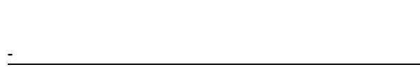
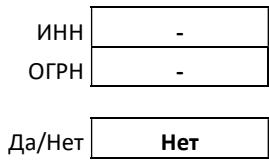

# ПАО АФК «Система»

Промежуточная бухгалтерская (финансовая) отчетность по состоянию на и за девять месяцев, закончившихся 30 сентября 2025 года

Организация

Идентификационный номер налогоплательщика

Организационно-правовая форма Форма собственности

Адрес в пределах места нахождения

# ПАО АФК «Система»

Публичное акционерное общество Частная собственность

125009, Москва г., Моховая ул., дом № 13, строение 1

<table><tr><td>по ОКПО</td><td>27987276</td></tr><tr><td>инн</td><td>7703104630</td></tr><tr><td>по ОКОПФ</td><td>12247</td></tr><tr><td>по ОКФС</td><td>16</td></tr></table>

Бухгалтерская отчетность подлежит обязательному аудиту

Наименование аудиторской организации, проводившей обязательный

Да/Нет Нет

Идентификационный номер налогоплательщика аудиторской организации Основной государственный регистрационный номер аудиторской организации

Бухгалтерская отчетность подлежит утверждению

Наименование органа, утверждающего бухгалтерскую отчетность

<table><tr><td rowspan=1 colspan=1>Пояснения</td><td rowspan=1 colspan=1>Наименование показателя</td><td rowspan=1 colspan=1>Код</td><td rowspan=1 colspan=1>На 30 сентября2025 г.</td><td rowspan=1 colspan=1>На 31 декабря2024г.</td></tr><tr><td rowspan=1 colspan=1></td><td rowspan=1 colspan=1>АКТИВI. ВНЕОБОРОТНЫЕ АКТИВЫНематериальные активы</td><td rowspan=1 colspan=1>1110</td><td rowspan=1 colspan=1>58957</td><td rowspan=1 colspan=1>21 898</td></tr><tr><td rowspan=1 colspan=1></td><td rowspan=1 colspan=1>Основные средства</td><td rowspan=1 colspan=1>1150</td><td rowspan=1 colspan=1>4 259 168</td><td rowspan=1 colspan=1>4 959 622</td></tr><tr><td rowspan=1 colspan=1>4</td><td rowspan=1 colspan=1>Финансовые вложения</td><td rowspan=1 colspan=1>1170</td><td rowspan=1 colspan=1>624 016 922</td><td rowspan=1 colspan=1>575 664 519</td></tr><tr><td rowspan=1 colspan=1>15</td><td rowspan=1 colspan=1>Отложенные налоговые активы</td><td rowspan=1 colspan=1>1180</td><td rowspan=1 colspan=1>22 227 001</td><td rowspan=1 colspan=1>26 100 753</td></tr><tr><td rowspan=1 colspan=1>5</td><td rowspan=1 colspan=1>Прочие внеоборотные активы</td><td rowspan=1 colspan=1>1190</td><td rowspan=1 colspan=1>4 147 117</td><td rowspan=1 colspan=1>221 000</td></tr><tr><td rowspan=1 colspan=1></td><td rowspan=1 colspan=1>Итого по разделу I</td><td rowspan=1 colspan=1>1100</td><td rowspan=1 colspan=1>654 709 165</td><td rowspan=1 colspan=1>606 967 791</td></tr><tr><td rowspan=1 colspan=1></td><td rowspan=1 colspan=1>II. ОБОРОТНЫЕ АКТИВЫНДС по приобретенным ценностям</td><td rowspan=1 colspan=1>1220</td><td rowspan=1 colspan=1>13 873</td><td rowspan=1 colspan=1>9 602</td></tr><tr><td rowspan=1 colspan=1>6</td><td rowspan=1 colspan=1>Дебиторская задолженность</td><td rowspan=1 colspan=1>1230</td><td rowspan=1 colspan=1>8 170 467</td><td rowspan=1 colspan=1>8782 955</td></tr><tr><td rowspan=1 colspan=1>4</td><td rowspan=1 colspan=1>Финансовые вложения (за исключением денежныхэквивалентов)</td><td rowspan=1 colspan=1>1240</td><td rowspan=1 colspan=1>46 595 393</td><td rowspan=1 colspan=1>29 674 395</td></tr><tr><td rowspan=1 colspan=1>7</td><td rowspan=1 colspan=1>Денежные средства и денежные эквиваленты</td><td rowspan=1 colspan=1>1250</td><td rowspan=1 colspan=1>3942 016</td><td rowspan=1 colspan=1>19 151 041</td></tr><tr><td rowspan=1 colspan=1></td><td rowspan=1 colspan=1>Прочие оборотные активы</td><td rowspan=1 colspan=1>1260</td><td rowspan=1 colspan=1>129 444</td><td rowspan=1 colspan=1>205 366</td></tr><tr><td rowspan=1 colspan=1></td><td rowspan=1 colspan=1>Итого по разделу II</td><td rowspan=1 colspan=1>1200</td><td rowspan=1 colspan=1>58 851 193</td><td rowspan=1 colspan=1>57 823 359</td></tr><tr><td rowspan=1 colspan=1></td><td rowspan=1 colspan=1>5ААHC</td><td rowspan=1 colspan=1>1600</td><td rowspan=1 colspan=1>713 560 358</td><td rowspan=1 colspan=1>664 791 151</td></tr><tr><td rowspan=1 colspan=1></td><td rowspan=1 colspan=1>ПАССИВIII. КАПИТАЛ И РЕЗЕРВЫ</td><td rowspan=1 colspan=1></td><td rowspan=1 colspan=1></td><td rowspan=1 colspan=1></td></tr><tr><td rowspan=1 colspan=1>8</td><td rowspan=1 colspan=1>Уставный капитал</td><td rowspan=1 colspan=1>1310</td><td rowspan=1 colspan=1>868500</td><td rowspan=1 colspan=1>868500</td></tr><tr><td rowspan=1 colspan=1></td><td rowspan=1 colspan=1>Накопленная дооценка внеоборотных активов</td><td rowspan=1 colspan=1>1340</td><td rowspan=1 colspan=1>3286 784</td><td rowspan=1 colspan=1>3 286 784</td></tr><tr><td rowspan=1 colspan=1></td><td rowspan=1 colspan=1>Добавочный капитал (без накопленной дооценки)</td><td rowspan=1 colspan=1>1350</td><td rowspan=1 colspan=1>37 708 280</td><td rowspan=1 colspan=1>37 708 280</td></tr><tr><td rowspan=1 colspan=1></td><td rowspan=1 colspan=1>Резервный капитал</td><td rowspan=1 colspan=1>1360</td><td rowspan=1 colspan=1>43 425</td><td rowspan=1 colspan=1>43 425</td></tr><tr><td rowspan=1 colspan=1></td><td rowspan=1 colspan=1>Нераспределенная прибыль (непокрытый убыток)</td><td rowspan=1 colspan=1>1370</td><td rowspan=1 colspan=1>195 369 954</td><td rowspan=1 colspan=1>159 564 570</td></tr><tr><td rowspan=1 colspan=1></td><td rowspan=1 colspan=1>Итого по разделу III</td><td rowspan=1 colspan=1>1300</td><td rowspan=1 colspan=1>237 276 943</td><td rowspan=1 colspan=1>201 471 559</td></tr><tr><td rowspan=1 colspan=1></td><td rowspan=1 colspan=1>IV. ДОЛГОСРОЧНЫЕ ОБЯЗАТЕЛЬСТВА</td><td rowspan=1 colspan=1></td><td rowspan=1 colspan=1></td><td rowspan=1 colspan=1></td></tr><tr><td rowspan=1 colspan=1>9</td><td rowspan=1 colspan=1>Заемные средства</td><td rowspan=1 colspan=1>1410</td><td rowspan=1 colspan=1>217 738 070</td><td rowspan=1 colspan=1>186 011 269</td></tr><tr><td rowspan=1 colspan=1>15</td><td rowspan=1 colspan=1>Отложенные налоговые обязательства</td><td rowspan=1 colspan=1>1420</td><td rowspan=1 colspan=1>16 441 312</td><td rowspan=1 colspan=1>44 064 536</td></tr><tr><td rowspan=1 colspan=1></td><td rowspan=1 colspan=1>Оценочные обязательства</td><td rowspan=1 colspan=1>1430</td><td rowspan=1 colspan=1>262912</td><td rowspan=1 colspan=1>358 568</td></tr><tr><td rowspan=1 colspan=1></td><td rowspan=1 colspan=1>Прочие долгосрочные обязательства</td><td rowspan=1 colspan=1>1450</td><td rowspan=1 colspan=1>536 223</td><td rowspan=1 colspan=1>794 363</td></tr><tr><td rowspan=1 colspan=1></td><td rowspan=1 colspan=1>Итого по разделу IV</td><td rowspan=1 colspan=1>1400</td><td rowspan=1 colspan=1>234 978 517</td><td rowspan=1 colspan=1>231 228 736</td></tr><tr><td rowspan=1 colspan=1></td><td rowspan=1 colspan=1>V. КРАТКОСРОЧНЫЕ ОБЯЗАТЕЛЬСТВА</td><td rowspan=1 colspan=1></td><td rowspan=1 colspan=1></td><td rowspan=1 colspan=1></td></tr><tr><td rowspan=1 colspan=1>9</td><td rowspan=1 colspan=1>Заемные средства</td><td rowspan=1 colspan=1>1510</td><td rowspan=1 colspan=1>240 133 014</td><td rowspan=1 colspan=1>228 994 971</td></tr><tr><td rowspan=1 colspan=1>10</td><td rowspan=1 colspan=1>Кредиторская задолженность</td><td rowspan=1 colspan=1>1520</td><td rowspan=1 colspan=1>635 713</td><td rowspan=1 colspan=1>2543 757</td></tr><tr><td rowspan=1 colspan=1></td><td rowspan=1 colspan=1>Доходы будущих периодов</td><td rowspan=1 colspan=1>1530</td><td rowspan=1 colspan=1>25 308</td><td rowspan=1 colspan=1>70 466</td></tr><tr><td rowspan=1 colspan=1></td><td rowspan=1 colspan=1>Оценочные обязательства</td><td rowspan=1 colspan=1>1540</td><td rowspan=1 colspan=1>401 170</td><td rowspan=1 colspan=1>302 785</td></tr><tr><td rowspan=1 colspan=1></td><td rowspan=1 colspan=1>Прочие краткосрочные обязательства</td><td rowspan=1 colspan=1>1550</td><td rowspan=1 colspan=1>109 693</td><td rowspan=1 colspan=1>178 877</td></tr><tr><td rowspan=1 colspan=1></td><td rowspan=1 colspan=1>Итого по разделу V</td><td rowspan=1 colspan=1>1500</td><td rowspan=1 colspan=1>241304 898</td><td rowspan=1 colspan=1>232 090 856</td></tr><tr><td rowspan=1 colspan=1></td><td rowspan=1 colspan=1>БААНС</td><td rowspan=1 colspan=1>1700</td><td rowspan=1 colspan=1>713 560 358</td><td rowspan=1 colspan=1>664 791 151</td></tr></table>

# Отчет о финансовых результатах за девять месяцев, закончившихся 30 сентября 2025 года

Организация ПАО АФК «СИСТЕМА» Единица измерения в тыс. руб.

<table><tr><td rowspan=2 colspan=1>Пояснения</td><td rowspan=2 colspan=1>Наименование показателя</td><td rowspan=2 colspan=1>Код</td><td rowspan=1 colspan=2>За девять месяцев,закончившихся 30 сентября</td></tr><tr><td rowspan=1 colspan=1>2025 года</td><td rowspan=1 colspan=1>2024 года</td></tr><tr><td rowspan=1 colspan=1>11</td><td rowspan=1 colspan=1>Выручка</td><td rowspan=1 colspan=1>2110</td><td rowspan=1 colspan=1>29 010 905</td><td rowspan=1 colspan=1>32 707 024</td></tr><tr><td rowspan=1 colspan=1></td><td rowspan=1 colspan=1>Себестоимость продаж</td><td rowspan=1 colspan=1>2120</td><td rowspan=1 colspan=1>-</td><td rowspan=1 colspan=1></td></tr><tr><td rowspan=1 colspan=1></td><td rowspan=1 colspan=1>Валовая прибыль (убыток)</td><td rowspan=1 colspan=1>2100</td><td rowspan=1 colspan=1>29 010 905</td><td rowspan=1 colspan=1>32 707 024</td></tr><tr><td rowspan=1 colspan=1></td><td rowspan=1 colspan=1>Коммерческие расходы</td><td rowspan=1 colspan=1>2210</td><td rowspan=1 colspan=1>-</td><td rowspan=1 colspan=1></td></tr><tr><td rowspan=1 colspan=1>12</td><td rowspan=1 colspan=1>Управленческие расходы</td><td rowspan=1 colspan=1>2220</td><td rowspan=1 colspan=1>(3 496 554)</td><td rowspan=1 colspan=1>(4 180 101)</td></tr><tr><td rowspan=1 colspan=1></td><td rowspan=1 colspan=1>Прибыль (убыток) от продаж</td><td rowspan=1 colspan=1>2200</td><td rowspan=1 colspan=1>25514 351</td><td rowspan=1 colspan=1>28 526 923</td></tr><tr><td rowspan=1 colspan=1></td><td rowspan=1 colspan=1>Доходы от участия в других организациях</td><td rowspan=1 colspan=1>2310</td><td rowspan=1 colspan=1>-</td><td rowspan=1 colspan=1></td></tr><tr><td rowspan=1 colspan=1></td><td rowspan=1 colspan=1>Проценты к получению</td><td rowspan=1 colspan=1>2320</td><td rowspan=1 colspan=1>14 787 396</td><td rowspan=1 colspan=1>14 072 893</td></tr><tr><td rowspan=1 colspan=1>9</td><td rowspan=1 colspan=1>Проценты к уплате</td><td rowspan=1 colspan=1>2330</td><td rowspan=1 colspan=1>(62 601 575)</td><td rowspan=1 colspan=1>(41 694 646)</td></tr><tr><td rowspan=1 colspan=1>13</td><td rowspan=1 colspan=1>Прочие доходы</td><td rowspan=1 colspan=1>2340</td><td rowspan=1 colspan=1>45 728 378</td><td rowspan=1 colspan=1>8 896 375</td></tr><tr><td rowspan=1 colspan=1>14</td><td rowspan=1 colspan=1>Прочие расходы</td><td rowspan=1 colspan=1>2350</td><td rowspan=1 colspan=1>(8 348 552)</td><td rowspan=1 colspan=1>(5 165 706)</td></tr><tr><td rowspan=1 colspan=1></td><td rowspan=1 colspan=1>Прибыль (убыток) от продолжающейся деятельностидо налогообложения</td><td rowspan=1 colspan=1>2300</td><td rowspan=1 colspan=1>15 079 998</td><td rowspan=1 colspan=1>4 635 838</td></tr><tr><td rowspan=1 colspan=1>15</td><td rowspan=1 colspan=1>Налог на прибыль</td><td rowspan=1 colspan=1>2410</td><td rowspan=1 colspan=1>2878 352</td><td rowspan=1 colspan=1>231 390</td></tr><tr><td rowspan=1 colspan=1></td><td rowspan=1 colspan=1>в том числе:текущий налог на прибыль организаций</td><td rowspan=1 colspan=1>2411</td><td rowspan=1 colspan=1>(419 746)</td><td rowspan=1 colspan=1>(324 443)</td></tr><tr><td rowspan=1 colspan=1></td><td rowspan=1 colspan=1>отложенный налог на прибыль организаций</td><td rowspan=1 colspan=1>2412</td><td rowspan=1 colspan=1>3 298 098</td><td rowspan=1 colspan=1>555 833</td></tr><tr><td rowspan=1 colspan=1>15</td><td rowspan=1 colspan=1>Прочее</td><td rowspan=1 colspan=1>2460</td><td rowspan=1 colspan=1>17 847 034</td><td rowspan=1 colspan=1>(2 677 133)</td></tr><tr><td rowspan=1 colspan=1></td><td rowspan=1 colspan=1>Чистая прибыль (убыток)</td><td rowspan=1 colspan=1>2400</td><td rowspan=1 colspan=1>35 805 384</td><td rowspan=1 colspan=1>2 190 095</td></tr><tr><td rowspan=1 colspan=1></td><td rowspan=1 colspan=1>Результат от переоценки внеоборотных активов, невключаемый в чистую прибыль (убыток)</td><td rowspan=1 colspan=1>2510</td><td rowspan=1 colspan=1></td><td rowspan=1 colspan=1></td></tr><tr><td rowspan=1 colspan=1></td><td rowspan=1 colspan=1>Результат от прочих операций, не включаемыйв чистую прибыль (убыток)</td><td rowspan=1 colspan=1>2520</td><td rowspan=1 colspan=1></td><td rowspan=1 colspan=1></td></tr><tr><td rowspan=1 colspan=1></td><td rowspan=1 colspan=1>Налог на прибыль от операций, относящийся крезультатам переоценки внеоборотных активов и прочихопераций, не включаемых в чистую прибыль (убыток)</td><td rowspan=1 colspan=1>2530</td><td rowspan=1 colspan=1>-</td><td rowspan=1 colspan=1></td></tr><tr><td rowspan=1 colspan=1></td><td rowspan=1 colspan=1>Совокупный финансовый результат</td><td rowspan=1 colspan=1>2500</td><td rowspan=1 colspan=1>35 805 384</td><td rowspan=1 colspan=1>2 190 095</td></tr><tr><td rowspan=1 colspan=1></td><td rowspan=1 colspan=1>СПРАВОЧНО</td><td rowspan=1 colspan=1></td><td rowspan=1 colspan=1></td><td rowspan=1 colspan=1></td></tr><tr><td rowspan=1 colspan=1></td><td rowspan=1 colspan=1>Базовая прибыль (убыток) на акцию, в рублях</td><td rowspan=1 colspan=1>2900</td><td rowspan=1 colspan=1>3,7</td><td rowspan=1 colspan=1>0,2</td></tr><tr><td rowspan=1 colspan=1></td><td rowspan=1 colspan=1>Разводненная прибыль (убыток) на акцию, в рублях</td><td rowspan=1 colspan=1>2910</td><td rowspan=1 colspan=1>3,7</td><td rowspan=1 colspan=1>0,2</td></tr></table>

# Отчет об изменениях капитала за девять месяцев, закончившихся 30 сентября 2025 года

Организация ПАО АФК «СИСТЕМА» Единица измерения в тыс. руб.

<table><tr><td rowspan=1 colspan=1>Пояснения</td><td rowspan=1 colspan=1>Наименование показателя</td><td rowspan=1 colspan=1>Код</td><td rowspan=1 colspan=1>Уставный капитал</td><td rowspan=1 colspan=1>Собственные акции,принадлежащие обществу,задолженность акционеровпо оплате акций</td><td rowspan=1 colspan=1>Накопленнаядооценкавнеоборотныхактивов</td><td rowspan=1 colspan=1>Добавочный капитал(без накопленнойдооценки)</td><td rowspan=1 colspan=1>Резервный капитал</td><td rowspan=1 colspan=1>Нераспределеннаяприбыль(непокрытыйубыток)</td><td rowspan=1 colspan=1>Итого</td></tr><tr><td rowspan=1 colspan=1></td><td rowspan=1 colspan=1>Величина капитала на 31 декабря 2023 г. - докорректировки</td><td rowspan=1 colspan=1>3100</td><td rowspan=1 colspan=1>868 500</td><td rowspan=1 colspan=1></td><td rowspan=1 colspan=1>2 758 061</td><td rowspan=1 colspan=1>37 708 280</td><td rowspan=1 colspan=1>43 425</td><td rowspan=1 colspan=1>222 790 039</td><td rowspan=1 colspan=1>264 168 305</td></tr><tr><td rowspan=1 colspan=1></td><td rowspan=1 colspan=1>корректировка в связи с:изменением учетной политики</td><td rowspan=1 colspan=1>3110</td><td rowspan=1 colspan=1></td><td rowspan=1 colspan=1></td><td rowspan=1 colspan=1></td><td rowspan=1 colspan=1></td><td rowspan=1 colspan=1></td><td rowspan=1 colspan=1></td><td rowspan=1 colspan=1></td></tr><tr><td rowspan=1 colspan=1></td><td rowspan=1 colspan=1>исправлением ошибок</td><td rowspan=1 colspan=1>3120</td><td rowspan=1 colspan=1></td><td rowspan=1 colspan=1></td><td rowspan=1 colspan=1></td><td rowspan=1 colspan=1></td><td rowspan=1 colspan=1></td><td rowspan=1 colspan=1></td><td rowspan=1 colspan=1></td></tr><tr><td rowspan=1 colspan=1></td><td rowspan=1 colspan=1>Величина капитала на 31 декабря 2023 г. - послекорректировки</td><td rowspan=1 colspan=1>3130</td><td rowspan=1 colspan=1>868 500</td><td rowspan=1 colspan=1></td><td rowspan=1 colspan=1>2758 061</td><td rowspan=1 colspan=1>37 708 280</td><td rowspan=1 colspan=1>43 425</td><td rowspan=1 colspan=1>222 790 039</td><td rowspan=1 colspan=1>264 168 305</td></tr><tr><td rowspan=1 colspan=1></td><td rowspan=1 colspan=1>Изменения капитала за девять месяцев,закончившиеся 30 сентября 2024 годаЧистая прибыль (убыток)</td><td rowspan=1 colspan=1>3211</td><td rowspan=1 colspan=1></td><td rowspan=1 colspan=1></td><td rowspan=1 colspan=1></td><td rowspan=1 colspan=1></td><td rowspan=1 colspan=1></td><td rowspan=1 colspan=1>2190 095</td><td rowspan=1 colspan=1>2190 095</td></tr><tr><td rowspan=1 colspan=1></td><td rowspan=1 colspan=1>Переоценка внеоборотных активов</td><td rowspan=1 colspan=1>3212</td><td rowspan=1 colspan=1>__</td><td rowspan=1 colspan=1>___(</td><td rowspan=1 colspan=1>_</td><td rowspan=1 colspan=1></td><td rowspan=1 colspan=1></td><td rowspan=1 colspan=1></td><td rowspan=1 colspan=1>__</td></tr><tr><td rowspan=1 colspan=1></td><td rowspan=1 colspan=1>Дивиденды</td><td rowspan=1 colspan=1>3227</td><td rowspan=1 colspan=1>-</td><td rowspan=1 colspan=1>___</td><td rowspan=1 colspan=1>___</td><td rowspan=1 colspan=1>___</td><td rowspan=1 colspan=1>__</td><td rowspan=1 colspan=1>(5018000)</td><td rowspan=1 colspan=1>(5 018 000)</td></tr><tr><td rowspan=1 colspan=1></td><td rowspan=1 colspan=1>Иные изменения за счет операций ссобственниками (за исключением дивидендов)всего</td><td rowspan=1 colspan=1>3230</td><td rowspan=1 colspan=1></td><td rowspan=1 colspan=1></td><td rowspan=1 colspan=1></td><td rowspan=1 colspan=1></td><td rowspan=1 colspan=1></td><td rowspan=1 colspan=1></td><td rowspan=1 colspan=1></td></tr><tr><td rowspan=1 colspan=1>___</td><td rowspan=1 colspan=1>Реорганизация юридического лица</td><td rowspan=1 colspan=1>3216</td><td rowspan=1 colspan=1>____</td><td rowspan=1 colspan=1>___</td><td rowspan=1 colspan=1>___</td><td rowspan=1 colspan=1>___</td><td rowspan=1 colspan=1>__</td><td rowspan=1 colspan=1>__</td><td rowspan=1 colspan=1>___</td></tr><tr><td rowspan=1 colspan=1>___</td><td rowspan=1 colspan=1>Иные изменения - всего</td><td rowspan=1 colspan=1>3240</td><td rowspan=1 colspan=1>___</td><td rowspan=1 colspan=1>___</td><td rowspan=1 colspan=1>___</td><td rowspan=1 colspan=1>___</td><td rowspan=1 colspan=1></td><td rowspan=1 colspan=1>___</td><td rowspan=1 colspan=1>___</td></tr><tr><td rowspan=1 colspan=1></td><td rowspan=1 colspan=1>Величина капитала на 30 сентября 2024 г.</td><td rowspan=1 colspan=1>3250</td><td rowspan=1 colspan=1>868 500</td><td rowspan=1 colspan=1>___</td><td rowspan=1 colspan=1>2 758 061</td><td rowspan=1 colspan=1>37 708 280</td><td rowspan=1 colspan=1>43 425</td><td rowspan=1 colspan=1>219 962 134</td><td rowspan=1 colspan=1>261 340 400</td></tr><tr><td rowspan=1 colspan=1></td><td rowspan=1 colspan=1>Величина капитала на 31 декабря 2024 г. - докорректировки</td><td rowspan=1 colspan=1>3200</td><td rowspan=1 colspan=1>868 500</td><td rowspan=1 colspan=1></td><td rowspan=1 colspan=1>3 286 784</td><td rowspan=1 colspan=1>37 708 280</td><td rowspan=1 colspan=1>43 425</td><td rowspan=1 colspan=1>159 564 570</td><td rowspan=1 colspan=1>201 471 559</td></tr><tr><td rowspan=1 colspan=1></td><td rowspan=1 colspan=1>корректировка в связи с:изменением учетной политики</td><td rowspan=1 colspan=1>3210</td><td rowspan=1 colspan=1></td><td rowspan=1 colspan=1></td><td rowspan=1 colspan=1></td><td rowspan=1 colspan=1></td><td rowspan=1 colspan=1></td><td rowspan=1 colspan=1></td><td rowspan=1 colspan=1></td></tr><tr><td rowspan=1 colspan=1>___</td><td rowspan=1 colspan=1>исправлением ошибок</td><td rowspan=1 colspan=1>32</td><td rowspan=1 colspan=1>__</td><td rowspan=1 colspan=1>__</td><td rowspan=1 colspan=1>__</td><td rowspan=1 colspan=1>___</td><td rowspan=1 colspan=1></td><td rowspan=1 colspan=1></td><td rowspan=1 colspan=1></td></tr><tr><td rowspan=1 colspan=1></td><td rowspan=1 colspan=1>Величина капитала на 31 декабря 2024 г. - послекорректировки</td><td rowspan=1 colspan=1>3230</td><td rowspan=1 colspan=1>868 500</td><td rowspan=1 colspan=1></td><td rowspan=1 colspan=1>3 286 784</td><td rowspan=1 colspan=1>37 708 280</td><td rowspan=1 colspan=1>43425</td><td rowspan=1 colspan=1>159 564 570</td><td rowspan=1 colspan=1>201471 559</td></tr><tr><td rowspan=1 colspan=1></td><td rowspan=1 colspan=1>Изменения капитала за девять месяцев,закончившиеся 30 сентября 2025 годаЧистая прибыль (убыток)</td><td rowspan=1 colspan=1>3311</td><td rowspan=1 colspan=1></td><td rowspan=1 colspan=1></td><td rowspan=1 colspan=1></td><td rowspan=1 colspan=1></td><td rowspan=1 colspan=1></td><td rowspan=1 colspan=1>35 805 384</td><td rowspan=1 colspan=1>35 805 384</td></tr><tr><td rowspan=1 colspan=1>___</td><td rowspan=1 colspan=1>Переоценка внеоборотных активов</td><td rowspan=1 colspan=1>3312</td><td rowspan=1 colspan=1>__</td><td rowspan=1 colspan=1>__</td><td rowspan=1 colspan=1></td><td rowspan=1 colspan=1></td><td rowspan=1 colspan=1></td><td rowspan=1 colspan=1>________</td><td rowspan=1 colspan=1>__________</td></tr><tr><td rowspan=1 colspan=1></td><td rowspan=1 colspan=1>Дивиденды</td><td rowspan=1 colspan=1>3327</td><td rowspan=1 colspan=1></td><td rowspan=1 colspan=1></td><td rowspan=1 colspan=1></td><td rowspan=1 colspan=1></td><td rowspan=1 colspan=1></td><td rowspan=1 colspan=1></td><td rowspan=1 colspan=1></td></tr><tr><td rowspan=1 colspan=1></td><td rowspan=1 colspan=1>Иные изменения за счет операций ссобственниками (за исключением дивидендов)всего</td><td rowspan=1 colspan=1>3330</td><td rowspan=1 colspan=1></td><td rowspan=1 colspan=1></td><td rowspan=1 colspan=1></td><td rowspan=1 colspan=1></td><td rowspan=1 colspan=1></td><td rowspan=1 colspan=1></td><td rowspan=1 colspan=1></td></tr><tr><td rowspan=1 colspan=1>___</td><td rowspan=1 colspan=1>Реорганизация юридического лица</td><td rowspan=1 colspan=1>3316</td><td rowspan=1 colspan=1>__</td><td rowspan=1 colspan=1>__</td><td rowspan=1 colspan=1></td><td rowspan=1 colspan=1>_</td><td rowspan=1 colspan=1></td><td rowspan=1 colspan=1>_</td><td rowspan=1 colspan=1>__</td></tr><tr><td rowspan=1 colspan=1>___</td><td rowspan=1 colspan=1>Иные изменения - всего</td><td rowspan=1 colspan=1>3340</td><td rowspan=1 colspan=1>__</td><td rowspan=1 colspan=1>___</td><td rowspan=1 colspan=1></td><td rowspan=1 colspan=1>___</td><td rowspan=1 colspan=1>_</td><td rowspan=1 colspan=1>_</td><td rowspan=1 colspan=1>__</td></tr><tr><td rowspan=1 colspan=1>__</td><td rowspan=1 colspan=1>Величина капитала на 30 сентября 2025 г.</td><td rowspan=1 colspan=1>3300</td><td rowspan=1 colspan=1>868 500</td><td rowspan=1 colspan=1>_</td><td rowspan=1 colspan=1>3 286 784</td><td rowspan=1 colspan=1>37 708 280</td><td rowspan=1 colspan=1>43 425</td><td rowspan=1 colspan=1>195 369 954</td><td rowspan=1 colspan=1>237 276 943</td></tr></table>

# Отчет о движении денежных средств за девять месяцев, закончившихся 30 сентября 2025 года

Организация ПАО АФК «СИСТЕМА» Единица измерения в тыс. руб.

<table><tr><td colspan="1" rowspan="2">Пояснения</td><td colspan="1" rowspan="2">Наименование показателя</td><td colspan="1" rowspan="2">Код</td><td colspan="2" rowspan="1">За девять месяцев,закончившихся 30 сентября</td></tr><tr><td colspan="1" rowspan="1">2025 года</td><td colspan="1" rowspan="1">2024 года</td></tr><tr><td colspan="1" rowspan="1"></td><td colspan="1" rowspan="1">Денежные потоки от текущих операцийПоступления - всего</td><td colspan="1" rowspan="1">4110</td><td colspan="1" rowspan="1">26 751 577</td><td colspan="1" rowspan="1">30 063 089</td></tr><tr><td colspan="1" rowspan="1"></td><td colspan="1" rowspan="1">в том числе:от продажи продукции, товаров, работ и услуг</td><td colspan="1" rowspan="1">4111</td><td colspan="1" rowspan="1">10 764</td><td colspan="1" rowspan="1">7777</td></tr><tr><td colspan="1" rowspan="1"></td><td colspan="1" rowspan="1">арендных платежей, лицензионных платежей, роялти,комиссионных и иных аналогичных платежей</td><td colspan="1" rowspan="1">4112</td><td colspan="1" rowspan="1">-</td><td colspan="1" rowspan="1"></td></tr><tr><td colspan="1" rowspan="1"></td><td colspan="1" rowspan="1">от перепродажи финансовых вложений</td><td colspan="1" rowspan="1">4113</td><td colspan="1" rowspan="1">-</td><td colspan="1" rowspan="1"></td></tr><tr><td colspan="1" rowspan="1"></td><td colspan="1" rowspan="1">процентов по дебиторской задолженности покупателей</td><td colspan="1" rowspan="1">4114</td><td colspan="1" rowspan="1"></td><td colspan="1" rowspan="1"></td></tr><tr><td colspan="1" rowspan="1"></td><td colspan="1" rowspan="1">дивидендов</td><td colspan="1" rowspan="1">4115</td><td colspan="1" rowspan="1">26 398 738</td><td colspan="1" rowspan="1">30 022 481</td></tr><tr><td colspan="1" rowspan="1"></td><td colspan="1" rowspan="1">поступления по приобретенным правам (требованиям)</td><td colspan="1" rowspan="1">4116</td><td colspan="1" rowspan="1"></td><td colspan="1" rowspan="1"></td></tr><tr><td colspan="1" rowspan="1"></td><td colspan="1" rowspan="1">прочие поступления</td><td colspan="1" rowspan="1">4119</td><td colspan="1" rowspan="1">342 076</td><td colspan="1" rowspan="1">32 830</td></tr><tr><td colspan="1" rowspan="1"></td><td colspan="1" rowspan="1">Платежи - всего</td><td colspan="1" rowspan="1">4120</td><td colspan="1" rowspan="1">(63 665 717)</td><td colspan="1" rowspan="1">(47 401 101)</td></tr><tr><td colspan="1" rowspan="1"></td><td colspan="1" rowspan="1">в том числе:поставщикам (подрядчикам) за сырье, материалы,работы, услуги</td><td colspan="1" rowspan="1">4121</td><td colspan="1" rowspan="1">(1 983 868)</td><td colspan="1" rowspan="1">(2 375 913)</td></tr><tr><td colspan="1" rowspan="1"></td><td colspan="1" rowspan="1">в связи с оплатой труда работников</td><td colspan="1" rowspan="1">4122</td><td colspan="1" rowspan="1">(1 762 619)</td><td colspan="1" rowspan="1">(4 236 856)</td></tr><tr><td colspan="1" rowspan="1"></td><td colspan="1" rowspan="1">процентов по долговым обязательствам</td><td colspan="1" rowspan="1">4123</td><td colspan="1" rowspan="1">(57 782 632)</td><td colspan="1" rowspan="1">(39 437 658)</td></tr><tr><td colspan="1" rowspan="1"></td><td colspan="1" rowspan="1">налог на прибыль организаций</td><td colspan="1" rowspan="1">4124</td><td colspan="1" rowspan="1">(762 664)</td><td colspan="1" rowspan="1">(100 381)</td></tr><tr><td colspan="1" rowspan="1"></td><td colspan="1" rowspan="1">прочие платежи</td><td colspan="1" rowspan="1">4129</td><td colspan="1" rowspan="1">(1 373 934)</td><td colspan="1" rowspan="1">(1 250 293)</td></tr><tr><td colspan="1" rowspan="1"></td><td colspan="1" rowspan="1">Сальдо денежных потоков от текущих операций</td><td colspan="1" rowspan="1">4100</td><td colspan="1" rowspan="1">(36 914 140)</td><td colspan="1" rowspan="1">(17 338 012)</td></tr><tr><td colspan="1" rowspan="1"></td><td colspan="1" rowspan="1">Денежные потоки от инвестиционных операцийПоступления - всего</td><td colspan="1" rowspan="1">4210</td><td colspan="1" rowspan="1">166 653 615</td><td colspan="1" rowspan="1">188 725 687</td></tr><tr><td colspan="1" rowspan="1"></td><td colspan="1" rowspan="1">в том числе:от продажи внеоборотных активов (кроме финансовыхвложений)</td><td colspan="1" rowspan="1">4211</td><td colspan="1" rowspan="1">4143</td><td colspan="1" rowspan="1"></td></tr><tr><td colspan="1" rowspan="1"></td><td colspan="1" rowspan="1">от продажи акций других организаций (долей участия)</td><td colspan="1" rowspan="1">4212</td><td colspan="1" rowspan="1">379 646</td><td colspan="1" rowspan="1">411 719</td></tr><tr><td colspan="1" rowspan="1"></td><td colspan="1" rowspan="1">от возврата предоставленных займов, от продажидолговых ценных бумаг (прав требования денежныхсредств к другим лицам)</td><td colspan="1" rowspan="1">4213</td><td colspan="1" rowspan="1">157345 118</td><td colspan="1" rowspan="1">174 333 492</td></tr><tr><td colspan="1" rowspan="1"></td><td colspan="1" rowspan="1">процентов по долговым финансовым вложениям ианалогичных поступлений от долевого участия в другихорганизациях</td><td colspan="1" rowspan="1">4214</td><td colspan="1" rowspan="1">8 924 709</td><td colspan="1" rowspan="1">13 980 476</td></tr><tr><td colspan="1" rowspan="1"></td><td colspan="1" rowspan="1">прочие поступления</td><td colspan="1" rowspan="1">4219</td><td colspan="1" rowspan="1">-</td><td colspan="1" rowspan="1"></td></tr><tr><td colspan="1" rowspan="1"></td><td colspan="1" rowspan="1">Платежи - всего</td><td colspan="1" rowspan="1">4220</td><td colspan="1" rowspan="1">(146 690 088)</td><td colspan="1" rowspan="1">(328 976 303)</td></tr><tr><td colspan="1" rowspan="1"></td><td colspan="1" rowspan="1">в том числе:в связи с приобретением, созданием, модернизацией,реконструкцией и подготовкой к использованиювнеоборотных активов</td><td colspan="1" rowspan="1">4221</td><td colspan="1" rowspan="1">(23 315)</td><td colspan="1" rowspan="1">(4 700)</td></tr><tr><td colspan="1" rowspan="1"></td><td colspan="1" rowspan="1">в связи с приобретением акций других организаций(долей участия), паев</td><td colspan="1" rowspan="1">4222</td><td colspan="1" rowspan="1">(20 873111)</td><td colspan="1" rowspan="1">(118 859 087)</td></tr><tr><td colspan="1" rowspan="1"></td><td colspan="1" rowspan="1">в связи с приобретением долговых ценных бумаг (правтребования денежных средств к другим лицам),предоставление займов другим лицам</td><td colspan="1" rowspan="1">4223</td><td colspan="1" rowspan="1">(117 666 120)</td><td colspan="1" rowspan="1">(196 825 892)</td></tr><tr><td colspan="1" rowspan="1"></td><td colspan="1" rowspan="1">процентов по долговым обязательствам, включаемым встоимость инвестиционного актива</td><td colspan="1" rowspan="1">4224</td><td colspan="1" rowspan="1"></td><td colspan="1" rowspan="1"></td></tr><tr><td colspan="1" rowspan="1"></td><td colspan="1" rowspan="1">вклады в имущество других организаций</td><td colspan="1" rowspan="1">4225</td><td colspan="1" rowspan="1">(7 786 968)</td><td colspan="1" rowspan="1">(13 038 381)</td></tr><tr><td colspan="1" rowspan="1"></td><td colspan="1" rowspan="1">прочие платежи</td><td colspan="1" rowspan="1">4229</td><td colspan="1" rowspan="1">(340 574)</td><td colspan="1" rowspan="1">(248 242)</td></tr><tr><td colspan="1" rowspan="1"></td><td colspan="1" rowspan="1">Сальдо денежных потоков от инвестиционных операций</td><td colspan="1" rowspan="1">4200</td><td colspan="1" rowspan="1">19 963 527</td><td colspan="1" rowspan="1">(140 250 616)</td></tr><tr><td colspan="1" rowspan="1"></td><td colspan="1" rowspan="1">Денежные потоки от финансовых операцийПоступления - всего</td><td colspan="1" rowspan="1">4310</td><td colspan="1" rowspan="1">415 548 548</td><td colspan="1" rowspan="1">435 310 693</td></tr><tr><td colspan="1" rowspan="1"></td><td colspan="1" rowspan="1">в том числе:получение кредитов и займов</td><td colspan="1" rowspan="1">4311</td><td colspan="1" rowspan="1">315 724 341</td><td colspan="1" rowspan="1">327 500 000</td></tr><tr><td colspan="1" rowspan="1"></td><td colspan="1" rowspan="1">денежных вкладов собственников (участников)</td><td colspan="1" rowspan="1">4312</td><td colspan="1" rowspan="1">-</td><td colspan="1" rowspan="1"></td></tr><tr><td colspan="1" rowspan="1"></td><td colspan="1" rowspan="1">от выпуска акций, увеличения долей участия</td><td colspan="1" rowspan="1">4313</td><td colspan="1" rowspan="1">-</td><td colspan="1" rowspan="1"></td></tr><tr><td colspan="1" rowspan="1"></td><td colspan="1" rowspan="1">от выпуска облигаций, векселей и других долговыхценных бумаг, долговых цифровых финансовых активов</td><td colspan="1" rowspan="1">4314</td><td colspan="1" rowspan="1">99 824 206</td><td colspan="1" rowspan="1">107 810 693</td></tr><tr><td colspan="1" rowspan="1"></td><td colspan="1" rowspan="1">прочие поступления</td><td colspan="1" rowspan="1">4319</td><td colspan="1" rowspan="1"></td><td colspan="1" rowspan="1"></td></tr><tr><td colspan="1" rowspan="1"></td><td colspan="1" rowspan="1">Платежи - всего</td><td colspan="1" rowspan="1">4320</td><td colspan="1" rowspan="1">(413 806 889)</td><td colspan="1" rowspan="1">(182 213 061)</td></tr><tr><td colspan="1" rowspan="1"></td><td colspan="1" rowspan="1">в том числе:собственникам (участникам) в связи с выкупом у нихакций (долей участия) организации или их выходом изсостава участников</td><td colspan="1" rowspan="1">4321</td><td colspan="1" rowspan="1"></td><td colspan="1" rowspan="1"></td></tr><tr><td colspan="1" rowspan="1"></td><td colspan="1" rowspan="1">на уплату дивидендов и иных платежей пораспределению прибыли в пользу собственников</td><td colspan="1" rowspan="1">4322</td><td colspan="1" rowspan="1">-</td><td colspan="1" rowspan="1">(4 904 764)</td></tr><tr><td colspan="1" rowspan="1"></td><td colspan="1" rowspan="1">в связи с погашением (выкупом) векселей и другихдолговых ценных бумаг, долговых цифровых финансовыхактивов, возврат кредитов и займов</td><td colspan="1" rowspan="1">4323</td><td colspan="1" rowspan="1">(413 496 142)</td><td colspan="1" rowspan="1">(177 004 665)</td></tr><tr><td colspan="1" rowspan="1"></td><td colspan="1" rowspan="1">прочие платежи</td><td colspan="1" rowspan="1">4329</td><td colspan="1" rowspan="1">(310 746)</td><td colspan="1" rowspan="1">(303 632)</td></tr><tr><td colspan="1" rowspan="1"></td><td colspan="1" rowspan="1">Сальдо денежных потоков от финансовых операций</td><td colspan="1" rowspan="1">4300</td><td colspan="1" rowspan="1">1741 659</td><td colspan="1" rowspan="1">253 097 632</td></tr><tr><td colspan="1" rowspan="1"></td><td colspan="1" rowspan="1">Сальдо денежных потоков за отчетный период</td><td colspan="1" rowspan="1">4400</td><td colspan="1" rowspan="1">(15 208 953)</td><td colspan="1" rowspan="1">95 509 005</td></tr><tr><td colspan="1" rowspan="1"></td><td colspan="1" rowspan="1">Остаток денежных средств и денежных эквивалентов наначало отчетного периода</td><td colspan="1" rowspan="1">4450</td><td colspan="1" rowspan="1">19 151 041</td><td colspan="1" rowspan="1">1747906</td></tr><tr><td colspan="1" rowspan="1"></td><td colspan="1" rowspan="1">Остаток денежных средств и денежных эквивалентов наконец отчетного периода</td><td colspan="1" rowspan="1">4500</td><td colspan="1" rowspan="1">3942 016</td><td colspan="1" rowspan="1">97 254 899</td></tr><tr><td colspan="1" rowspan="1"></td><td colspan="1" rowspan="1">Величина влияния изменений курса иностранной валюты поотношению к рублю</td><td colspan="1" rowspan="1">4490</td><td colspan="1" rowspan="1">(72)</td><td colspan="1" rowspan="1">(2 012)</td></tr></table>

# ПОЯСНЕНИЯ К БУХГАЛТЕРСКОМУ БАЛАНСУ И ОТЧЕТУ О ФИНАНСОВЫХ РЕЗУЛЬТАТАХ, ВКЛЮЧАЯ ОСНОВНЫЕ ПОЛОЖЕНИЯ УЧЕТНОЙ ПОЛИТИКИ ПАО АФК «СИСТЕМА» ПО СОСТОЯНИЮ НА И ЗА ДЕВЯТЬ МЕСЯЦЕВ, ЗАКОНЧИВШИХСЯ 30 СЕНТЯБРЯ 2025 ГОДА

# 1. ОБЩАЯ ЧАСТЬ

Публичное акционерное общество «Акционерная финансовая корпорация «Система», в дальнейшем именуемое «Общество», зарегистрировано Московской регистрационной палатой 16 июля 1993 года (Свидетельство о государственной регистрации № 025.866).

Общество внесено в Единый государственный реестр юридических лиц за Основным государственным регистрационным номером (ОГРН) 1027700003891.

Полное фирменное наименование Общества на русском языке: Публичное акционерное общество «Акционерная финансовая корпорация «Система».

Сокращенное фирменное наименование Общества на русском языке: ПАО АФК «Система».

Полное фирменное наименование Общества на английском языке: Sistema Public Joint Stoсk Financial Corporation.

Сокращенное фирменное наименование Общества на английском языке: Sistema PJSFC.

Юридический и фактический адрес: Российская Федерация, 125009, город Москва, улица Моховая, дом 13, строение 1.

В соответствии с п.16 ПБУ 11/2008, Общество не раскрывает информацию, предусмотренную п. 13 ПБУ 11/2008, так как раскрытие такой информации может нанести экономический ущерб Обществу, связанным сторонам и контрагентам.

Акции Общества зарегистрированы на Московской и СПБ биржах.

Основным видом деятельности Общества является участие в уставных капиталах других организаций.

Общество действует в соответствии с Гражданским кодексом Российской Федерации, Федеральным законом «Об акционерных обществах», иными нормативными правовыми актами Российской Федерации (далее  «РФ») и Уставом Общества.

Среднесписочная численность работающих в Обществе за девять месяцев, закончившихся 30 сентября 2025 и 30 сентября 2024 года составила 254 и 267 человек, соответственно.

# 2. ОРГАНИЗАЦИЯ БУХГАЛТЕРСКОГО УЧЕТА

Промежуточная бухгалтерская (финансовая) отчетность Общества составлена в соответствии с федеральными стандартами.

Ведение бухгалтерского учета в 2025 году осуществлялось в соответствии со способами, указанными в Учетной политике Общества, утвержденной приказом Президента Общества от 28 декабря 2024 года № Y2024-85.

Ведение бухгалтерского и налогового учета осуществляется с применением корпоративной информационной системы 1С: Предприятие.

# 2.1. Принципы подготовки промежуточной бухгалтерской (финансовой) отчетности

Данная промежуточная бухгалтерская (финансовая) отчетность по состоянию на и за девять месяцев, закончившихся 30 сентября 2025 года, была подготовлена в соответствии с требованиями Федерального стандарта бухгалтерского учета 4/2023 «Бухгалтерская (финансовая) отчетность» («ФСБУ 4/2023»).

По решению Общества в промежуточной бухгалтерской (финансовой) отчетности раскрывается только информация об имевших место в промежуточный отчетный период существенных фактах хозяйственной жизни, актуализирующая информацию, раскрытую в годовой бухгалтерской (финансовой) отчетности за 2024 год согласно требованиями пунктов 55-57 ФСБУ 4/2023.

Промежуточная бухгалтерская (финансовая) отчетность не содержит всей информации, раскрытие которой требуется при составлении годовой бухгалтерской отчетности, как это установлено требованиями пунктов 8-50 ФСБУ 4/2023, и, таким образом, должна рассматриваться совместно с годовой бухгалтерской (финансовой) отчетностью Общества за 2024 год.

# 2.2. Применимость допущения непрерывности деятельности Общества

Бухгалтерская отчетность была подготовлена руководством Общества, исходя из допущения о том, что Общество будет продолжать свою деятельность в обозримом будущем и у него отсутствуют намерения и необходимость ликвидации или существенного сокращения деятельности Общества и, следовательно, обязательства будут погашаться в установленном порядке.

Краткосрочные обязательства Общества по состоянию на 30 сентября 2025 года превышают оборотные активы на 182,453,705 тыс. руб. (отрицательный оборотный капитал), что преимущественно связано с наступлением в течение двенадцати месяцев после отчетной даты срока возврата кредитов и безотзывных оферт по биржевым облигациям Общества (Пояснение 8). Чистая прибыль Общества за девять месяцев, закончившихся 30 сентября 2025 года, составила 35,805,384 тыс. руб., чистый денежный отток от текущих операций составил 36,914,140 тыс. руб. На 30 сентября 2025 года чистые активы Общества составляют 237,302,251 тыс. руб.

Руководство Общества подготовило бюджет денежных потоков на срок не менее 12 месяцев после отчётной даты, включающий меры по покрытию отрицательного оборотного капитала. Уровень оборотного капитала регулярно отслеживается и контролируется руководством с учётом изменений внешних и внутренних факторов. Указанные меры включают использование доступных Обществу кредитных линий и выкупленных собственных биржевых облигаций, хранящихся на казначейском (забалансовом) счете депо (Пояснение 8), а также при необходимости реализацию отдельных активов, принадлежащих Группе АФК «Система» (Пояснения 4.1, 4.2, 4.4), рыночная стоимость которых достаточна для устранения дефицита.

Подготовленный руководством Общества прогноз денежных потоков, с учетом доступных Обществу указанных выше мероприятий, свидетельствует о способности Общества погашать текущие обязательства в установленные договорными обязательствами сроки.

# 3. ИЗМЕНЕНИЯ КЛАССИФИКАЦИИ, ИЗМЕНЕНИЯ В УЧЕТНОЙ ПОЛИТИКЕ, В ТОМ ЧИСЛЕ ИЗ-ЗА ПРИМЕНЕНИЯ НОВЫХ ФСБУ, И ИСПРАВЛЕНИЕ ОШИБОК

В данной промежуточной бухгалтерской (финансовой) отчетности были использованы те же принципы учетной политики, представления и методы расчета, что и при подготовке бухгалтерской (финансовой) отчетности Общества за 2024 год, за исключением последствий от применения новых Федеральных стандартов бухгалтерского учета, как это представлено ниже.

Первое применение ФСБУ 4/2023 «Бухгалтерская (финансовая) отчетность»   

<table><tr><td rowspan="2"></td><td colspan="3">(тыс. руб.) За девять месяцев, закончившихся 30 сентября 2024 года</td></tr><tr><td>Первоначальное</td><td>Новые</td><td>Скоррек-</td></tr><tr><td rowspan="3">Отчет о финансовых результатах</td><td>значение</td><td>требования</td><td>тированное</td></tr><tr><td></td><td>ФСБУ 4/2023</td><td>значение</td></tr><tr><td></td><td></td><td></td></tr><tr><td>Прочие доходы</td><td>17,945,384</td><td>(9,049,009)</td><td>8,896,375</td></tr><tr><td>Прочие расходы</td><td>(14,214,715)</td><td>9,049,009</td><td>(5,165,706)</td></tr></table>

# 4. ФИНАНСОВЫЕ ВЛОЖЕНИЯ

# 4.1. Долгосрочные финансовые вложения

Долгосрочные финансовые вложения за вычетом резерва под обесценение финансовых вложений по состоянию на 30 сентября 2025 года и 31 декабря 2024 года представлены следующим образом:

(тыс. руб.)

<table><tr><td></td><td>Акции, доли и вклады в имущество</td><td>Паи инвестицион- ных фондов</td><td>Займы</td><td>Долговые ценные бумаги</td><td>Итого</td></tr><tr><td>На 31 декабря 2024 года</td><td>481,765,481</td><td>2,617,289</td><td>86,293,641</td><td>4,988,108</td><td>575,664,519</td></tr><tr><td>Поступило</td><td>62,401,855</td><td>20,000</td><td>22,651,355</td><td>10,002,500</td><td>95,075,710</td></tr><tr><td>Выбыло или погашено</td><td>-</td><td>(195,602)</td><td>(70,825,550)</td><td>(13,045,720)</td><td>(84,066,872)</td></tr><tr><td>Переоценка валютных вложений</td><td></td><td></td><td>(1,146,856)</td><td>(147,655)</td><td>(1,294,511)</td></tr><tr><td>Изменение текущей рыночной</td><td>43,411,254</td><td></td><td></td><td>419,077</td><td></td></tr><tr><td>стоимости (Поясн. 4.4)</td><td></td><td></td><td>94,079</td><td></td><td>43,830,331 94,079</td></tr><tr><td>Изменение резерва (Поясн. 4.3) Реклассификация между</td><td></td><td></td><td></td><td></td><td></td></tr><tr><td>краткосрочными и долгосрочными финансовыми вложениями</td><td></td><td></td><td>(4,574,179)</td><td>(712,155)</td><td>(5,286,334)</td></tr><tr><td>На 30 сентября 2025 года</td><td>587,578,590</td><td>2,441,687</td><td>32,492,490</td><td>1,504,155</td><td>624,016,922</td></tr></table>

В отчетном периоде Общество приобрело акции дочерней компании в рамках размещения дополнительного выпуска акций за 36,320,948 тыс. руб.

В отчетном периоде Общество приобрело дополнительную долю в уставном капитале дочерней компании при увеличении её уставного капитала за 16,626,618 тыс. руб.

# 4.2. Краткосрочные финансовые вложения

Краткосрочные финансовые вложения за вычетом резерва под обесценение финансовых вложений по состоянию на 30 сентября 2025 и 31 декабря 2024 годов представлены следующим образом:

(тыс. руб.)

<table><tr><td>Займы</td><td colspan="2">Долговые ценные бумаги</td><td>Итого</td><td></td></tr><tr><td>29,573,834</td><td></td><td>100,561</td><td></td><td rowspan="4">29,674,395</td></tr><tr><td>85,621,021</td><td></td><td></td><td>85,621,021</td></tr><tr><td>(73,611,570)</td><td></td><td>(77,852)</td><td>(73,689,422)</td></tr><tr><td>(300,149)</td><td></td><td>(6,286)</td><td>(306,435)</td></tr><tr><td></td><td>9,500</td><td></td><td></td></tr><tr><td></td><td></td><td></td><td>9,500</td></tr><tr><td>4,574,179</td><td></td><td>712,155</td><td>5,286,334</td></tr><tr><td>45,866,815</td><td></td><td>728,578</td><td>46,595,393</td></tr></table>

# 4.3. Резерв под обесценение финансовых вложений

Данные о резерве под обесценение финансовых вложений по состоянию на 30 сентября 2025 и 31 декабря 2024 годов представлены следующим образом:

<table><tr><td></td><td>(тыс. руб.)</td></tr><tr><td>На 30 сентября 2025 года</td><td>На 31 декабря 2024 года</td></tr><tr><td>98,261,921</td><td>98,261,921</td></tr><tr><td>5,806,365</td><td>5,909,944</td></tr><tr><td>1,027,925</td><td>1,027,925</td></tr><tr><td>909,153</td><td></td></tr><tr><td></td><td>909,153</td></tr><tr><td>106,005,364</td><td>106,108,943</td></tr><tr><td>100,030,742 5,974,622</td><td>100,190,622</td></tr></table>

Изменение величины резерва под обесценение финансовых вложений за девять месяцев, закончившихся 30 сентября 2025 и 2024 годов, представлены следующим образом:

(тыс. руб.)

Девять месяцев, закончившихся 30 сентября

Резерв по состоянию на 30 сентября

# 4.4. Переоценка котируемых ценных бумаг

Стоимость финансовых вложений Общества в ценные бумаги, по которым определяется рыночная стоимость, по состоянию на 30 сентября 2025 и 31 декабря 2024 приведена ниже:

Акции   
Долговые ценные бумаги   
Итого

<table><tr><td></td><td>(тыс. руб.)</td></tr><tr><td>30 сентября</td><td>31 декабря</td></tr><tr><td>2025 года</td><td>2024 год</td></tr><tr><td>376,861,483</td><td></td></tr><tr><td>359,861</td><td>297,129,280 3,025,618</td></tr><tr><td>377,221,344</td><td>300,154,898</td></tr></table>

Общая сумма дооценки финансовых вложений, по которым определяется рыночная стоимость, за девять месяцев, закончившихся 30 сентября 2025 и 2024 годов, составила 43,830,331 тыс. руб. и 3,845,291 тыс. руб., соответственно, и была отражена по строке 2340 «Прочие доходы».

# 5. ПРОЧИЕ ВНЕОБОРОТНЫЕ АКТИВЫ

Прочие внеоборотные активы за вычетом резерва по сомнительным долгам, относящегося к прочим внеоборотным активам, по состоянию на 30 сентября 2025 года и 31 декабря 2024 года представлены следующим образом:

Расчеты по процентам к получению долгосрочные, дебиторская задолженность за приобретаемые акции, доли, паи

Итого

Резерв по сомнительным долгам, относящийся к прочим внеоборотным активам, на 30 сентября 2025 года составляет 207,827 тыс. руб. На 31 декабря 2024 года указанный резерв не создавался.

# 6. ДЕБИТОРСКАЯ ЗАДОЛЖЕННОСТЬ

Дебиторская задолженность за вычетом резерва по сомнительным долгам по состоянию на 30 сентября 2025 года и 31 декабря 2024 года представлены следующим образом:

Расчеты по процентам к получению Расчеты с поставщиками и подрядчиками Расчеты с персоналом Расчеты с покупателями и заказчиками Расчеты с прочими дебиторами

# Итого

<table><tr><td></td><td>(тыс. руб.)</td></tr><tr><td>30 сентября</td><td>31 декабря</td></tr><tr><td>2025 года</td><td>2024 года</td></tr><tr><td></td><td></td></tr><tr><td>7,686,674</td><td>8,307,380</td></tr><tr><td>181,165</td><td>230,810</td></tr><tr><td>9,443</td><td>10,952</td></tr><tr><td>1,120</td><td>707</td></tr><tr><td>292,065</td><td>233,106</td></tr><tr><td></td><td></td></tr><tr><td>8,170,467</td><td>8,782,955</td></tr></table>

Резерв по сомнительным долгам на 30 сентября 2025 года и 31 декабря 2024 года составляет 5,209,676 тыс. руб. и 3,582,714 тыс. руб., соответственно.

# 7. ДЕНЕЖНЫЕ СРЕДСТВА И ДЕНЕЖНЫЕ ЭКВИВАЛЕНТЫ

Денежные средства и денежные эквиваленты по состоянию на 30 сентября 2025 года и 31 декабря 2024 года представлены следующим образом:

Банковские депозиты   
Расчетные счета   
Прочие денежные эквиваленты   
Прочие специальные счета   
Валютные счета   
Касса

<table><tr><td></td><td>(тыс. руб.)</td></tr><tr><td>30 сентября</td><td>31 декабря</td></tr><tr><td>2025 года</td><td>2024 года</td></tr><tr><td></td><td></td></tr><tr><td>3,700,000</td><td>18,762,000</td></tr><tr><td>186,954</td><td>337,102</td></tr><tr><td>50,400</td><td>43,507</td></tr><tr><td>3,989</td><td>7,687</td></tr><tr><td>357</td><td>357</td></tr><tr><td>316</td><td>388</td></tr><tr><td></td><td></td></tr><tr><td>3,942,016</td><td>19,151,041</td></tr></table>

# Итого

В составе денежных средств и денежных эквивалентов представлены банковские депозиты в российских рублях с первоначальным сроком погашения менее 3-х месяцев.

# 8. УСТАВНЫЙ КАПИТАЛ

Уставный капитал Общества по состоянию на 30 сентября 2025 и 31 декабря 2024 годов представлен следующим образом:

<table><tr><td rowspan="2">Категория акций</td><td rowspan="2">Номинал,</td><td colspan="2">Кол-во акций, шт.</td></tr><tr><td>30 сентября</td><td>31 декабря</td></tr><tr><td></td><td>py6.</td><td>2025 года</td><td>2024 года</td></tr><tr><td>Обыкновенные, полностью оплаченные</td><td>0.09</td><td>9,650,000,000</td><td>9,650,000,000</td></tr></table>

В течение девяти месяцев, закончившихся 30 сентября 2025 года, структура акционеров Общества не претерпела существенных изменений.

В течение девяти месяцев, закончившихся 30 сентября 2025 года, Общество не объявляло о выплате дивидендов.

# 9. ЗАЕМНЫЕ СРЕДСТВА

Заемные средства по состоянию на 30 сентября 2025 года и 31 декабря 2024 года представлены следующим образом:

Долгосрочные заемные средства Облигационные займы Кредиты Прочие займы

Итого долгосрочные заемные средства

<table><tr><td></td><td>(тыс. руб.)</td></tr><tr><td>30 сентября</td><td>31 декабря</td></tr><tr><td>2025 года</td><td>2024 года</td></tr><tr><td></td><td></td></tr><tr><td>167,658,997</td><td>135,066,366</td></tr><tr><td>42,500,000</td><td>48,800,000</td></tr><tr><td>2,030,305</td><td>2,053,045</td></tr><tr><td>212,189,302</td><td>185,919,411</td></tr></table>

Краткосрочные заемные средства Кредиты Облигационные займы и долговые ЦФА Прочие займы

# Кроме того, в составе заемных средств Обществом отражена текущая задолженность по процентам, причитающимся к уплате по кредитам и займам, включая облигационные, в следующих суммах:

<table><tr><td></td><td>(тыс. руб.) 31 декабря</td></tr><tr><td>30 сентября 2025 года</td><td>2024 года</td></tr><tr><td></td><td></td></tr><tr><td>5,548,768</td><td>91,859</td></tr><tr><td>6,152,055</td><td>6,650,933</td></tr></table>

Долгосрочные проценты по заемным средствам Краткосрочные проценты по заемным средствам

В течение девяти месяцев, закончившихся 30 сентября 2025 и 2024 годов, по заемным средствам начислены расходы (проценты и другие дополнительные расходы) на общую сумму 41,479,680 и 42,078,282 тыс. руб., соответственно, в том числе:

учтено в составе строки «Проценты к уплате» отчета о финансовых результатах – 62,517,009 и 41,620,148 тыс. руб., соответственно;

учтено в составе строки «Прочие расходы» отчета о финансовых результатах (затраты на привлечение заемного финансирования) – 275,753 и 458,134 тыс. руб., соответственно.

Сроки погашения основных видов заемных средств по состоянию на 30 сентября 2025 года представлены следующим образом:   

<table><tr><td>До 1 года</td><td>1 год-5 лет</td><td>Свыше 5 лет</td><td>(тыс. руб.) Итого</td></tr><tr><td>127,660,000</td><td></td><td></td><td></td></tr><tr><td></td><td>42,500,000</td><td></td><td>170,160,000</td></tr><tr><td>81,060,893</td><td>167,658,997</td><td></td><td>248,719,890</td></tr><tr><td>25,260,066</td><td>2,014,200</td><td>16,105</td><td>27,290,371</td></tr><tr><td>233,980,959</td><td>212,173,197</td><td>16,105</td><td>446,170,261</td></tr></table>

Кредиты   
Облигационные займы и долговые ЦФА   
Прочие займы

Итого

Общество имеет безусловное обязательство выкупить облигации по номинальной стоимости, если в определенный момент этого потребуют держатели облигаций после объявления очередного купона. Такие облигации раскрываются в составе обязательств со сроком погашения в том отчетном периоде, в котором может быть предъявлено требование выкупа, без учета ожиданий Общества в отношении намерений держателей облигаций.

С учетом некоторых исключений, обязательства по кредитным договорам содержат различные ограничительные условия и обстоятельства, невыполнение или наступление которых дает кредиторам право досрочного требования всей суммы долга. Такие обстоятельства включают в себя несоблюдение определенного уровня отдельных финансовых показателей, наличие вступивших в силу существенных судебных решений, конфискация определенных существенных активов. Также на кредитные соглашения

Общества распространяются условия перекрестного невыполнения платежных обязательств по другим кредитным соглашениям Общества. По состоянию на 30 сентября 2025 года отсутствуют нарушения по ограничительным условиям Общества, установленным в кредитных соглашениях, которые привели бы к реклассификации долгосрочных долговых обязательств в краткосрочную часть.

По состоянию на 30 сентября 2025 года Обществу доступны открытые, но не использованные кредитные линии целевого назначения на общую сумму 177,840,000 тыс. руб. Также Общество располагает портфелем выкупленных собственных биржевых облигаций, хранящихся на казначейском (забалансовом) счете депо в АО НКО НРД, рыночная стоимость которых по состоянию на 30 сентября 2025 года составляет 80,301,965 тыс. руб..

# 10. КРЕДИТОРСКАЯ ЗАДОЛЖЕННОСТЬ

Кредиторская задолженность на 30 сентября 2025 года и 31 декабря 2024 года представлена следующим образом:

Задолженность участникам (учредителям) по выплате доходов   
Расчеты с поставщиками и подрядчиками   
Расчеты по налогам, сборам, социальному страхованию и обеспечению   
Расчеты по договорам купли-продажи ценных бумаг, долей, имущественных прав   
Расчеты с прочими кредиторами

Итого

<table><tr><td></td><td>(тыс. руб.)</td></tr><tr><td>30 сентября</td><td>31 декабря</td></tr><tr><td>2025 года</td><td>2024 года</td></tr><tr><td></td><td></td></tr><tr><td>318,733</td><td>287,053</td></tr><tr><td>172,576</td><td>79,513</td></tr><tr><td>83,664</td><td>950,723</td></tr><tr><td></td><td>1,204,462</td></tr><tr><td>60,740</td><td>22,006</td></tr><tr><td></td><td></td></tr><tr><td>635,713</td><td>2,543,757</td></tr></table>

# 11. ВЫРУЧКА

Выручка по продолжающейся деятельности за девять месяцев, закончившихся 30 сентября 2025 и 2024 годов, представлена следующим образом:

Участие в уставных капиталах других организаций Прочие виды деятельности

Итого

<table><tr><td colspan="2">(тыс. руб.) Девять месяцев,</td></tr><tr><td colspan="2">закончившихся 30 сентября</td></tr><tr><td>2025 года</td><td>2024 года</td></tr><tr><td></td><td></td></tr><tr><td>29,003,078</td><td>32,697,053</td></tr><tr><td>7,827</td><td>9,971</td></tr><tr><td></td><td></td></tr><tr><td>29,010,905</td><td>32,707,024</td></tr></table>

# 12. РАСХОДЫ ПО ОБЫЧНЫМ ВИДАМ ДЕЯТЕЛЬНОСТИ

Расходы по обычным видам деятельности в разрезе элементов затрат за девять месяцев, закончившихся 30 сентября 2025 и 2024 годов, представлены следующим образом:

(тыс. руб.)

Затраты на оплату труда   
Отчисления в социальные внебюджетные фонды   
Амортизация   
Материальные затраты   
Прочие затраты

Итого

<table><tr><td colspan="2">закончившихся 30 сентября</td></tr><tr><td>2025 года</td><td>2024 года</td></tr><tr><td>1,439,785</td><td>2,268,875</td></tr><tr><td>347,588</td><td>454,934</td></tr><tr><td>429,305</td><td>364,973</td></tr><tr><td>49,113</td><td>37,287</td></tr><tr><td>1,230,763</td><td>1,054,032</td></tr><tr><td>3,496,554</td><td>4,180,101</td></tr></table>

# 13. ПРОЧИЕ ДОХОДЫ

Прочие доходы за девять месяцев, закончившихся 30 сентября 2025 и 2024 годов, представлены следующим образом:

Свернутое сальдо доходов и расходов от переоценки финансовых вложений по текущей рыночной стоимости   
Доходы от возврата ранее внесенных вкладов в имущество дочерних обществ   
Свернутое сальдо доходов и расходов, связанных с реализацией и погашением ценных бумаг   
Доходы по паям ПИФ, не связанные с их продажей/ погашением   
Свернутое сальдо положительных и отрицательных курсовых разниц   
Прочие

Итого

(тыс. руб.) Девять месяцев, ончившихся 30 сентября   

<table><tr><td>2025 года</td><td>2024 года</td></tr><tr><td>43,830,331</td><td>3,845,291</td></tr><tr><td>1,233,209</td><td>2,614,667</td></tr><tr><td>368,380</td><td>87,678</td></tr><tr><td>-</td><td>1,627,089</td></tr><tr><td>-</td><td>650,494</td></tr><tr><td>296,458</td><td>71,156</td></tr><tr><td>45,728,378</td><td>8,896,375</td></tr></table>

# 14. ПРОЧИЕ РАСХОДЫ

Прочие расходы за девять месяцев, закончившихся 30 сентября 2025 и 2024 годов, представлены следующим образом:

Расходы, связанные с внесением вклада в имущество дочерних обществ   
Свернутое сальдо доходов и расходов от создания и восстановления резервов и оценочных обязательств   
Свернутое сальдо положительных и отрицательных курсовых разниц   
Свернутое сальдо доходов и расходов по ПФИ   
Расходы, связанные с привлечением заемного финансирования   
Прочие

Итого

(тыс. руб.) Девять месяцев, закончившихся 30 сентября   

<table><tr><td>2025 года</td><td>2024 года</td></tr><tr><td>2,788,228</td><td>2,051,085</td></tr><tr><td>1,771,803</td><td>887,276</td></tr><tr><td>1,623,783</td><td></td></tr><tr><td>789,232</td><td>545,105</td></tr><tr><td>275,753</td><td>458,134</td></tr><tr><td>1,099,753</td><td>1,224,106</td></tr><tr><td>8,348,552</td><td>5,165,706</td></tr></table>

# 15. НАЛОГ НА ПРИБЫЛЬ

Взаимосвязь между расходом по налогу на прибыль за девять месяцев, закончившихся 30 сентября 2025 и 2024 годов, и показателем прибыли до налогообложения представлена следующим образом:

(тыс. руб.)   

<table><tr><td rowspan="2"></td><td colspan="2">Девять месяцев, закончившихся 30 сентября</td></tr><tr><td>2025 род</td><td>2024 род</td></tr><tr><td>Прибыль/(Убыток) от продолжающейся деятельности до налогообложения</td><td>15,079,998</td><td>4,635,838</td></tr><tr><td>В т.Ч. дивиденды, облагаемые по ставке 0%</td><td>7,248,526</td><td>10,792,159</td></tr><tr><td>дивиденды, облагаемые по ставке 13%</td><td>21,754,552</td><td>21,904,894</td></tr><tr><td>налоговая база, облагаемая по ставке 0%</td><td>0</td><td>1,288</td></tr><tr><td>налоговая база, облагаемая по ставке 20% (в 2024 году - 15%)</td><td>2,098,729</td><td>2,151,851</td></tr><tr><td>налоговая база, облагаемая по ставке 25% (в 2024 году - 20%)</td><td>(16,021,809)</td><td>(30,214,354)</td></tr><tr><td>Условный (доход)/расход по налогу на прибыль</td><td>(981,367)</td><td>(3,218,585)</td></tr><tr><td>Постоянные налоговые расходы/(доходы)</td><td>707,355</td><td>5,661,767</td></tr><tr><td>В Т.Ч. переоценка котируемых финансовых вложений</td><td>426,630</td><td></td></tr><tr><td>прочие</td><td>280,725</td><td>5,069,913 591,854</td></tr><tr><td>Налог на прибыль</td><td></td><td></td></tr><tr><td>Текущий налог на прибыль</td><td>2,878,352 (419,746)</td><td>231,390 (324,443)</td></tr><tr><td>В Т.Ч.</td><td></td><td></td></tr><tr><td>по операциям, облагаемым по ставке 20% (в 2024 году - 15%)</td><td>(419,746)</td><td>(324,443)</td></tr><tr><td>Отложенный налог на прибыль</td><td>3,298,098</td><td>555,833</td></tr><tr><td>В Т.Ч. по налоговому убытку отчетного периода</td><td>13,224,614</td><td></td></tr><tr><td> по переоценке котируемых финансовых вложений</td><td>(11,384,212)</td><td>4,715,821</td></tr><tr><td> по вкладам в имущество дочерних и зависимых обществ</td><td>388,755</td><td>(5,838,971) 410,217</td></tr><tr><td>прочее</td><td>1,068,942</td><td>1,268,766</td></tr><tr><td>Прочее*</td><td></td><td></td></tr><tr><td>В Т.Ч.</td><td>17,847,034</td><td>(2,677,133)</td></tr><tr><td> Налог на доходы в виде дивидендов</td><td>(2,604,340)</td><td>(2,674,572)</td></tr><tr><td>Доходы (расходы) от списания и восстановления отложенных активов и обязательств</td><td>20,451,374</td><td></td></tr><tr><td>В Т.Ч.</td><td></td><td>(2,561)</td></tr><tr><td>(непризнание)/восстановление ранее непризнанного отложенного</td><td></td><td></td></tr><tr><td>налогового актива</td><td>(20,152,757)</td><td></td></tr><tr><td>реклассификация отложенных налоговых обязательств/(активов)</td><td></td><td></td></tr><tr><td>в постоянные налоговые доходы/(расходы)</td><td>40,604,131</td><td>(2,561)</td></tr></table>

\* - строка 2460 Отчета о финансовых результатах

В отчетном периоде, по итогам анализа вероятности использования в среднесрочной перспективе отложенных налоговых активов по налоговым убыткам, Общество не признало часть указанных отложенных налоговых активов в сумме 20,152,757 тыс. руб.

В отчетном периоде, в связи с получением права на применение ставки налога на прибыль $0 \%$ в отношении некоторых своих финансовых вложений в акции, Общество переквалифицировало отложенные налоговые обязательства по указанным финансовым вложениям в постоянные налоговые доходы в сумме 40,604,131 тыс. руб.

# 16. СВЯЗАННЫЕ СТОРОНЫ

Связанными сторонами Общества являются его дочерние и зависимые компании, основной управленческий персонал Общества и его дочерних и зависимых компаний, а также акционеры, имеющие право распоряжаться более чем $20 \%$ общего количества голосов Общества.

# 16.1.Финансовые вложения

Финансовые вложения по группам связанных сторон на 30 сентября 2025 года и 31 декабря 2024 года представлены следующим образом:

<table><tr><td>Акции, доли, вклады в имущество</td></tr><tr><td>Дочерние компании</td></tr><tr><td>Зависимые компании</td></tr><tr><td>Прочие связанные стороны За вычетом резерва под обесценение</td></tr><tr><td>итого</td></tr><tr><td>Предоставленные займы</td></tr><tr><td>Дочерние компании</td></tr><tr><td>Зависимые компании</td></tr><tr><td>Прочие связанные стороны</td></tr><tr><td>За вычетом резерва под обесценение</td></tr><tr><td>ИТОГО</td></tr><tr><td>Долговые ценные бумаги</td></tr><tr><td>Дочерние компании</td></tr><tr><td>Прочие связанные стороны</td></tr><tr><td>За вычетом резерва под обесценение</td></tr><tr><td>итого</td></tr></table>

<table><tr><td>30 сентября</td><td>(тыс. руб.) 31 декабря</td></tr><tr><td>2025 года</td><td>2024 года</td></tr><tr><td></td><td></td></tr><tr><td>463,156,792</td><td>411,276,948</td></tr><tr><td>222,569,593</td><td>168,636,328</td></tr><tr><td>3,000</td><td>3,000</td></tr><tr><td>(98,261,917)</td><td>(98,261,917)</td></tr><tr><td>587,467,468</td><td>481,654,359</td></tr><tr><td></td><td></td></tr><tr><td>49,328,523</td><td>67,619,063</td></tr><tr><td>27,417,801</td><td>42,642,012</td></tr><tr><td>1,858,236</td><td>1,858,236</td></tr><tr><td>(4,863,065)</td><td>(4,863,065)</td></tr><tr><td>73,741,495</td><td>107,256,246</td></tr><tr><td></td><td></td></tr><tr><td>359,861</td><td>3,025,618</td></tr><tr><td>901,450 -</td><td>901,450 -</td></tr><tr><td>1,261,311</td><td>3,927,068</td></tr><tr><td></td><td></td></tr><tr><td>662,470,274</td><td>592,837,673</td></tr></table>

Кроме того, по состоянию на 30 сентября 2025 года и 31 декабря 2024 года Общество владеет паями связанных сторон в сумме 2,347,949 тыс. руб.

Стоимость финансовых вложений в ценные бумаги, по которым определяется рыночная стоимость, по группам связанных сторон по состоянию на 30 сентября 2025 года и 31 декабря 2024 года приведена ниже:

Акции Дочерние компании Зависимые компании   
ИТОГО

Долговые ценные бумаги Дочерние компании ИТОГО

Итого

<table><tr><td></td><td>(тыс. руб.)</td></tr><tr><td>30 сентября</td><td>31 декабря</td></tr><tr><td>2025 года</td><td>2024 род</td></tr><tr><td></td><td></td></tr><tr><td>155,233,081 221,628,402</td><td>129,431,159 167,698,121</td></tr><tr><td>376,861,483</td><td>297,129,280</td></tr><tr><td></td><td></td></tr><tr><td>359,861</td><td>3,025,618</td></tr><tr><td>359,861</td><td>3,025,618</td></tr><tr><td>377,221,344</td><td>300,154,898</td></tr></table>

Общая сумма дооценки финансовых вложений, по которым определяется рыночная стоимость, за девять месяцев, закончившихся 30 сентября 2025 и 2024 годов, составила 43,830,331 тыс. руб. и 3,845,291 тыс. руб., соответственно.

# 16.2.Заемные средства

Заемные средства по группам связанных сторон на 30 сентября 2025 года и 31 декабря 2024 года представлены следующим образом:

<table><tr><td></td><td>(тыс. руб.)</td></tr><tr><td>30 сентября</td><td>31 декабря</td></tr><tr><td>2025 года</td><td>2024 года</td></tr><tr><td>35,830,000</td><td>26,740,000</td></tr><tr><td>– 35,830,000</td><td>140,000 26,880,000</td></tr><tr><td></td><td></td></tr><tr><td>3,274,266</td><td>3,782,992</td></tr><tr><td>3,274,266</td><td>3,782,992</td></tr><tr><td>39,104,266</td><td>30,662,992</td></tr></table>

Итого

Объем биржевых облигаций Общества, находящийся в портфеле у связанных сторон, на 30 сентября 2025 года и 31 декабря 2024 года, составляет 16,010,216 тыс. руб. и 11,859,459 тыс. руб., соответственно.

Кроме того, в составе заемных средств Обществом отражена текущая задолженность по процентам, причитающимся к уплате, которая по группам связанных сторон на 30 сентября 2025 года и 31 декабря 2024 года представлена следующим образом:

Итого

<table><tr><td colspan="2"></td></tr><tr><td>30 сентября</td><td>31 декабря</td></tr><tr><td>2025 года</td><td>2024 года</td></tr><tr><td rowspan="5">316,976</td><td></td></tr><tr><td></td></tr><tr><td>765,853</td></tr><tr><td>576</td></tr><tr><td>-</td><td></td></tr><tr><td></td><td></td></tr><tr><td>316,976</td><td>766,429</td></tr></table>

# 17. СОБЫТИЯ ПОСЛЕ ОТЧЕТНОЙ ДАТЫ

# Выплата дохода по биржевым облигациям и долговым ЦФА

После 30 сентября 2025 года Общество выплатило купоны по биржевым облигациям и процентный доход по долговым ЦФА в общей сумме 5,284,286 тыс. руб.

# Привлечение и погашение кредитов

После 30 сентября 2025 года Общество погасило кредиты на общую сумму 20,600,000 тыс.   
руб. и привлекло кредитов на общую сумму 27,660,000 тыс. руб.

# Размещение, погашение и выкуп биржевых облигаций и долговых ЦФА

После 30 сентября 2025 года Обществом погашены биржевые облигации серии 001Р-12 на общую сумму 1,300,000 ты. руб., в рамках оферт приобретены 291,604 биржевых облигаций серии 001Р-12 по цене $100 \%$ от номинала на общую сумму 291,604 тыс. руб. и 1,015,997 биржевых облигаций серии 001Р-13 по цене $100 \%$ от номинала на общую сумму 1,015,997 тыс. руб., а также выкуплены/погашены долговые $\sqcup \Phi \mathsf { A }$ на сумму 1,006,427 тыс. руб.

После 30 сентября 2025 года Обществом проведено вторичное размещение биржевых облигаций серии 001Р-12 на общую сумму 899,899 тыс. руб. и размещены долговые ЦФА на общую сумму 5,510,000 тыс. руб.

Первый Вице-президент

Главный бухгалтер

27 ноября 2025 года