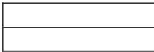
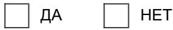

# Бухгалтерская отчетность за январь - март 2025 г.

Организация: Публичное акционерное общество "АМУРКАБЕЛЬ" по ОКПО Идентификационный номер налогоплательщика ИНН 2702011416 Организационно-правовая формаПубличные акционерные общества по ОКОПФ 12247 Форма собственности Частная собственность по ОКФС 16

Адрес в пределах места нахождения 115563, Москва г, Борисовский проезд, дом 17, корпус 1, офис СТРОЕНИЕ2

Бухгалтерская отчетность подлежит обязательному аудиту

Наименование аудиторской организации, проводившей обязательный аудит

Идентификационный номер налогоплательщика аудиторской организации ИНН Основной государственный регистрационный номер аудиторской организации ОГРН

Бухгалтерская отчетность подлежит утверждению

Наименование органа, утверждающего бухгалтерскую отчетность

# Бухгалтерский баланс на 31 марта 2025 г.

Организация: Публичное акционерное общество "АМУРКАБЕЛЬ" Единица измерения тыс. руб.

<table><tr><td colspan="1" rowspan="1">Пояснения</td><td colspan="1" rowspan="1">Наименование показателя</td><td colspan="1" rowspan="1">Код</td><td colspan="1" rowspan="1">На 31 марта2025 г.</td><td colspan="1" rowspan="1">На 31 декабря2024 г.</td><td colspan="1" rowspan="1">На 31 декабря2023 г.</td></tr><tr><td colspan="1" rowspan="1"></td><td colspan="1" rowspan="1">АКТИВI. Внеоборотные активыФудвил</td><td colspan="1" rowspan="1">1105</td><td colspan="1" rowspan="1"></td><td colspan="1" rowspan="1"></td><td colspan="1" rowspan="1"></td></tr><tr><td colspan="1" rowspan="1"></td><td colspan="1" rowspan="1">Нематериальные активы</td><td colspan="1" rowspan="1">1110</td><td colspan="1" rowspan="1"></td><td colspan="1" rowspan="1"></td><td colspan="1" rowspan="1"></td></tr><tr><td colspan="1" rowspan="1"></td><td colspan="1" rowspan="1">Нематериальные поисковые активы</td><td colspan="1" rowspan="1">1130</td><td colspan="1" rowspan="1"></td><td colspan="1" rowspan="1">-</td><td colspan="1" rowspan="1"></td></tr><tr><td colspan="1" rowspan="1"></td><td colspan="1" rowspan="1">Материальные поисковые активы</td><td colspan="1" rowspan="1">1140</td><td colspan="1" rowspan="1"></td><td colspan="1" rowspan="1">-</td><td colspan="1" rowspan="1">-</td></tr><tr><td colspan="1" rowspan="1"></td><td colspan="1" rowspan="1">Основные средства</td><td colspan="1" rowspan="1">1150</td><td colspan="1" rowspan="1">1 054</td><td colspan="1" rowspan="1">1 054</td><td colspan="1" rowspan="1">1 054</td></tr><tr><td colspan="1" rowspan="1"></td><td colspan="1" rowspan="1">Инвестиционная недвижимость</td><td colspan="1" rowspan="1">1160</td><td colspan="1" rowspan="1"></td><td colspan="1" rowspan="1"></td><td colspan="1" rowspan="1">-</td></tr><tr><td colspan="1" rowspan="1"></td><td colspan="1" rowspan="1">Финансовые вложения</td><td colspan="1" rowspan="1">1170</td><td colspan="1" rowspan="1"></td><td colspan="1" rowspan="1"></td><td colspan="1" rowspan="1"></td></tr><tr><td colspan="1" rowspan="1"></td><td colspan="1" rowspan="1">Отложенные налоговые активы</td><td colspan="1" rowspan="1">1180</td><td colspan="1" rowspan="1"></td><td colspan="1" rowspan="1"></td><td colspan="1" rowspan="1">-</td></tr><tr><td colspan="1" rowspan="1"></td><td colspan="1" rowspan="1">Прочие внеоборотные активы</td><td colspan="1" rowspan="1">1190</td><td colspan="1" rowspan="1"></td><td colspan="1" rowspan="1">-</td><td colspan="1" rowspan="1">-</td></tr><tr><td colspan="1" rowspan="1"></td><td colspan="1" rowspan="1">Итого по разделу 1</td><td colspan="1" rowspan="1">1100</td><td colspan="1" rowspan="1">1 054</td><td colspan="1" rowspan="1">1 054</td><td colspan="1" rowspan="1">1 054</td></tr><tr><td colspan="1" rowspan="1"></td><td colspan="1" rowspan="1">II. Оборотные активыЗапасы</td><td colspan="1" rowspan="1">1210</td><td colspan="1" rowspan="1">37 379</td><td colspan="1" rowspan="1">37 379</td><td colspan="1" rowspan="1">37 379</td></tr><tr><td colspan="1" rowspan="1"></td><td colspan="1" rowspan="1">Долгосрочные активы к продаже</td><td colspan="1" rowspan="1">1215</td><td colspan="1" rowspan="1">_</td><td colspan="1" rowspan="1">–</td><td colspan="1" rowspan="1">__</td></tr><tr><td colspan="1" rowspan="1"></td><td colspan="1" rowspan="1">Налог на добавленную стоимость поприобретенным ценностям</td><td colspan="1" rowspan="1">1220</td><td colspan="1" rowspan="1"></td><td colspan="1" rowspan="1"></td><td colspan="1" rowspan="1"></td></tr><tr><td colspan="1" rowspan="1"></td><td colspan="1" rowspan="1">НДС, начисленный по отгрузке</td><td colspan="1" rowspan="1">1220</td><td colspan="1" rowspan="1">__</td><td colspan="1" rowspan="1">__</td><td colspan="1" rowspan="1">___</td></tr><tr><td colspan="1" rowspan="1"></td><td colspan="1" rowspan="1">Дебиторская задолженность</td><td colspan="1" rowspan="1">1230</td><td colspan="1" rowspan="1">42 883</td><td colspan="1" rowspan="1">43 091</td><td colspan="1" rowspan="1">42859</td></tr><tr><td colspan="1" rowspan="1"></td><td colspan="1" rowspan="1">Финансовые вложения (за исключениемденежных эквивалентов)</td><td colspan="1" rowspan="1">1240</td><td colspan="1" rowspan="1"></td><td colspan="1" rowspan="1"></td><td colspan="1" rowspan="1">-</td></tr><tr><td colspan="1" rowspan="1"></td><td colspan="1" rowspan="1">Денежные средства и денежныеэквиваленты</td><td colspan="1" rowspan="1">1250</td><td colspan="1" rowspan="1">29</td><td colspan="1" rowspan="1">57</td><td colspan="1" rowspan="1">74</td></tr><tr><td colspan="1" rowspan="1"></td><td colspan="1" rowspan="1">Прочие оборотные активы</td><td colspan="1" rowspan="1">1260</td><td colspan="1" rowspan="1">57 165</td><td colspan="1" rowspan="1">53 866</td><td colspan="1" rowspan="1">41 239</td></tr><tr><td colspan="1" rowspan="1"></td><td colspan="1" rowspan="1">Итого по разделу II</td><td colspan="1" rowspan="1">1200</td><td colspan="1" rowspan="1">137 456</td><td colspan="1" rowspan="1">134 393</td><td colspan="1" rowspan="1">121 551</td></tr><tr><td colspan="1" rowspan="1"></td><td colspan="1" rowspan="1">БАЛАНС</td><td colspan="1" rowspan="1">1600</td><td colspan="1" rowspan="1">138510</td><td colspan="1" rowspan="1">135 447</td><td colspan="1" rowspan="1">122 605</td></tr><tr><td colspan="1" rowspan="1"></td><td colspan="1" rowspan="1">ПАССИВIII. КапиталУставный капитал</td><td colspan="1" rowspan="1">1310</td><td colspan="1" rowspan="1">139</td><td colspan="1" rowspan="1">139</td><td colspan="1" rowspan="1">139</td></tr><tr><td colspan="1" rowspan="1"></td><td colspan="1" rowspan="1">Собственные акции, принадлежащиеобществу, задолженность акционеров пооплате акций</td><td colspan="1" rowspan="1">1320</td><td colspan="1" rowspan="1"></td><td colspan="1" rowspan="1"></td><td colspan="1" rowspan="1">-</td></tr><tr><td colspan="1" rowspan="1"></td><td colspan="1" rowspan="1">Накопленная дооценка внеоборотныхактивов</td><td colspan="1" rowspan="1">1340</td><td colspan="1" rowspan="1"></td><td colspan="1" rowspan="1"></td><td colspan="1" rowspan="1"></td></tr><tr><td colspan="1" rowspan="1"></td><td colspan="1" rowspan="1">Добавочный капитал (без накопленнойдооценки)</td><td colspan="1" rowspan="1">1350</td><td colspan="1" rowspan="1">20612</td><td colspan="1" rowspan="1">20612</td><td colspan="1" rowspan="1">20 612</td></tr><tr><td colspan="1" rowspan="1"></td><td colspan="1" rowspan="1">Резервный капитал</td><td colspan="1" rowspan="1">1360</td><td colspan="1" rowspan="1">35</td><td colspan="1" rowspan="1">35</td><td colspan="1" rowspan="1">35</td></tr><tr><td colspan="1" rowspan="1"></td><td colspan="1" rowspan="1">Нераспределенная прибыль (непокрытыйубыток)</td><td colspan="1" rowspan="1">1370</td><td colspan="1" rowspan="1">(29 026)</td><td colspan="1" rowspan="1">(29 012)</td><td colspan="1" rowspan="1">(28 937)</td></tr><tr><td colspan="1" rowspan="1"></td><td colspan="1" rowspan="1">Итого по разделу II</td><td colspan="1" rowspan="1">1300</td><td colspan="1" rowspan="1">(8241)</td><td colspan="1" rowspan="1">(8 226)</td><td colspan="1" rowspan="1">(8 151)</td></tr><tr><td colspan="1" rowspan="1"></td><td colspan="1" rowspan="1">IⅣ. Долгосрочные обязательстваЗаемные средства</td><td colspan="1" rowspan="1">1410</td><td colspan="1" rowspan="1"></td><td colspan="1" rowspan="1"></td><td colspan="1" rowspan="1"></td></tr><tr><td colspan="1" rowspan="1"></td><td colspan="1" rowspan="1">_</td><td colspan="1" rowspan="1">1410</td><td colspan="1" rowspan="1">142 653</td><td colspan="1" rowspan="1">140 503</td><td colspan="1" rowspan="1">128 083</td></tr><tr><td colspan="1" rowspan="1"></td><td colspan="1" rowspan="1">Отложенные налоговые обязательства</td><td colspan="1" rowspan="1">1420</td><td colspan="1" rowspan="1">-</td><td colspan="1" rowspan="1">-</td><td colspan="1" rowspan="1"></td></tr><tr><td colspan="1" rowspan="1"></td><td colspan="1" rowspan="1">Оценочные обязательства</td><td colspan="1" rowspan="1">1430</td><td colspan="1" rowspan="1">__</td><td colspan="1" rowspan="1">__</td><td colspan="1" rowspan="1"></td></tr><tr><td colspan="1" rowspan="1"></td><td colspan="1" rowspan="1">Прочие долгосрочные обязательства</td><td colspan="1" rowspan="1">1450</td><td colspan="1" rowspan="1">-</td><td colspan="1" rowspan="1">-</td><td colspan="1" rowspan="1"></td></tr><tr><td colspan="1" rowspan="1"></td><td colspan="1" rowspan="1">Итого по разделу IV</td><td colspan="1" rowspan="1">1400</td><td colspan="1" rowspan="1">142 653</td><td colspan="1" rowspan="1">140 503</td><td colspan="1" rowspan="1">128 083</td></tr><tr><td colspan="1" rowspan="1"></td><td colspan="1" rowspan="1">V. Краткосрочные обязательстваЗаемные средства</td><td colspan="1" rowspan="1">1510</td><td colspan="1" rowspan="1"></td><td colspan="1" rowspan="1">-</td><td colspan="1" rowspan="1"></td></tr><tr><td colspan="1" rowspan="1"></td><td colspan="1" rowspan="1">Кредиторская задолженность</td><td colspan="1" rowspan="1">1520</td><td colspan="1" rowspan="1">4098</td><td colspan="1" rowspan="1">3170</td><td colspan="1" rowspan="1">2673</td></tr><tr><td colspan="1" rowspan="1"></td><td colspan="1" rowspan="1">Обязательство по аренде</td><td colspan="1" rowspan="1">1520</td><td colspan="1" rowspan="1">-</td><td colspan="1" rowspan="1">__</td><td colspan="1" rowspan="1">-</td></tr><tr><td colspan="1" rowspan="1"></td><td colspan="1" rowspan="1">Доходы будущих периодов</td><td colspan="1" rowspan="1">1530</td><td colspan="1" rowspan="1"></td><td colspan="1" rowspan="1">_____</td><td colspan="1" rowspan="1">_</td></tr><tr><td colspan="1" rowspan="1"></td><td colspan="1" rowspan="1">Оценочные обязательства</td><td colspan="1" rowspan="1">1540</td><td colspan="1" rowspan="1">___</td><td colspan="1" rowspan="1">___</td><td colspan="1" rowspan="1">-</td></tr><tr><td colspan="1" rowspan="1"></td><td colspan="1" rowspan="1">Прочие краткосрочные обязательства</td><td colspan="1" rowspan="1">1550</td><td colspan="1" rowspan="1"></td><td colspan="1" rowspan="1">_____</td><td colspan="1" rowspan="1">-</td></tr><tr><td colspan="1" rowspan="1"></td><td colspan="1" rowspan="1">Итого по разделу V</td><td colspan="1" rowspan="1">1500</td><td colspan="1" rowspan="1">4098</td><td colspan="1" rowspan="1">3170</td><td colspan="1" rowspan="1">2673</td></tr><tr><td colspan="1" rowspan="1"></td><td colspan="1" rowspan="1">БАЛАНС</td><td colspan="1" rowspan="1">1700</td><td colspan="1" rowspan="1">138510</td><td colspan="1" rowspan="1">135 447</td><td colspan="1" rowspan="1">122 605</td></tr></table>

# Генеральный директор

(наименование должности)

# Мусин Радик Мансурович

15 апреля 2025 г.

# Отчет о финансовых результатах за январь - март 2025 г.

Организация: Публичное акционерное общество "АМУРКАБЕЛЬ" Единица измерения тыс. руб.

<table><tr><td rowspan=1 colspan=1>Пояснения</td><td rowspan=1 colspan=1>Наименование показателя</td><td rowspan=1 colspan=1>Код</td><td rowspan=1 colspan=1>За январь - март2025 г.</td><td rowspan=1 colspan=1>За январь - март2024 г.</td></tr><tr><td rowspan=1 colspan=1></td><td rowspan=1 colspan=1>Выручка</td><td rowspan=1 colspan=1>2110</td><td rowspan=1 colspan=1></td><td rowspan=1 colspan=1></td></tr><tr><td rowspan=1 colspan=1></td><td rowspan=1 colspan=1>Себестоимость продаж</td><td rowspan=1 colspan=1>2120</td><td rowspan=1 colspan=1></td><td rowspan=1 colspan=1></td></tr><tr><td rowspan=1 colspan=1></td><td rowspan=1 colspan=1>Валовая прибыль (убыток)</td><td rowspan=1 colspan=1>2100</td><td rowspan=1 colspan=1></td><td rowspan=1 colspan=1></td></tr><tr><td rowspan=1 colspan=1></td><td rowspan=1 colspan=1>Коммерческие расходы</td><td rowspan=1 colspan=1>2210</td><td rowspan=1 colspan=1></td><td rowspan=1 colspan=1></td></tr><tr><td rowspan=1 colspan=1></td><td rowspan=1 colspan=1>Управленческие расходы</td><td rowspan=1 colspan=1>2220</td><td rowspan=1 colspan=1></td><td rowspan=1 colspan=1></td></tr><tr><td rowspan=1 colspan=1></td><td rowspan=1 colspan=1>Прибыль (убыток) от продаж</td><td rowspan=1 colspan=1>2200</td><td rowspan=1 colspan=1></td><td rowspan=1 colspan=1></td></tr><tr><td rowspan=1 colspan=1></td><td rowspan=1 colspan=1>Доходы от участия в других организациях</td><td rowspan=1 colspan=1>2310</td><td rowspan=1 colspan=1></td><td rowspan=1 colspan=1></td></tr><tr><td rowspan=1 colspan=1></td><td rowspan=1 colspan=1>Проценты к получению</td><td rowspan=1 colspan=1>2320</td><td rowspan=1 colspan=1></td><td rowspan=1 colspan=1></td></tr><tr><td rowspan=1 colspan=1></td><td rowspan=1 colspan=1>Проценты к уплате</td><td rowspan=1 colspan=1>2330</td><td rowspan=1 colspan=1></td><td rowspan=1 colspan=1></td></tr><tr><td rowspan=1 colspan=1></td><td rowspan=1 colspan=1>Прочие доходы</td><td rowspan=1 colspan=1>2340</td><td rowspan=1 colspan=1></td><td rowspan=1 colspan=1></td></tr><tr><td rowspan=1 colspan=1></td><td rowspan=1 colspan=1>в том числе:Операции с инструментами финансового рынка</td><td rowspan=1 colspan=1></td><td rowspan=1 colspan=1></td><td rowspan=1 colspan=1></td></tr><tr><td rowspan=1 colspan=1></td><td rowspan=1 colspan=1>Сдача имущества в аренду или субаренду</td><td rowspan=1 colspan=1></td><td rowspan=1 colspan=1></td><td rowspan=1 colspan=1></td></tr><tr><td rowspan=1 colspan=1></td><td rowspan=1 colspan=1>Реализация и ликвидация внеоборотных активов</td><td rowspan=1 colspan=1></td><td rowspan=1 colspan=1></td><td rowspan=1 colspan=1></td></tr><tr><td rowspan=1 colspan=1></td><td rowspan=1 colspan=1>Реализация иного имущества, прав требования,прочих работ и услуг</td><td rowspan=1 colspan=1></td><td rowspan=1 colspan=1></td><td rowspan=1 colspan=1></td></tr><tr><td rowspan=1 colspan=1></td><td rowspan=1 colspan=1>Результаты инвентаризации</td><td rowspan=1 colspan=1></td><td rowspan=1 colspan=1></td><td rowspan=1 colspan=1></td></tr><tr><td rowspan=1 colspan=1></td><td rowspan=1 colspan=1>Иная операционная деятельность</td><td rowspan=1 colspan=1></td><td rowspan=1 colspan=1></td><td rowspan=1 colspan=1></td></tr><tr><td rowspan=1 colspan=1></td><td rowspan=1 colspan=1>Курсовые разницы</td><td rowspan=1 colspan=1></td><td rowspan=1 colspan=1></td><td rowspan=1 colspan=1></td></tr><tr><td rowspan=1 colspan=1></td><td rowspan=1 colspan=1>Прочие расходы</td><td rowspan=1 colspan=1>2350</td><td rowspan=1 colspan=1>(15)</td><td rowspan=1 colspan=1>(12)</td></tr><tr><td rowspan=1 colspan=1></td><td rowspan=1 colspan=1>в том числе:Операции с инструментами финансового рынка</td><td rowspan=1 colspan=1></td><td rowspan=1 colspan=1></td><td rowspan=1 colspan=1></td></tr><tr><td rowspan=1 colspan=1></td><td rowspan=1 colspan=1>Сдача имущества в аренду или субаренду</td><td rowspan=1 colspan=1></td><td rowspan=1 colspan=1></td><td rowspan=1 colspan=1></td></tr><tr><td rowspan=1 colspan=1></td><td rowspan=1 colspan=1>Реализация и ликвидация внеоборотных активов</td><td rowspan=1 colspan=1></td><td rowspan=1 colspan=1></td><td rowspan=1 colspan=1></td></tr><tr><td rowspan=1 colspan=1></td><td rowspan=1 colspan=1>Расходы от снижения стоимости активов</td><td rowspan=1 colspan=1></td><td rowspan=1 colspan=1></td><td rowspan=1 colspan=1></td></tr><tr><td rowspan=1 colspan=1></td><td rowspan=1 colspan=1>Отчисления в оценочные резервы</td><td rowspan=1 colspan=1></td><td rowspan=1 colspan=1></td><td rowspan=1 colspan=1></td></tr><tr><td rowspan=1 colspan=1></td><td rowspan=1 colspan=1>Реализация иного имущества, прав требования,прочих работ и услуг</td><td rowspan=1 colspan=1></td><td rowspan=1 colspan=1></td><td rowspan=1 colspan=1></td></tr><tr><td rowspan=1 colspan=1></td><td rowspan=1 colspan=1>Результаты инвентаризации</td><td rowspan=1 colspan=1></td><td rowspan=1 colspan=1></td><td rowspan=1 colspan=1></td></tr><tr><td rowspan=1 colspan=1></td><td rowspan=1 colspan=1>Иная операционная деятельность</td><td rowspan=1 colspan=1></td><td rowspan=1 colspan=1>(15)</td><td rowspan=1 colspan=1>(12)</td></tr><tr><td rowspan=1 colspan=1></td><td rowspan=1 colspan=1>Курсовые разницы</td><td rowspan=1 colspan=1></td><td rowspan=1 colspan=1></td><td rowspan=1 colspan=1></td></tr><tr><td rowspan=1 colspan=1></td><td rowspan=1 colspan=1>Прибыль (убыток) от продолжающейсядеятельности до налогообложения</td><td rowspan=1 colspan=1>2300</td><td rowspan=1 colspan=1>(15)</td><td rowspan=1 colspan=1>(12)</td></tr><tr><td rowspan=1 colspan=1></td><td rowspan=1 colspan=1>Налог на прибыль организаций</td><td rowspan=1 colspan=1>2410</td><td rowspan=1 colspan=1></td><td rowspan=1 colspan=1></td></tr><tr><td rowspan=1 colspan=1></td><td rowspan=1 colspan=1>в том числе:текущий налог на прибыль организаций</td><td rowspan=1 colspan=1>2411</td><td rowspan=1 colspan=1></td><td rowspan=1 colspan=1></td></tr><tr><td rowspan=1 colspan=1></td><td rowspan=1 colspan=1>отложенный налог на прибыль организаций</td><td rowspan=1 colspan=1>2412</td><td rowspan=1 colspan=1></td><td rowspan=1 colspan=1></td></tr><tr><td rowspan=1 colspan=1></td><td rowspan=1 colspan=1>Налог при упрощенной системе налогообложения</td><td rowspan=1 colspan=1>2410</td><td rowspan=1 colspan=1></td><td rowspan=1 colspan=1></td></tr><tr><td rowspan=1 colspan=1></td><td rowspan=1 colspan=1>Прибыль (убыток) от прекращаемой деятельности (завычетом относящегося к ней налога на прибыльорганизаций)</td><td rowspan=1 colspan=1>2420</td><td rowspan=1 colspan=1></td><td rowspan=1 colspan=1></td></tr><tr><td rowspan=1 colspan=1></td><td rowspan=1 colspan=1>в том числе:Прибыль (убыток) от прекращаемой деятельности</td><td rowspan=1 colspan=1></td><td rowspan=1 colspan=1></td><td rowspan=1 colspan=1></td></tr><tr><td rowspan=1 colspan=1></td><td rowspan=1 colspan=1>Налог на прибыль, относящийся к прекращаемойдеятельности</td><td rowspan=1 colspan=1></td><td rowspan=1 colspan=1></td><td rowspan=1 colspan=1></td></tr><tr><td rowspan=1 colspan=1></td><td rowspan=1 colspan=1>Прочее</td><td rowspan=1 colspan=1>2460</td><td rowspan=1 colspan=1></td><td rowspan=1 colspan=1></td></tr><tr><td rowspan=1 colspan=1></td><td rowspan=1 colspan=1>Чистая прибыль (убыток)</td><td rowspan=1 colspan=1>2400</td><td rowspan=1 colspan=1>(15)</td><td rowspan=1 colspan=1>(12)</td></tr></table>