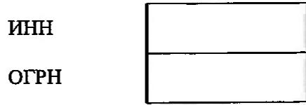
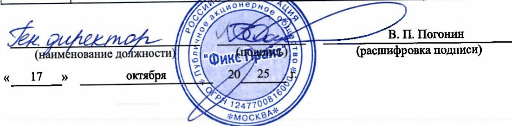
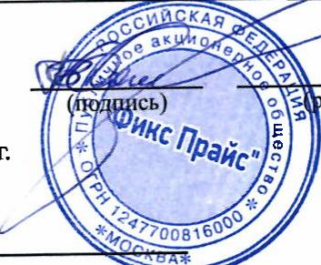

# ЭрганИЗациЯ ПУБЛИЧНОЕ АКЦИОНЕРНОЕ ОБЩЕСТВО "ФИКС ПРАЙС"

по ОКПО ИHH по ОКОПФ по ОКФС

<table><tr><td>80273858</td></tr><tr><td>7743462664</td></tr><tr><td>12247</td></tr><tr><td>23</td></tr></table>

Бухгалтерская отчетность подлежит обязательному аудиту

Наименование аудиторской организации,проводившей обязательный аудiт

Идентификационный номер налогоплательщика   
аудиторской организации   
Основной государственный регистрационный номер   
аудиторской организации

Бухгалтерская отчетность подлежит утверждению

Наименование органа, утверждающего бухгалтерскую отчетность Совет директоров

ОрганИЗациЯ ПУБЛИЧНОЕ АКЦИОНЕРНОЕ ОБЩЕСТВО "ФИКС ПРАЙС"

Единица измерения: тыс. руб.

<table><tr><td rowspan=1 colspan=1>Пояснения</td><td rowspan=1 colspan=1>Наименование показателя</td><td rowspan=1 colspan=1>Код</td><td rowspan=1 colspan=1>на 30 сентября2025 r.2</td><td rowspan=1 colspan=1>на 31 декабря2024г.3</td><td rowspan=1 colspan=1>на 31 декабря2023 r:4</td></tr><tr><td rowspan=1 colspan=1></td><td rowspan=1 colspan=1>АКТИВI. Внеоборотные активыНематериальные активы</td><td rowspan=1 colspan=1>1110</td><td rowspan=1 colspan=1></td><td rowspan=1 colspan=1></td><td rowspan=1 colspan=1></td></tr><tr><td rowspan=1 colspan=1></td><td rowspan=1 colspan=1>Основные средства</td><td rowspan=1 colspan=1>1150</td><td rowspan=1 colspan=1></td><td rowspan=1 colspan=1></td><td rowspan=1 colspan=1></td></tr><tr><td rowspan=1 colspan=1></td><td rowspan=1 colspan=1>Инвестиционная недвижимость</td><td rowspan=1 colspan=1>1160</td><td rowspan=1 colspan=1></td><td rowspan=1 colspan=1></td><td rowspan=1 colspan=1></td></tr><tr><td rowspan=1 colspan=1>4,15</td><td rowspan=1 colspan=1>Финансовые вложения</td><td rowspan=1 colspan=1>1170</td><td rowspan=1 colspan=1>172214114</td><td rowspan=1 colspan=1>0</td><td rowspan=1 colspan=1>о</td></tr><tr><td rowspan=1 colspan=1>10</td><td rowspan=1 colspan=1>Отложенные налоговые активы</td><td rowspan=1 colspan=1>1180</td><td rowspan=1 colspan=1>8286</td><td rowspan=1 colspan=1>о</td><td rowspan=1 colspan=1>0</td></tr><tr><td rowspan=1 colspan=1></td><td rowspan=1 colspan=1>Прочие внеоборотные активы</td><td rowspan=1 colspan=1>1190</td><td rowspan=1 colspan=1></td><td rowspan=1 colspan=1></td><td rowspan=1 colspan=1></td></tr><tr><td rowspan=1 colspan=1></td><td rowspan=1 colspan=1>Итого по разделу I</td><td rowspan=1 colspan=1>1100</td><td rowspan=1 colspan=1>172222400</td><td rowspan=1 colspan=1>0</td><td rowspan=1 colspan=1>0</td></tr><tr><td rowspan=1 colspan=1></td><td rowspan=1 colspan=1>II. Оборотные активыЗапасы</td><td rowspan=1 colspan=1>1210</td><td rowspan=1 colspan=1></td><td rowspan=1 colspan=1></td><td rowspan=1 colspan=1></td></tr><tr><td rowspan=1 colspan=1></td><td rowspan=1 colspan=1>Долгосрочные активы к продаже</td><td rowspan=1 colspan=1>1215</td><td rowspan=1 colspan=1></td><td rowspan=1 colspan=1></td><td rowspan=1 colspan=1></td></tr><tr><td rowspan=1 colspan=1></td><td rowspan=1 colspan=1>Налог на добавленную стоимость поприобретенным ценностям</td><td rowspan=1 colspan=1>1220</td><td rowspan=1 colspan=1>5051</td><td rowspan=1 colspan=1>0</td><td rowspan=1 colspan=1>0</td></tr><tr><td rowspan=1 colspan=1>6</td><td rowspan=1 colspan=1>Дебиторская задолженность</td><td rowspan=1 colspan=1>1230</td><td rowspan=1 colspan=1>784</td><td rowspan=1 colspan=1>0</td><td rowspan=1 colspan=1>о</td></tr><tr><td rowspan=1 colspan=1></td><td rowspan=1 colspan=1>Финансовые вложения (заисключением денежныхэквивалентов)</td><td rowspan=1 colspan=1>1240</td><td rowspan=1 colspan=1></td><td rowspan=1 colspan=1></td><td rowspan=1 colspan=1></td></tr><tr><td rowspan=1 colspan=1>9</td><td rowspan=1 colspan=1>Денежные средства и денежныеэквиваленты</td><td rowspan=1 colspan=1>1250</td><td rowspan=1 colspan=1>2140</td><td rowspan=1 colspan=1>о</td><td rowspan=1 colspan=1>0</td></tr><tr><td rowspan=1 colspan=1>7</td><td rowspan=1 colspan=1>Прочие оборотные активы</td><td rowspan=1 colspan=1>1260</td><td rowspan=1 colspan=1>21</td><td rowspan=1 colspan=1>0</td><td rowspan=1 colspan=1>0</td></tr><tr><td rowspan=1 colspan=1></td><td rowspan=1 colspan=1>Итого по разделу II</td><td rowspan=1 colspan=1>1200</td><td rowspan=1 colspan=1>7996</td><td rowspan=1 colspan=1>0</td><td rowspan=1 colspan=1>о</td></tr><tr><td rowspan=1 colspan=1>____</td><td rowspan=1 colspan=1>БАЛАHC</td><td rowspan=1 colspan=1>1600</td><td rowspan=1 colspan=1>172230396</td><td rowspan=1 colspan=1>0</td><td rowspan=1 colspan=1>0</td></tr></table>

Форма 0710001 с. 2   

<table><tr><td rowspan=1 colspan=1>Пояснения</td><td rowspan=1 colspan=1>Наименование показателя</td><td rowspan=1 colspan=1>Код</td><td rowspan=1 colspan=1>на 30 сентября2025 r.2</td><td rowspan=1 colspan=1>на 31 декабря2024г.3</td><td rowspan=1 colspan=1>на 31 декабря2023 .4</td></tr><tr><td rowspan=1 colspan=1>8</td><td rowspan=1 colspan=1>ПАССИВШ. КапиталУставный капитал</td><td rowspan=1 colspan=1>1310</td><td rowspan=1 colspan=1>100000</td><td rowspan=1 colspan=1>0</td><td rowspan=1 colspan=1>0</td></tr><tr><td rowspan=1 colspan=1></td><td rowspan=1 colspan=1>Собственные акции, принадлежащиеобществу, задолженность акционеровпо оплате акций</td><td rowspan=1 colspan=1>1320</td><td rowspan=1 colspan=1></td><td rowspan=1 colspan=1></td><td rowspan=1 colspan=1></td></tr><tr><td rowspan=1 colspan=1></td><td rowspan=1 colspan=1>Накопленная дооценка внеоборотныхактивов</td><td rowspan=1 colspan=1>1340</td><td rowspan=1 colspan=1></td><td rowspan=1 colspan=1></td><td rowspan=1 colspan=1></td></tr><tr><td rowspan=1 colspan=1>8</td><td rowspan=1 colspan=1>Добавочный капитал (безнакопленной дооценки)</td><td rowspan=1 colspan=1>1350</td><td rowspan=1 colspan=1>172114214</td><td rowspan=1 colspan=1>0</td><td rowspan=1 colspan=1>0</td></tr><tr><td rowspan=1 colspan=1></td><td rowspan=1 colspan=1>Резервный капитал</td><td rowspan=1 colspan=1>1360</td><td rowspan=1 colspan=1></td><td rowspan=1 colspan=1></td><td rowspan=1 colspan=1></td></tr><tr><td rowspan=1 colspan=1></td><td rowspan=1 colspan=1>Нераспределенная прибыль(непокрытый убыток)</td><td rowspan=1 colspan=1>1370</td><td rowspan=1 colspan=1>(24868)</td><td rowspan=1 colspan=1>о</td><td rowspan=1 colspan=1>0</td></tr><tr><td></td><td rowspan=2 colspan=1>Итого по разделу III</td><td rowspan=2 colspan=1>1300</td><td rowspan=2 colspan=1>172189346</td><td rowspan=2 colspan=1>0</td><td rowspan=2 colspan=1>0</td></tr><tr><td rowspan=1 colspan=1></td></tr><tr><td rowspan=1 colspan=1></td><td rowspan=1 colspan=1>IV. Долгосрочные обязательстваЗаемные средства</td><td rowspan=1 colspan=1>1410</td><td rowspan=1 colspan=1>о</td><td rowspan=1 colspan=1>0</td><td rowspan=1 colspan=1>0</td></tr><tr><td></td><td rowspan=2 colspan=1>Отложенные налоговые обязательства</td><td rowspan=2 colspan=1>1420</td><td rowspan=2 colspan=1></td><td rowspan=2 colspan=1></td><td rowspan=2 colspan=1></td></tr><tr><td rowspan=1 colspan=1></td></tr><tr><td></td><td rowspan=2 colspan=1>Оценочные обязательства</td><td rowspan=2 colspan=1>1430</td><td rowspan=2 colspan=1></td><td rowspan=2 colspan=1></td><td rowspan=2 colspan=1></td></tr><tr><td rowspan=1 colspan=1></td></tr><tr><td></td><td rowspan=2 colspan=1>Прочие долгосрочные обязательства</td><td rowspan=2 colspan=1>1450</td><td rowspan=2 colspan=1></td><td rowspan=2 colspan=1></td><td rowspan=2 colspan=1></td></tr><tr><td rowspan=1 colspan=1></td></tr><tr><td></td><td rowspan=2 colspan=1>Итого по разделу IV</td><td rowspan=2 colspan=1>1400</td><td rowspan=2 colspan=1>0</td><td rowspan=2 colspan=1>0</td><td rowspan=2 colspan=1>0</td></tr><tr><td rowspan=1 colspan=1></td></tr><tr><td rowspan=1 colspan=1>10</td><td rowspan=1 colspan=1>V. Краткосрочные обязательстваЗаемные средства</td><td rowspan=1 colspan=1>1510</td><td rowspan=1 colspan=1>40542</td><td rowspan=1 colspan=1>0</td><td rowspan=1 colspan=1>0</td></tr><tr><td></td><td rowspan=2 colspan=1>Кредиторская задолженность</td><td rowspan=2 colspan=1>1520</td><td rowspan=2 colspan=1>508</td><td rowspan=2 colspan=1>0</td><td rowspan=2 colspan=1>0</td></tr><tr><td rowspan=1 colspan=1>12</td></tr><tr><td></td><td></td><td rowspan=2 colspan=1>1540</td><td rowspan=2 colspan=1></td><td rowspan=2 colspan=1></td><td rowspan=2 colspan=1></td></tr><tr><td rowspan=1 colspan=1></td><td rowspan=1 colspan=1>Оценочные обязательства</td></tr><tr><td></td><td rowspan=2 colspan=1>Прочие краткосрочные обязательства</td><td rowspan=2 colspan=1>1550</td><td rowspan=2 colspan=1></td><td rowspan=2 colspan=1></td><td rowspan=2 colspan=1></td></tr><tr><td rowspan=1 colspan=1></td></tr><tr><td></td><td rowspan=2 colspan=1>Итого по разделу</td><td rowspan=2 colspan=1>1500</td><td rowspan=2 colspan=1>41050</td><td rowspan=2 colspan=1>0</td><td rowspan=2 colspan=1>0</td></tr><tr><td rowspan=1 colspan=1></td></tr><tr><td rowspan=1 colspan=1>___</td><td rowspan=1 colspan=1>БАЛАНС</td><td rowspan=1 colspan=1>1700</td><td rowspan=1 colspan=1>172230396</td><td rowspan=1 colspan=1>0</td><td rowspan=1 colspan=1>0</td></tr></table>

POCCИЙCKАЯ Тен дурехто (найменование должности) (подниев «17» октября Фикс Прайс

# В. П. Погонин

(расшифровка подписи)

Единица измерения: тыс. руб.

<table><tr><td rowspan=1 colspan=1>Пояснения</td><td rowspan=1 colspan=1>Наименование показателя</td><td rowspan=1 colspan=1>Код</td><td rowspan=1 colspan=1>За 9 месяцев 2025 г.2</td><td rowspan=1 colspan=1>За 9 месяцев 2024 г.3</td></tr><tr><td></td><td rowspan=2 colspan=1>Выручка</td><td rowspan=2 colspan=1>2110</td><td rowspan=2 colspan=1>0</td><td rowspan=2 colspan=1>0</td></tr><tr><td rowspan=1 colspan=1>16</td></tr><tr><td></td><td rowspan=2 colspan=1>Себестоимость продаж</td><td rowspan=2 colspan=1>2120</td><td rowspan=2 colspan=1>(0)</td><td rowspan=2 colspan=1>(0)</td></tr><tr><td rowspan=1 colspan=1>17</td></tr><tr><td></td><td rowspan=2 colspan=1>Валовая прибыль (убыток)</td><td rowspan=2 colspan=1>2100</td><td rowspan=2 colspan=1>0</td><td rowspan=2 colspan=1>0</td></tr><tr><td rowspan=1 colspan=1></td></tr><tr><td></td><td rowspan=2 colspan=1>Коммерческие расходы</td><td rowspan=2 colspan=1>2210</td><td rowspan=2 colspan=1>(0)</td><td rowspan=2 colspan=1>(0)</td></tr><tr><td rowspan=1 colspan=1>18</td></tr><tr><td></td><td rowspan=2 colspan=1>Управленческие расходы</td><td rowspan=2 colspan=1>2220</td><td rowspan=2 colspan=1>(29841)</td><td rowspan=2 colspan=1>(0)</td></tr><tr><td rowspan=1 colspan=1>19</td></tr><tr><td></td><td rowspan=2 colspan=1>Прибыль (убыток) от продаж</td><td rowspan=2 colspan=1>2200</td><td rowspan=2 colspan=1>(29841)</td><td rowspan=2 colspan=1>0</td></tr><tr><td rowspan=1 colspan=1></td></tr><tr><td></td><td rowspan=2 colspan=1>Доходы от участия в других организациях</td><td rowspan=2 colspan=1>2310</td><td rowspan=2 colspan=1></td><td rowspan=2 colspan=1></td></tr><tr><td rowspan=1 colspan=1></td></tr><tr><td></td><td rowspan=2 colspan=1>Проценты к получению</td><td rowspan=2 colspan=1>2320</td><td rowspan=2 colspan=1>0</td><td rowspan=2 colspan=1>0</td></tr><tr><td rowspan=1 colspan=1>20</td></tr><tr><td></td><td rowspan=2 colspan=1>Проценты к уплате</td><td rowspan=2 colspan=1>2330</td><td rowspan=2 colspan=1>(2242)</td><td rowspan=2 colspan=1>(0)</td></tr><tr><td rowspan=1 colspan=1>21</td></tr><tr><td></td><td rowspan=2 colspan=1>Прочие доходы</td><td rowspan=2 colspan=1>2340</td><td rowspan=2 colspan=1>о</td><td rowspan=2 colspan=1>0</td></tr><tr><td rowspan=1 colspan=1>22</td></tr><tr><td></td><td rowspan=2 colspan=1>Прочие расходы</td><td rowspan=2 colspan=1>2350</td><td rowspan=2 colspan=1>(1071)</td><td rowspan=2 colspan=1>(0)</td></tr><tr><td rowspan=1 colspan=1>23</td></tr><tr><td rowspan=1 colspan=1></td><td rowspan=1 colspan=1>Прибыль (убыток) от продолжающейсядеятельности до налогообложения</td><td rowspan=1 colspan=1>2300</td><td rowspan=1 colspan=1>(33154)</td><td rowspan=1 colspan=1>0</td></tr><tr><td></td><td rowspan=2 colspan=1>Налог на прибыль организаций</td><td rowspan=2 colspan=1>2410</td><td rowspan=2 colspan=1>8286</td><td rowspan=2 colspan=1>0</td></tr><tr><td rowspan=1 colspan=1>11</td></tr><tr><td rowspan=1 colspan=1></td><td rowspan=1 colspan=1>в том числе:текущий налог на прибыль организаций</td><td rowspan=1 colspan=1>2411</td><td rowspan=1 colspan=1></td><td rowspan=1 colspan=1></td></tr><tr><td rowspan=1 colspan=1>11</td><td rowspan=1 colspan=1>отложенный налог на прибыльорганизаций</td><td rowspan=1 colspan=1>2412</td><td rowspan=1 colspan=1>8286</td><td rowspan=1 colspan=1>0</td></tr><tr><td></td><td rowspan=2 colspan=1>Прочее</td><td rowspan=2 colspan=1>2460</td><td rowspan=2 colspan=1></td><td rowspan=2 colspan=1></td></tr><tr><td rowspan=1 colspan=1></td></tr><tr><td rowspan=1 colspan=1></td><td rowspan=1 colspan=1>Прибыль (убыток) от прекращаемойдеятельности (за вычетом относящегося к нейналога на прибыль организаций)</td><td rowspan=1 colspan=1>2420</td><td rowspan=1 colspan=1></td><td rowspan=1 colspan=1></td></tr><tr><td rowspan=1 colspan=1></td><td rowspan=1 colspan=1>Чистая прибыль (убыток)</td><td rowspan=1 colspan=1>2400</td><td rowspan=1 colspan=1>(24868)</td><td rowspan=1 colspan=1>0</td></tr></table>

Форма 0710002 с. 2   

<table><tr><td rowspan=1 colspan=1>Пояснения</td><td rowspan=1 colspan=1>Наименование показателя</td><td rowspan=1 colspan=1>Код</td><td rowspan=1 colspan=1>За 9 месяцев 2025 г.2</td><td rowspan=1 colspan=1>За 9 месяцев 2024 г.3</td></tr><tr><td rowspan=1 colspan=1></td><td rowspan=1 colspan=1>Результат переоценки внеоборотных активов,не включаемый в чистую прибыль (убыток)</td><td rowspan=1 colspan=1>2510</td><td rowspan=1 colspan=1></td><td rowspan=1 colspan=1></td></tr><tr><td rowspan=1 colspan=1></td><td rowspan=1 colspan=1>Результат прочих операций, не включаемый вчистую прибыль (убыток)</td><td rowspan=1 colspan=1>2520</td><td rowspan=1 colspan=1></td><td rowspan=1 colspan=1></td></tr><tr><td rowspan=1 colspan=1></td><td rowspan=1 colspan=1>Налог на прибыль организаций, относящийся крезультатам переоценки внеоборотных активови прочих операций, не включаемых в чистуюприбыль (убыток)</td><td rowspan=1 colspan=1>2530</td><td rowspan=1 colspan=1></td><td rowspan=1 colspan=1></td></tr><tr><td rowspan=1 colspan=1></td><td rowspan=1 colspan=1>Совокупный финансовый результат</td><td rowspan=1 colspan=1>2500</td><td rowspan=1 colspan=1>(24868)</td><td rowspan=1 colspan=1>0</td></tr><tr><td rowspan=1 colspan=1></td><td rowspan=1 colspan=1>Базовая прибыль (убыток) на акцию, руб. коп.</td><td rowspan=1 colspan=1>2900</td><td rowspan=1 colspan=1>0</td><td rowspan=1 colspan=1>0</td></tr><tr><td rowspan=1 colspan=1></td><td rowspan=1 colspan=1>Разводненная прибыль (убыток) на акцию, руб,КОП.                    ИЙСКАЯ ФЕЛ</td><td rowspan=1 colspan=1>2910</td><td rowspan=1 colspan=1></td><td rowspan=1 colspan=1></td></tr></table>

# B. П. Погонин

Тен директор (найменование доджности) "Фикс(Прайоь)   
«_17» октября 20 MOCKBA

(распифровка подписи)

1. Указывается номер соответствующего пояснения.   
2. Указывается отчетный период.   
3. Указывается период предыдущего года, аналогичный отчетному периоду.

Единица измерения: тыс. руб.

<table><tr><td colspan="1" rowspan="1">Пояснения</td><td colspan="1" rowspan="1">Наименование показателя</td><td colspan="1" rowspan="1">Код</td><td colspan="1" rowspan="1">Уставный</td><td colspan="1" rowspan="1">Собственные акции,принадлежащиеобществу,задолженностьакционеров пооплате акций</td><td colspan="1" rowspan="1">Накопленнаядооценкавнеоборотныхактивов</td><td colspan="1" rowspan="1">Добавочныйкапитал (безнакопленнойдооценки)</td><td colspan="1" rowspan="1">Резервныйкапитал</td><td colspan="1" rowspan="1">Нерaспределеннaяприбыль(непокрытыйубыток)</td><td colspan="1" rowspan="1">Итого</td></tr><tr><td></td><td></td><td></td><td></td><td colspan="1" rowspan="2">0</td><td colspan="1" rowspan="2"></td><td colspan="1" rowspan="2">0</td><td colspan="1" rowspan="2"></td><td colspan="1" rowspan="2">0</td><td colspan="1" rowspan="2">0</td></tr><tr><td colspan="1" rowspan="1"></td><td colspan="1" rowspan="1">На 31 декабря 2023 г.3</td><td colspan="1" rowspan="1">3100</td><td colspan="1" rowspan="1">0</td></tr><tr><td></td><td></td><td colspan="1" rowspan="2">3110</td><td colspan="1" rowspan="2">о</td><td colspan="1" rowspan="2"></td><td colspan="1" rowspan="2">_</td><td colspan="1" rowspan="2"></td><td colspan="1" rowspan="2"></td><td colspan="1" rowspan="2"></td><td colspan="1" rowspan="2">0</td></tr><tr><td colspan="1" rowspan="2"></td><td colspan="1" rowspan="2">Корректировка в связи с:изменением учетной политики</td></tr><tr><td></td><td></td><td></td><td colspan="1" rowspan="2">____</td><td colspan="1" rowspan="2">____</td><td colspan="1" rowspan="2">_____</td><td colspan="1" rowspan="2"></td><td colspan="1" rowspan="2">0</td></tr><tr><td colspan="1" rowspan="1">_</td><td colspan="1" rowspan="1">исправлением ошибок</td><td colspan="1" rowspan="1">3120</td><td colspan="1" rowspan="1">о</td><td colspan="1" rowspan="1">_______</td></tr><tr><td></td><td></td><td colspan="1" rowspan="2">3130</td><td colspan="1" rowspan="2">о</td><td colspan="1" rowspan="2">0</td><td colspan="1" rowspan="3">_</td><td colspan="1" rowspan="3"></td><td colspan="1" rowspan="3"></td><td colspan="1" rowspan="3"></td><td colspan="1" rowspan="3">0</td></tr><tr><td colspan="1" rowspan="1"></td><td colspan="1" rowspan="2">На 31 декабря 2023 г.3после корректировки</td></tr><tr><td></td><td></td><td></td><td></td></tr><tr><td colspan="1" rowspan="1">Пояснения</td><td colspan="1" rowspan="1">Наименование показателя</td><td colspan="1" rowspan="1">Код</td><td colspan="1" rowspan="1">Уставныйкапитал²</td><td colspan="1" rowspan="1">Собственные акции,принадлежащиеобществу,задолженностьакционеров пооплате акций</td><td colspan="1" rowspan="1">Накопленнаядооценкавнеоборотныхактивов</td><td colspan="1" rowspan="1">Добавочныйкапитал (безнакопленнойдооценки)</td><td colspan="1" rowspan="1">Резервныйкапитал</td><td colspan="1" rowspan="1">Нераспределеннаяприбыль(непокрытыйубыток)</td><td colspan="1" rowspan="1">Итого</td></tr><tr><td colspan="1" rowspan="1"></td><td colspan="1" rowspan="1">За 9 месяцев 2024 г.4Чистая прибыль (убыток)</td><td colspan="1" rowspan="1">3211</td><td colspan="1" rowspan="1">0</td><td colspan="1" rowspan="1"></td><td colspan="1" rowspan="1"></td><td colspan="1" rowspan="1"></td><td colspan="1" rowspan="1"></td><td colspan="1" rowspan="1"></td><td colspan="1" rowspan="1">0</td></tr><tr><td></td><td></td><td></td><td colspan="1" rowspan="2">0</td><td colspan="1" rowspan="2"></td><td colspan="1" rowspan="2">____</td><td colspan="1" rowspan="2"></td><td colspan="1" rowspan="2"></td><td colspan="1" rowspan="2"></td><td colspan="1" rowspan="2">0</td></tr><tr><td colspan="1" rowspan="1">___</td><td colspan="1" rowspan="1">Переоценка внеоборотных активов</td><td colspan="1" rowspan="1">3212</td></tr><tr><td></td><td></td><td></td><td colspan="1" rowspan="2">0</td><td colspan="1" rowspan="2"></td><td colspan="1" rowspan="2"></td><td colspan="1" rowspan="2"></td><td colspan="1" rowspan="2">___</td><td colspan="1" rowspan="2"></td><td colspan="1" rowspan="2">0</td></tr><tr><td colspan="1" rowspan="1"></td><td colspan="1" rowspan="1">Дивиденды</td><td colspan="1" rowspan="1">3227</td></tr><tr><td colspan="1" rowspan="1"></td><td colspan="1" rowspan="1">Иные изменения за счет операцийс собственниками (за исключениемдивидендов) - всего</td><td colspan="1" rowspan="1">3230</td><td colspan="1" rowspan="1">0</td><td colspan="1" rowspan="1"></td><td colspan="1" rowspan="1"></td><td colspan="1" rowspan="1"></td><td colspan="1" rowspan="1"></td><td colspan="1" rowspan="1"></td><td colspan="1" rowspan="1">0</td></tr><tr><td colspan="1" rowspan="1"></td><td colspan="1" rowspan="1">в том числе:Реорганизация юридического лица</td><td colspan="1" rowspan="1">3216</td><td colspan="1" rowspan="1">0</td><td colspan="1" rowspan="1"></td><td colspan="1" rowspan="1"></td><td colspan="1" rowspan="1"></td><td colspan="1" rowspan="1"></td><td colspan="1" rowspan="1"></td><td colspan="1" rowspan="1">0</td></tr><tr><td></td><td></td><td></td><td colspan="1" rowspan="2">0</td><td colspan="1" rowspan="2">_</td><td colspan="1" rowspan="2">_</td><td colspan="1" rowspan="2">__</td><td colspan="1" rowspan="2">__</td><td colspan="1" rowspan="2"></td><td colspan="1" rowspan="2">0</td></tr><tr><td colspan="1" rowspan="1">___</td><td colspan="1" rowspan="1">Иные изменения - всего</td><td colspan="1" rowspan="1">3240</td></tr><tr><td></td><td></td><td colspan="1" rowspan="2">__</td><td colspan="1" rowspan="2"></td><td colspan="1" rowspan="2">_</td><td colspan="1" rowspan="2">___</td><td colspan="1" rowspan="2">__</td><td colspan="1" rowspan="2"></td><td colspan="1" rowspan="2"></td><td colspan="1" rowspan="2">_________</td></tr><tr><td colspan="1" rowspan="1"></td><td colspan="1" rowspan="1">в том числе:</td></tr><tr><td></td><td colspan="1" rowspan="2">На 30 сентября 2024 г.5</td><td colspan="1" rowspan="2">3250</td><td colspan="1" rowspan="2">0</td><td colspan="1" rowspan="2">0</td><td colspan="1" rowspan="2">__</td><td colspan="1" rowspan="2">___</td><td colspan="1" rowspan="2">____</td><td colspan="1" rowspan="2"></td><td colspan="1" rowspan="2">0</td></tr><tr><td colspan="1" rowspan="1"></td></tr><tr><td></td><td colspan="1" rowspan="2">На 31 декабря 20246</td><td colspan="1" rowspan="2">3200</td><td colspan="1" rowspan="2">0</td><td colspan="1" rowspan="2">0</td><td colspan="1" rowspan="2">__</td><td colspan="1" rowspan="2">о</td><td colspan="1" rowspan="2">__</td><td colspan="1" rowspan="2">о</td><td colspan="1" rowspan="2">о</td></tr><tr><td colspan="1" rowspan="1"></td></tr><tr><td colspan="1" rowspan="1"></td><td colspan="1" rowspan="1">Корректировка в связи с: изменениемучетной политики</td><td colspan="1" rowspan="1">3210</td><td colspan="1" rowspan="1">0</td><td colspan="1" rowspan="1">___</td><td colspan="1" rowspan="1">_</td><td colspan="1" rowspan="1"></td><td colspan="1" rowspan="1">_</td><td colspan="1" rowspan="1">____</td><td colspan="1" rowspan="1">0</td></tr><tr><td></td><td></td><td colspan="1" rowspan="2">3220</td><td colspan="1" rowspan="2">0</td><td colspan="1" rowspan="2">_</td><td colspan="1" rowspan="2">___</td><td colspan="1" rowspan="2">____</td><td colspan="1" rowspan="2">______</td><td colspan="1" rowspan="2">____</td><td colspan="1" rowspan="2">0</td></tr><tr><td colspan="1" rowspan="1">____</td><td colspan="1" rowspan="1">исправлением ошибок</td></tr><tr><td colspan="1" rowspan="2"></td><td colspan="1" rowspan="2">На 31 декабря 20246после корректировки</td><td colspan="1" rowspan="2">3230</td><td colspan="1" rowspan="2">о</td><td colspan="1" rowspan="2">0</td><td colspan="1" rowspan="2"></td><td colspan="1" rowspan="2"></td><td colspan="1" rowspan="2"></td><td colspan="1" rowspan="2"></td><td colspan="1" rowspan="2">0</td></tr><tr></tr><tr><td></td><td></td><td colspan="1" rowspan="2">Код</td><td colspan="1" rowspan="2">Уставныйкапитал</td><td colspan="1" rowspan="2">Собственные акции,принадлежащиеобществу,задолженностьакционеров пооплате акций</td><td colspan="1" rowspan="2">Накопленнаядооценкавнеоборотныхактивов</td><td colspan="1" rowspan="2">Добавочныйкапитал(безнакопленнойдооценки)</td><td colspan="1" rowspan="2">Резервныйкапитал</td><td colspan="1" rowspan="2">Нераспределеннаяприбыль(непокрытыйубыток)</td><td colspan="1" rowspan="2">Итого</td></tr><tr><td colspan="1" rowspan="1">Пояснения</td><td colspan="1" rowspan="1">Наименование показателя</td></tr><tr><td></td><td></td><td colspan="1" rowspan="2">3311</td><td colspan="1" rowspan="2">0</td><td colspan="1" rowspan="2"></td><td colspan="1" rowspan="2"></td><td colspan="1" rowspan="2"></td><td colspan="1" rowspan="2"></td><td colspan="1" rowspan="2">(24868)</td><td colspan="1" rowspan="2">(24868)</td></tr><tr><td colspan="1" rowspan="1"></td><td colspan="1" rowspan="1">За 9 месяцев 2025 г.7Чистая прибыль (убыток)</td></tr><tr><td></td><td></td><td></td><td></td><td colspan="1" rowspan="2"></td><td colspan="1" rowspan="2"></td><td colspan="1" rowspan="2"></td><td colspan="1" rowspan="2"></td><td colspan="1" rowspan="2"></td><td colspan="1" rowspan="2">0</td></tr><tr><td colspan="1" rowspan="1"></td><td colspan="1" rowspan="1">Переоценка внеоборотных активов</td><td colspan="1" rowspan="1">3312</td><td colspan="1" rowspan="1">0</td></tr><tr><td></td><td></td><td></td><td></td><td colspan="1" rowspan="2"></td><td colspan="1" rowspan="2"></td><td colspan="1" rowspan="2"></td><td colspan="1" rowspan="2"></td><td colspan="1" rowspan="2">________</td><td colspan="1" rowspan="2">0</td></tr><tr><td colspan="1" rowspan="1"></td><td colspan="1" rowspan="1">Дивиденды</td><td colspan="1" rowspan="1">3327</td><td colspan="1" rowspan="1">0</td></tr><tr><td></td><td colspan="1" rowspan="2">Иные изменения за счет операцийс собственниками (за исключениемдивидендов) - всего</td><td colspan="1" rowspan="2">3330</td><td colspan="1" rowspan="2">1000000</td><td colspan="1" rowspan="2"></td><td colspan="1" rowspan="2"></td><td colspan="1" rowspan="2">172114214</td><td colspan="1" rowspan="2"></td><td colspan="1" rowspan="2"></td><td colspan="1" rowspan="2">172214214</td></tr><tr><td colspan="1" rowspan="1"></td></tr><tr><td></td><td></td><td colspan="1" rowspan="2">3331</td><td colspan="1" rowspan="2">10000</td><td colspan="1" rowspan="2"></td><td colspan="1" rowspan="2"></td><td colspan="1" rowspan="2"></td><td colspan="1" rowspan="2"></td><td colspan="1" rowspan="2"></td><td colspan="1" rowspan="2">100000</td></tr><tr><td colspan="1" rowspan="1"></td><td colspan="1" rowspan="1">в том числе:Дополнительный выпуск акций</td></tr><tr><td></td><td></td><td colspan="1" rowspan="2">3332</td><td colspan="1" rowspan="2">0</td><td colspan="1" rowspan="2"></td><td colspan="1" rowspan="2"></td><td colspan="1" rowspan="2">172114214</td><td colspan="1" rowspan="2"></td><td colspan="1" rowspan="2"></td><td colspan="1" rowspan="2">172114214</td></tr><tr><td colspan="1" rowspan="1"></td><td colspan="1" rowspan="1">Доходы, относящиесянепосредственно на увеличениекапитала</td></tr><tr><td></td><td></td><td></td><td></td><td colspan="1" rowspan="2">______</td><td colspan="1" rowspan="2">_____</td><td colspan="1" rowspan="2">_</td><td colspan="1" rowspan="2">___</td><td colspan="1" rowspan="2">_____</td><td colspan="1" rowspan="2">0</td></tr><tr><td colspan="1" rowspan="1"></td><td colspan="1" rowspan="1">Реорганизация юридического лица</td><td colspan="1" rowspan="1">3316</td><td colspan="1" rowspan="1">0</td></tr><tr><td></td><td></td><td></td><td></td><td colspan="1" rowspan="2">__________</td><td colspan="1" rowspan="2">_______</td><td colspan="1" rowspan="2">____</td><td colspan="1" rowspan="2">___</td><td colspan="1" rowspan="2">___</td><td colspan="1" rowspan="2">0</td></tr><tr><td colspan="1" rowspan="1">__</td><td colspan="1" rowspan="1">Иные изменения - всего</td><td colspan="1" rowspan="1">3340</td><td colspan="1" rowspan="1">0</td></tr><tr><td></td><td></td><td></td><td colspan="1" rowspan="2">__</td><td colspan="1" rowspan="2">____</td><td colspan="1" rowspan="2"></td><td colspan="1" rowspan="2">___</td><td colspan="1" rowspan="2">____</td><td colspan="1" rowspan="2">____</td><td colspan="1" rowspan="2">____</td></tr><tr><td colspan="1" rowspan="2"></td><td colspan="1" rowspan="1">в том числе:</td><td colspan="1" rowspan="1">__</td></tr><tr><td colspan="1" rowspan="1">На 30 сентября 2025 скАя ФедЕ!</td><td colspan="1" rowspan="1">3300</td><td colspan="1" rowspan="1">10000</td><td colspan="1" rowspan="1">0</td><td colspan="1" rowspan="1">___</td><td colspan="1" rowspan="2">172114214</td><td colspan="1" rowspan="2">______</td><td colspan="1" rowspan="2">(24868)</td><td colspan="1" rowspan="2">172189346</td></tr><tr><td></td><td></td><td></td><td></td><td></td><td></td></tr></table>

1. Указывается номер соответствующего пояснения.   
2.Иной аналогичный показатель в зависимости от организационно-правовой формы организации.   
3. Указывается год, предшествующий предыдущему.   
4.Указывается период предыдущего года, аналогичный отчетному периоду.   
5. Указывается дата окончания периода предыдущего года, аналогичного отчетному периоду.   
6. Указывается предыдущий год.   
7. Указывается отчетный период.   
8. Указывается отчетная дата.

Единица измерения: тыс. руб.

<table><tr><td rowspan=1 colspan=1>Пояснения</td><td rowspan=1 colspan=1>Наименование показателя</td><td rowspan=1 colspan=2>Код</td><td rowspan=1 colspan=1>За 9 месяцев 2025 г.2</td><td rowspan=1 colspan=1>За 9 месяцев 2024 г.3</td></tr><tr><td rowspan=1 colspan=1></td><td rowspan=1 colspan=1>Денежные потоки от текущих операцийПоступления — всего</td><td rowspan=1 colspan=2>4110</td><td rowspan=1 colspan=1>0</td><td rowspan=1 colspan=1></td></tr><tr><td rowspan=1 colspan=1></td><td rowspan=1 colspan=1>в том числе:от продажи продукции, товаров,выполнения работ, оказания услуг</td><td rowspan=1 colspan=2>4111</td><td rowspan=1 colspan=1></td><td rowspan=1 colspan=1></td></tr><tr><td rowspan=1 colspan=1></td><td rowspan=1 colspan=1>арендных платежей, роялти, комиссионныхи иных аналогичных платежей</td><td rowspan=1 colspan=2>4112</td><td rowspan=1 colspan=1></td><td rowspan=1 colspan=1></td></tr><tr><td></td><td rowspan=2 colspan=1>от перепродажи финансовых вложений</td><td rowspan=2 colspan=2>4113</td><td rowspan=2 colspan=1></td><td rowspan=2 colspan=1></td></tr><tr><td rowspan=1 colspan=1></td></tr><tr><td rowspan=1 colspan=1></td><td rowspan=1 colspan=1>процентов по дебиторской задолженностипокупателей</td><td rowspan=1 colspan=2>4114</td><td rowspan=1 colspan=1></td><td rowspan=1 colspan=1></td></tr><tr><td></td><td rowspan=2 colspan=1>прочие поступления</td><td rowspan=2 colspan=2>4119</td><td rowspan=2 colspan=1>0</td><td rowspan=2 colspan=1></td></tr><tr><td rowspan=1 colspan=1></td></tr><tr><td></td><td rowspan=2 colspan=1>Платежи – всего</td><td rowspan=2 colspan=2>4120</td><td rowspan=2 colspan=1>(36260)</td><td rowspan=2 colspan=1>0</td></tr><tr><td rowspan=1 colspan=1></td></tr><tr><td rowspan=1 colspan=1></td><td rowspan=1 colspan=1>в том числе:поставщикам (подрядчикам) за сырье,материалы, выполненные работы,оказанные услуги</td><td rowspan=1 colspan=2>4121</td><td rowspan=1 colspan=1>(27389)</td><td rowspan=1 colspan=1>о</td></tr><tr><td></td><td rowspan=2 colspan=1>в связи с оплатой труда работников</td><td rowspan=2 colspan=2>4122</td><td rowspan=2 colspan=1>(3607)</td><td rowspan=2 colspan=1>0</td></tr><tr><td rowspan=1 colspan=1></td></tr><tr><td></td><td rowspan=2 colspan=1>процентов по долговым обязательствам</td><td rowspan=2 colspan=2>4123</td><td rowspan=2 colspan=1></td><td rowspan=2 colspan=1></td></tr><tr><td rowspan=1 colspan=1></td></tr><tr><td></td><td></td><td rowspan=2 colspan=2>4124</td><td rowspan=2 colspan=1></td><td rowspan=2 colspan=1></td></tr><tr><td rowspan=1 colspan=1></td><td rowspan=1 colspan=1>налога на прибыль организаций</td></tr><tr><td></td><td rowspan=2 colspan=1>прочие платежи</td><td></td><td rowspan=2 colspan=1>4129</td><td rowspan=2 colspan=1>(5264)</td><td rowspan=2 colspan=1>0</td></tr><tr><td rowspan=1 colspan=1></td><td></td></tr><tr><td rowspan=1 colspan=1></td><td rowspan=1 colspan=1>Сальдо денежных потоков от текущихопераций</td><td></td><td rowspan=1 colspan=1>4100</td><td rowspan=1 colspan=1>(36260)</td><td rowspan=1 colspan=1></td></tr><tr><td rowspan=1 colspan=1></td><td rowspan=1 colspan=1>Денежные потоки отинвестиционных операцийПоступления — всего</td><td></td><td rowspan=1 colspan=1>4210</td><td rowspan=1 colspan=1>0</td><td rowspan=1 colspan=1></td></tr><tr><td rowspan=1 colspan=1></td><td rowspan=1 colspan=1>в том числе:от продажи внеоборотных активов (кромефинансовых вложений)</td><td></td><td rowspan=1 colspan=1>4211</td><td rowspan=1 colspan=1>0</td><td rowspan=1 colspan=1></td></tr><tr><td rowspan=1 colspan=1></td><td rowspan=1 colspan=1>от продажи акций других организаций(долей участия)</td><td></td><td rowspan=1 colspan=1>4212</td><td rowspan=1 colspan=1></td><td rowspan=1 colspan=1></td></tr><tr><td rowspan=1 colspan=1></td><td rowspan=1 colspan=1>от возврата предоставленных займов, отпродажи долговых ценных бумаг (правтребования денежных средств к другимлицам)</td><td></td><td rowspan=1 colspan=1>4213</td><td rowspan=1 colspan=1></td><td rowspan=1 colspan=1></td></tr><tr><td rowspan=2 colspan=1></td><td rowspan=2 colspan=1>дивидендов, процентов по долговымфинансовым вложениям и аналогичныхпоступлений от долевого участия в другихорганизациях</td><td></td><td rowspan=2 colspan=1>4214</td><td rowspan=2 colspan=1></td><td rowspan=2 colspan=1></td></tr><tr><td></td></tr></table>

Форма 0710005 с. 2   

<table><tr><td rowspan=1 colspan=1>Пояснения</td><td rowspan=1 colspan=1>Наименование показателя</td><td rowspan=1 colspan=1>Код</td><td rowspan=1 colspan=1>За 9 месяцев 2025 г.2</td><td rowspan=1 colspan=1>За 9 месяцев 2024 г.3</td></tr><tr><td rowspan=1 colspan=1></td><td rowspan=1 colspan=1>прочие поступления</td><td rowspan=1 colspan=1>4219</td><td rowspan=1 colspan=1></td><td rowspan=1 colspan=1></td></tr><tr><td rowspan=1 colspan=1></td><td rowspan=1 colspan=1>Платежи — всего</td><td rowspan=1 colspan=1>4220</td><td rowspan=1 colspan=1></td><td rowspan=1 colspan=1></td></tr><tr><td rowspan=1 colspan=1></td><td rowspan=1 colspan=1>в том числе:в связи с приобретением, созданием,модернизацией, реконструкциейи подготовкой к использованиювнеоборотных активов</td><td rowspan=1 colspan=1>4221</td><td rowspan=1 colspan=1></td><td rowspan=1 colspan=1></td></tr><tr><td rowspan=1 colspan=1></td><td rowspan=1 colspan=1>в связи с приобретением акций другихорганизаций (долей участия)</td><td rowspan=1 colspan=1>4222</td><td rowspan=1 colspan=1></td><td rowspan=1 colspan=1></td></tr><tr><td rowspan=1 colspan=1></td><td rowspan=1 colspan=1>в связи с приобретением долговых ценныхбумаг (прав требования денежных средствк другим лицам), предоставление займовдругим лицам</td><td rowspan=1 colspan=1>4223</td><td rowspan=1 colspan=1></td><td rowspan=1 colspan=1></td></tr><tr><td rowspan=1 colspan=1></td><td rowspan=1 colspan=1>процентов по долговым обязательствам,включаемым в стоимость инвестиционногоактива</td><td rowspan=1 colspan=1>4224</td><td rowspan=1 colspan=1></td><td rowspan=1 colspan=1></td></tr><tr><td rowspan=1 colspan=1></td><td rowspan=1 colspan=1>прочие платежи</td><td rowspan=1 colspan=1>4229</td><td rowspan=1 colspan=1></td><td rowspan=1 colspan=1></td></tr><tr><td rowspan=1 colspan=1></td><td rowspan=1 colspan=1>Сальдо денежных потоков отинвестиционных операций</td><td rowspan=1 colspan=1>4200</td><td rowspan=1 colspan=1>0</td><td rowspan=1 colspan=1></td></tr><tr><td rowspan=1 colspan=1></td><td rowspan=1 colspan=1>Денежные потоки от финансовых операцийПоступления — всего</td><td rowspan=1 colspan=1>4310</td><td rowspan=1 colspan=1>38400</td><td rowspan=1 colspan=1></td></tr><tr><td rowspan=1 colspan=1></td><td rowspan=1 colspan=1>в том числе:получение кредитов и займов</td><td rowspan=1 colspan=1>4311</td><td rowspan=1 colspan=1>38300</td><td rowspan=1 colspan=1></td></tr><tr><td rowspan=1 colspan=1></td><td rowspan=1 colspan=1>денежных вкладов собственников(участников)</td><td rowspan=1 colspan=1>4312</td><td rowspan=1 colspan=1></td><td rowspan=1 colspan=1></td></tr><tr><td rowspan=1 colspan=1></td><td rowspan=1 colspan=1>от выпуска акций, увеличения долейучастия</td><td rowspan=1 colspan=1>4313</td><td rowspan=1 colspan=1>100</td><td rowspan=1 colspan=1></td></tr><tr><td rowspan=1 colspan=1></td><td rowspan=1 colspan=1>от выпуска облигаций, векселей и другихдолговых ценных бумаг</td><td rowspan=1 colspan=1>4314</td><td rowspan=1 colspan=1></td><td rowspan=1 colspan=1></td></tr><tr><td></td><td rowspan=3 colspan=1>прочие поступления</td><td rowspan=2 colspan=1>4319</td><td rowspan=2 colspan=1></td><td rowspan=2 colspan=1>_____</td></tr><tr><td rowspan=2 colspan=1>_</td></tr><tr><td></td><td></td><td></td></tr></table>

<table><tr><td rowspan=1 colspan=1>Пояснения</td><td rowspan=1 colspan=1>Наименование показателя</td><td rowspan=1 colspan=1>Код</td><td rowspan=1 colspan=1>За 9 месяцев 2025 г.2</td><td rowspan=1 colspan=1>За 9 месяцев 2024 г.3</td></tr><tr><td rowspan=1 colspan=1></td><td rowspan=1 colspan=1>Платежи - всего</td><td rowspan=1 colspan=1>4320</td><td rowspan=1 colspan=1></td><td rowspan=1 colspan=1></td></tr><tr><td rowspan=1 colspan=1></td><td rowspan=1 colspan=1>в том числе:собственникам (участникам) в связи свыкупом у них акций (долей участия)организации или их выходом из составаучастников</td><td rowspan=1 colspan=1>4321</td><td rowspan=1 colspan=1></td><td rowspan=1 colspan=1></td></tr><tr><td rowspan=1 colspan=1></td><td rowspan=1 colspan=1>на уплату дивидендов и иных платежейпо распределению прибыли в пользусобственников (участников)</td><td rowspan=1 colspan=1>4322</td><td rowspan=1 colspan=1></td><td rowspan=1 colspan=1></td></tr><tr><td rowspan=1 colspan=1></td><td rowspan=1 colspan=1>в связи с погашением (выкупом) векселейи других долговых ценных бумаг, возвраткредитов и займов</td><td rowspan=1 colspan=1>4323</td><td rowspan=1 colspan=1></td><td rowspan=1 colspan=1></td></tr><tr><td></td><td rowspan=2 colspan=1>прочие платежи</td><td rowspan=2 colspan=1>4329</td><td rowspan=2 colspan=1></td><td rowspan=2 colspan=1></td></tr><tr><td rowspan=1 colspan=1></td></tr><tr><td rowspan=1 colspan=1></td><td rowspan=1 colspan=1>Сальдо денежных потоков от финансовыхопераций</td><td rowspan=1 colspan=1>4300</td><td rowspan=1 colspan=1>38400</td><td rowspan=1 colspan=1></td></tr><tr><td rowspan=1 colspan=1></td><td rowspan=1 colspan=1>Сальдо денежных потоков за период</td><td rowspan=1 colspan=1>4400</td><td rowspan=1 colspan=1>2140</td><td rowspan=1 colspan=1></td></tr><tr><td rowspan=1 colspan=1></td><td rowspan=1 colspan=1>Остаток денежных средств и денежныхэквивалентов на начало периода</td><td rowspan=1 colspan=1>4450</td><td rowspan=1 colspan=1>0</td><td rowspan=1 colspan=1></td></tr><tr><td rowspan=1 colspan=1></td><td rowspan=1 colspan=1>Остаток денежных средств и денежныхэквивалентов на конец периода</td><td rowspan=1 colspan=1>4500</td><td rowspan=1 colspan=1>2140</td><td rowspan=1 colspan=1></td></tr><tr><td rowspan=1 colspan=1></td><td rowspan=1 colspan=1>Величина влияния изменения курсаиностранной валюты по отношению к рублю</td><td rowspan=1 colspan=1>4490</td><td rowspan=1 colspan=1></td><td rowspan=1 colspan=1></td></tr></table>

# Ten. aurermoh

(наменование должности)

« 17 » октября _20_25_г

# B. П. Погонин

расшифровка подписи)

# Пояснения к бухгалтерскому балансу и отчету о финансовых результатах

1. Основные виды экономической деятельности Основным видом деятельности Общества является - деятельность холдинговых компаний

# 2. Учетная политика

Бхарочеттсставена стети седераныистадартаи спообаения буаерчета отнстя сорутроиоеифато хозяйственй деьтипя стоотатоани еноборта,енарриееня чтбхаерета,анизаегтр бухгалтерского учета, обработки информации.

# 3. Нематериальные активы

3.1. Наличие и движение нематериальных активов   

<table><tr><td rowspan=3 colspan=1>Наименованиепоказателя</td><td rowspan=3 colspan=1>Период</td><td rowspan=1 colspan=2>На начало года</td><td rowspan=1 colspan=9>Изменения за период</td><td rowspan=1 colspan=2>На конец периода</td></tr><tr><td rowspan=2 colspan=1>перво-начальная(переоце-ненная)СТОИМОСТЬ</td><td rowspan=2 colspan=1>накоплен-ныеаморти-зация иобесцене-ние</td><td rowspan=2 colspan=1>носту-пило</td><td rowspan=1 colspan=2>списано</td><td rowspan=1 colspan=1>амортиза-</td><td rowspan=1 colspan=1>обесце-</td><td rowspan=1 colspan=2>переоценка 1</td><td rowspan=1 colspan=2>переклассифицировано</td><td rowspan=2 colspan=1>перво-начальная(переоце-ненная)СТОИМоСТЬ</td><td rowspan=2 colspan=1>накоплен-ныеаморти-зация иобесцене-ние</td></tr><tr><td rowspan=1 colspan=1>перво-начальная(переоце-ненная)СТОИМОСТЬ</td><td rowspan=1 colspan=1>накоплен-ные аморти-зация иобесценение</td><td rowspan=1 colspan=1>ция</td><td rowspan=1 colspan=1>нение</td><td rowspan=1 colspan=1>перво-начальная(переоце-ненная)СТОИ-МОСТЬ</td><td rowspan=1 colspan=1>накоп-леннаяаморти-зация</td><td rowspan=1 colspan=1>перво-начальная(переоце-ненная)СТОИМОстЬ</td><td rowspan=1 colspan=1>накоплен-ные аморти-зация иобесценение</td></tr><tr><td rowspan=2 colspan=1>Нематериальныеактивы - всего</td><td rowspan=1 colspan=1>3a20  $r.{$</td><td rowspan=1 colspan=1></td><td rowspan=1 colspan=1>(         )</td><td rowspan=1 colspan=1></td><td rowspan=1 colspan=1>(        )</td><td rowspan=1 colspan=1></td><td rowspan=1 colspan=1>(        )</td><td rowspan=1 colspan=1></td><td rowspan=1 colspan=1></td><td rowspan=1 colspan=1></td><td rowspan=1 colspan=1></td><td rowspan=1 colspan=1></td><td rowspan=1 colspan=1></td><td rowspan=1 colspan=1>(        )</td></tr><tr><td rowspan=1 colspan=1>3a20   $r.$</td><td rowspan=1 colspan=1></td><td rowspan=1 colspan=1>(        )</td><td rowspan=1 colspan=1></td><td rowspan=1 colspan=1>(       )</td><td rowspan=1 colspan=1></td><td rowspan=1 colspan=1>        )</td><td rowspan=1 colspan=1></td><td rowspan=1 colspan=1></td><td rowspan=1 colspan=1></td><td rowspan=1 colspan=1></td><td rowspan=1 colspan=1></td><td rowspan=1 colspan=1></td><td rowspan=1 colspan=1>        )</td></tr></table>

c.2

3.2. Нематериальные активы, созданные организацией   

<table><tr><td>в том числе:</td><td></td><td></td><td></td><td></td><td></td><td></td><td></td><td></td><td></td><td></td><td></td><td></td><td></td><td></td><td></td></tr><tr><td></td><td>3a 20 $r.2$</td><td></td><td>(</td><td></td><td></td><td></td><td></td><td></td><td></td><td></td><td></td><td></td><td></td><td></td><td>(</td></tr><tr><td>(гpynna)</td><td>3a</td><td></td><td></td><td>)</td><td></td><td></td><td></td><td></td><td></td><td></td><td></td><td></td><td></td><td></td><td></td></tr><tr><td></td><td>20 р.$</td><td></td><td>(</td><td></td><td>(</td><td>)</td><td>(</td><td>)</td><td></td><td></td><td></td><td></td><td></td><td></td><td></td></tr><tr><td>из них ИСКЛЮЧИ-</td><td>3a $r.2$ 20</td><td></td><td></td><td>)</td><td>с</td><td>)</td><td>(</td><td>)</td><td></td><td></td><td></td><td></td><td></td><td></td><td>)</td></tr><tr><td>тельные</td><td>3a</td><td></td><td></td><td></td><td></td><td></td><td></td><td></td><td></td><td></td><td></td><td></td><td></td><td></td><td></td></tr><tr><td>права 4</td><td>20 р.</td><td></td><td>(</td><td>)</td><td>(</td><td>)</td><td>(</td><td>)</td><td></td><td></td><td></td><td></td><td></td><td></td><td></td></tr></table>

<table><tr><td rowspan=3 colspan=1>Наименованиепоказателя</td><td rowspan=3 colspan=1>Период</td><td rowspan=1 colspan=2>На начало года</td><td rowspan=1 colspan=9>Изменения за период</td><td rowspan=1 colspan=2>На конец периода</td></tr><tr><td rowspan=2 colspan=1>перво-начальная(переоце-ненная)СТОИМОСТЬ</td><td rowspan=2 colspan=1>накоплен-ныеаморти-зация иобесцене-ние</td><td rowspan=2 colspan=1>посту-пило</td><td rowspan=1 colspan=2>списано</td><td rowspan=1 colspan=1>амортиза-</td><td rowspan=1 colspan=1>обесце-</td><td rowspan=1 colspan=2>переоценка </td><td rowspan=1 colspan=2>переклассифицировано</td><td rowspan=2 colspan=1>перво-начальная(переоце-ненная)СТОИМОСТЬ</td><td rowspan=2 colspan=1>накоплен-ныеаморти-зация иобесцене-ние</td></tr><tr><td rowspan=1 colspan=1>перво-начальная(переоце»ненная)СТОИМОСТЬ</td><td rowspan=1 colspan=1>накоплен-ные аморти-зация иобесценение</td><td rowspan=1 colspan=1>ция</td><td rowspan=1 colspan=1>нение</td><td rowspan=1 colspan=1>перво-начальная(переоце-ненная)СТОИ-МОСТЬ</td><td rowspan=1 colspan=1>накоплен-наяамортиза-ция</td><td rowspan=1 colspan=1>нерво-начальная(переоце-ненная)СТОИМОСТЬ</td><td rowspan=1 colspan=1>накоплен-ные аморти-зация иобесценение</td></tr><tr><td rowspan=2 colspan=1>Нематериальныеактивы, созданныеорганизацией-всего</td><td rowspan=1 colspan=1>3a20 r.2</td><td rowspan=1 colspan=1></td><td rowspan=1 colspan=1>(</td><td rowspan=1 colspan=1></td><td rowspan=1 colspan=1>(        )</td><td rowspan=1 colspan=1></td><td rowspan=1 colspan=1>)</td><td rowspan=1 colspan=1></td><td rowspan=1 colspan=1></td><td rowspan=1 colspan=1></td><td rowspan=1 colspan=1></td><td rowspan=1 colspan=1></td><td rowspan=1 colspan=1></td><td rowspan=1 colspan=1>(</td></tr><tr><td rowspan=1 colspan=1>3a20   $r.$</td><td rowspan=1 colspan=1></td><td rowspan=1 colspan=1>(</td><td rowspan=1 colspan=1></td><td rowspan=1 colspan=1>(        )</td><td rowspan=1 colspan=1></td><td rowspan=1 colspan=1>)</td><td rowspan=1 colspan=1></td><td rowspan=1 colspan=1></td><td rowspan=1 colspan=1></td><td rowspan=1 colspan=1></td><td rowspan=1 colspan=1></td><td rowspan=1 colspan=1></td><td rowspan=1 colspan=1>(         )</td></tr><tr><td rowspan=2 colspan=1>в том числе:(гpynna)</td><td rowspan=1 colspan=1>3a20  r.2}$</td><td rowspan=1 colspan=1></td><td rowspan=1 colspan=1>)</td><td rowspan=1 colspan=1></td><td rowspan=1 colspan=1>(        )</td><td rowspan=1 colspan=1></td><td rowspan=1 colspan=1>)</td><td rowspan=1 colspan=1></td><td rowspan=1 colspan=1></td><td rowspan=1 colspan=1></td><td rowspan=1 colspan=1></td><td rowspan=1 colspan=1></td><td rowspan=1 colspan=1></td><td rowspan=1 colspan=1>(         )</td></tr><tr><td rowspan=1 colspan=1>3a20   r.3}$</td><td rowspan=1 colspan=1></td><td rowspan=1 colspan=1>(        )</td><td rowspan=1 colspan=1></td><td rowspan=1 colspan=1>(        )</td><td rowspan=1 colspan=1></td><td rowspan=1 colspan=1>(        )</td><td rowspan=1 colspan=1></td><td rowspan=1 colspan=1></td><td rowspan=1 colspan=1></td><td rowspan=1 colspan=1></td><td rowspan=1 colspan=1></td><td rowspan=1 colspan=1></td><td rowspan=1 colspan=1>(</td></tr><tr><td></td><td rowspan=2 colspan=1>3a20   $r.}$</td><td rowspan=2 colspan=1></td><td rowspan=2 colspan=1>(        )</td><td rowspan=2 colspan=1></td><td rowspan=2 colspan=1>(        )</td><td rowspan=2 colspan=1></td><td rowspan=2 colspan=1>(        )</td><td rowspan=2 colspan=1></td><td rowspan=2 colspan=1></td><td rowspan=2 colspan=1></td><td rowspan=2 colspan=1></td><td rowspan=2 colspan=1></td><td rowspan=2 colspan=1></td><td rowspan=2 colspan=1>(         )</td></tr><tr><td rowspan=3 colspan=1>из ниХисключитель-</td></tr><tr><td rowspan=2 colspan=1>3a20  $r.{3$</td><td rowspan=2 colspan=1></td><td rowspan=2 colspan=1>(        )</td><td rowspan=2 colspan=1></td><td rowspan=2 colspan=1>(        )</td><td rowspan=2 colspan=1></td><td rowspan=2 colspan=1>(        )</td><td rowspan=2 colspan=1></td><td rowspan=2 colspan=1></td><td rowspan=2 colspan=1></td><td rowspan=2 colspan=1></td><td rowspan=2 colspan=1></td><td rowspan=2 colspan=1></td><td rowspan=2 colspan=1>(</td></tr><tr></tr></table>

# 3.3. Амортизируемые и неамортизируемые нематериальные активы

c. 3

<table><tr><td rowspan=1 colspan=1>Наименование показателя</td><td rowspan=1 colspan=1>Ha20  r.$</td><td rowspan=1 colspan=1>На 31 декабря20   r.6</td><td rowspan=1 colspan=1>На 31 декабря20   r.</td></tr><tr><td rowspan=1 colspan=1>Амортизируемые нематериальные активы - всего</td><td rowspan=1 colspan=1></td><td rowspan=1 colspan=1></td><td rowspan=1 colspan=1></td></tr><tr><td rowspan=1 colspan=1>в том числе:(2pynna)</td><td rowspan=1 colspan=1></td><td rowspan=1 colspan=1></td><td rowspan=1 colspan=1></td></tr><tr><td rowspan=1 colspan=1>из нихсозданные организацией</td><td rowspan=1 colspan=1></td><td rowspan=1 colspan=1></td><td rowspan=1 colspan=1></td></tr><tr><td rowspan=1 colspan=1>Неамортизируемые нематериальные активы -всего</td><td rowspan=1 colspan=1></td><td rowspan=1 colspan=1></td><td rowspan=1 colspan=1></td></tr><tr><td rowspan=1 colspan=1>в том числе:(группа, объект)</td><td rowspan=1 colspan=1></td><td rowspan=1 colspan=1></td><td rowspan=1 colspan=1></td></tr><tr><td rowspan=1 colspan=1>ИЗ НИХсозданные организацией</td><td rowspan=1 colspan=1></td><td rowspan=1 colspan=1></td><td rowspan=1 colspan=1></td></tr></table>

# 3.4. Нематериальные активы, в отношении которых имеются ограничения имущественных прав

<table><tr><td rowspan=1 colspan=1>Наименование показателя</td><td rowspan=1 colspan=1>Ha20   r.$</td><td rowspan=1 colspan=1>На 31 декабря20   г.6</td><td rowspan=1 colspan=1>На 31 декабря20{.7$</td></tr><tr><td rowspan=1 colspan=1>Нематериальные активы, находящиеся в залоге,-всего</td><td rowspan=1 colspan=1></td><td rowspan=1 colspan=1></td><td rowspan=1 colspan=1></td></tr><tr><td rowspan=1 colspan=1>в том числе:(группа, объект)</td><td rowspan=1 colspan=1></td><td rowspan=1 colspan=1></td><td rowspan=1 colspan=1></td></tr></table>

c.4

3.5. Капитальные вложения в нематериальные активы   

<table><tr><td rowspan=1 colspan=1>Нематериальные активы, в отношении которыхимеются ограничения по иным основаниям, -всего</td></tr><tr><td rowspan=1 colspan=1>в том числе:(группа, объект)</td></tr></table>

<table><tr><td></td><td rowspan=3 colspan=1>Период</td><td rowspan=2 colspan=2>На начало года</td><td rowspan=2 colspan=4>Изменения за период</td><td rowspan=2 colspan=2>На конец периода</td></tr><tr><td rowspan=2 colspan=1>Наименование показателя</td></tr><tr><td rowspan=1 colspan=1>фактическиезатраты</td><td rowspan=1 colspan=1>накопленноеобесценение</td><td rowspan=1 colspan=1>затраты</td><td rowspan=1 colspan=1>обесценение</td><td rowspan=1 colspan=1>списано</td><td rowspan=1 colspan=1>принято к учету вкачественематериальныхактивов</td><td rowspan=1 colspan=1>фактическиезатраты</td><td rowspan=1 colspan=1>накопленноеобесценение</td></tr><tr><td rowspan=2 colspan=1>Капитальные вложения на приобретениенематериальных активов - всего</td><td rowspan=1 colspan=1>3a20   r.2</td><td rowspan=1 colspan=1></td><td rowspan=1 colspan=1></td><td rowspan=1 colspan=1></td><td rowspan=1 colspan=1></td><td rowspan=1 colspan=1></td><td rowspan=1 colspan=1>(                )</td><td rowspan=1 colspan=1></td><td rowspan=1 colspan=1></td></tr><tr><td rowspan=1 colspan=1>3a20   r.3$</td><td rowspan=1 colspan=1></td><td rowspan=1 colspan=1></td><td rowspan=1 colspan=1></td><td rowspan=1 colspan=1></td><td rowspan=1 colspan=1>)</td><td rowspan=1 colspan=1>)</td><td rowspan=1 colspan=1></td><td rowspan=1 colspan=1></td></tr><tr><td rowspan=3 colspan=1>в том числе:(группа, объект)</td><td rowspan=1 colspan=1>3a20  r{$</td><td rowspan=1 colspan=1></td><td rowspan=1 colspan=1></td><td rowspan=1 colspan=1></td><td rowspan=1 colspan=1></td><td rowspan=1 colspan=1>(</td><td rowspan=1 colspan=1>)</td><td rowspan=1 colspan=1></td><td rowspan=1 colspan=1></td></tr><tr><td rowspan=1 colspan=1>3a20   $r.3}$</td><td rowspan=1 colspan=1></td><td rowspan=1 colspan=1></td><td rowspan=1 colspan=1></td><td rowspan=1 colspan=1></td><td rowspan=1 colspan=1>(</td><td rowspan=1 colspan=1>)</td><td rowspan=2 colspan=1></td><td rowspan=2 colspan=1></td></tr><tr><td></td><td></td><td></td><td></td><td></td><td></td><td></td></tr></table>

c.5

<table><tr><td rowspan=2 colspan=1>Капитальные вложения на созданиенематериальных активов - всего</td><td rowspan=1 colspan=1>3a20  $r.2$</td><td rowspan=1 colspan=1></td><td rowspan=1 colspan=1></td><td rowspan=1 colspan=1></td><td rowspan=1 colspan=1></td><td rowspan=1 colspan=1></td><td rowspan=1 colspan=1></td><td rowspan=1 colspan=1></td><td rowspan=1 colspan=1></td></tr><tr><td rowspan=1 colspan=1>3a20  $r.3}$</td><td rowspan=1 colspan=1></td><td rowspan=1 colspan=1></td><td rowspan=1 colspan=1></td><td rowspan=1 colspan=1></td><td rowspan=1 colspan=1>)]</td><td rowspan=1 colspan=1>(</td><td rowspan=1 colspan=1></td><td rowspan=1 colspan=1></td></tr><tr><td rowspan=2 colspan=1>в том числе:(группа, объект)</td><td rowspan=1 colspan=1>3a20   r.$</td><td rowspan=1 colspan=1></td><td rowspan=1 colspan=1></td><td rowspan=1 colspan=1></td><td rowspan=1 colspan=1></td><td rowspan=1 colspan=1>(</td><td rowspan=1 colspan=1>(               )</td><td rowspan=1 colspan=1></td><td rowspan=1 colspan=1></td></tr><tr><td rowspan=1 colspan=1>3a20  r.3</td><td rowspan=1 colspan=1></td><td rowspan=1 colspan=1></td><td rowspan=1 colspan=1></td><td rowspan=1 colspan=1></td><td rowspan=1 colspan=1>(</td><td rowspan=1 colspan=1>(                )</td><td rowspan=1 colspan=1></td><td rowspan=1 colspan=1></td></tr><tr><td></td><td rowspan=2 colspan=3>Капитальные вложения на улучшениенематериальных активов - всего</td><td rowspan=1 colspan=1>3a20   $r.{$</td><td rowspan=1 colspan=1></td><td rowspan=1 colspan=1></td><td rowspan=1 colspan=1></td><td rowspan=1 colspan=1></td><td rowspan=1 colspan=1>(</td></tr><tr><td></td><td rowspan=1 colspan=1>3a20   r.3</td><td rowspan=1 colspan=1></td><td rowspan=1 colspan=1></td><td rowspan=1 colspan=1></td><td rowspan=1 colspan=1></td><td rowspan=1 colspan=1>)</td><td rowspan=1 colspan=1></td><td rowspan=1 colspan=1></td><td rowspan=1 colspan=1></td></tr><tr><td rowspan=2 colspan=1>в том числе:(група, объект)</td><td rowspan=1 colspan=1>3a20   $r.{$</td><td rowspan=1 colspan=1></td><td rowspan=1 colspan=1></td><td rowspan=1 colspan=1></td><td rowspan=1 colspan=1></td><td rowspan=1 colspan=1>(</td><td rowspan=1 colspan=1>)</td><td rowspan=1 colspan=1></td><td rowspan=1 colspan=1></td></tr><tr><td rowspan=1 colspan=1>3a20   $.3}$</td><td rowspan=1 colspan=1></td><td rowspan=1 colspan=1></td><td rowspan=1 colspan=1></td><td rowspan=1 colspan=1></td><td rowspan=1 colspan=1>(</td><td rowspan=1 colspan=1>)</td><td rowspan=1 colspan=1></td><td rowspan=1 colspan=1></td></tr></table>

c.6

3.6. Права на результаты интеллектуальной деятельности, средства индивидуализацииучитываемые на забалансовых счетах   

<table><tr><td rowspan=2 colspan=2>Наименование показателя</td><td rowspan=2 colspan=1>Период</td><td rowspan=2 colspan=1>На начало года</td><td rowspan=1 colspan=2>Изменения за период</td><td rowspan=1 colspan=2>На конец периода</td></tr><tr><td rowspan=1 colspan=1>затраты</td><td rowspan=1 colspan=1>списано</td><td rowspan=1 colspan=1>по фактическимзатратам</td><td rowspan=1 colspan=1>по рыночнойСТОИМОСТИ(при наличии)</td></tr><tr><td></td><td rowspan=2 colspan=1>Средства индивидуализации, создаваемыесобственными силами организации, - всего</td><td rowspan=1 colspan=1>3a20   r.2$</td><td rowspan=1 colspan=1></td><td rowspan=1 colspan=1></td><td rowspan=1 colspan=1></td><td rowspan=1 colspan=1></td><td rowspan=1 colspan=1></td></tr><tr><td></td><td rowspan=1 colspan=1>3a20   $r.3}$</td><td rowspan=1 colspan=1></td><td rowspan=1 colspan=1></td><td rowspan=1 colspan=1></td><td rowspan=1 colspan=1></td><td rowspan=1 colspan=1></td></tr><tr><td></td><td rowspan=2 colspan=1>в том числе:(группа, объект)</td><td rowspan=1 colspan=1>3a20   r.2$</td><td rowspan=1 colspan=1></td><td rowspan=1 colspan=1></td><td rowspan=1 colspan=1></td><td rowspan=1 colspan=1></td><td rowspan=1 colspan=1></td></tr><tr><td></td><td rowspan=1 colspan=1>3a20   $r.3}$</td><td rowspan=1 colspan=1></td><td rowspan=1 colspan=1></td><td rowspan=1 colspan=1></td><td rowspan=1 colspan=1></td><td rowspan=1 colspan=1></td></tr><tr><td></td><td rowspan=2 colspan=1>из нихисключительные права</td><td rowspan=1 colspan=1>3a20   r.2$</td><td rowspan=1 colspan=1></td><td rowspan=1 colspan=1></td><td rowspan=1 colspan=1></td><td rowspan=1 colspan=1></td><td rowspan=1 colspan=1></td></tr><tr><td></td><td rowspan=1 colspan=1>3a20   $.</td><td rowspan=1 colspan=1></td><td rowspan=1 colspan=1></td><td rowspan=1 colspan=1></td><td rowspan=1 colspan=1></td><td rowspan=1 colspan=1></td></tr><tr><td></td><td rowspan=2 colspan=1>Права на результаты интеллектуальнойдеятельности, средства индивидуализации, неотвечающие признакам нематериального актива,всего</td><td rowspan=1 colspan=1>3a20   r.2$</td><td rowspan=1 colspan=1></td><td rowspan=1 colspan=1></td><td rowspan=1 colspan=1></td><td rowspan=1 colspan=1></td><td rowspan=1 colspan=1></td></tr><tr><td></td><td rowspan=1 colspan=1>3a20   r.3$</td><td rowspan=1 colspan=1></td><td rowspan=1 colspan=1></td><td rowspan=1 colspan=1></td><td rowspan=1 colspan=1></td><td rowspan=1 colspan=1></td></tr><tr><td></td><td rowspan=2 colspan=1>в том числе:(группа, объект)</td><td rowspan=1 colspan=1>3a20   r.$</td><td rowspan=1 colspan=1></td><td rowspan=1 colspan=1></td><td rowspan=1 colspan=1></td><td rowspan=1 colspan=1></td><td rowspan=1 colspan=1></td></tr><tr><td></td><td rowspan=1 colspan=1>3a20   .$</td><td rowspan=1 colspan=1></td><td rowspan=1 colspan=1></td><td rowspan=1 colspan=1></td><td rowspan=1 colspan=1></td><td rowspan=1 colspan=1></td></tr><tr><td></td><td rowspan=2 colspan=1>из нихисключительные права</td><td rowspan=1 colspan=1>3a20   r.2$</td><td rowspan=1 colspan=1></td><td rowspan=1 colspan=1></td><td rowspan=1 colspan=1></td><td rowspan=1 colspan=1></td><td rowspan=1 colspan=1></td></tr><tr><td></td><td rowspan=1 colspan=1>3a20  r.</td><td rowspan=1 colspan=1></td><td rowspan=1 colspan=1></td><td rowspan=1 colspan=1></td><td rowspan=1 colspan=1></td><td rowspan=1 colspan=1></td></tr></table>

# 4. Основные средства

4.1. Наличие и движение основных средств   

<table><tr><td></td><td rowspan=5 colspan=1>Период</td><td rowspan=3 colspan=2>На начало года</td><td rowspan=3 colspan=9>Изменения за период</td><td></td><td></td></tr><tr><td></td><td rowspan=2 colspan=2>На конец периода</td></tr><tr><td rowspan=3 colspan=1>Наименованиепоказателя</td></tr><tr><td rowspan=2 colspan=1>перво-начальная(переоце-ненная)СТОИМОСТЬ</td><td rowspan=2 colspan=1>накоплен-ныеаморти-зация иобесцене-ние</td><td rowspan=1 colspan=1>посту-нило</td><td rowspan=1 colspan=2>списано</td><td rowspan=1 colspan=1>амортиза-ция</td><td rowspan=1 colspan=1>обесце-нение</td><td rowspan=1 colspan=2>переоценка</td><td rowspan=1 colspan=2>переклассифици-ровано</td><td rowspan=2 colspan=1>перво-начальная(переоце-ненная)СТОИМОСТЬ</td><td rowspan=2 colspan=1>накоплен-ныеамортиза-ция иобесцене-ние</td></tr><tr><td rowspan=1 colspan=1></td><td rowspan=1 colspan=1>перво-начальная(переоце-ненная)СТОИМОСТЬ</td><td rowspan=1 colspan=1>накоплен-ныеамортиза-ция иобесцене-ние</td><td rowspan=1 colspan=1></td><td rowspan=1 colspan=1></td><td rowspan=1 colspan=1>перво-начальная(переоце-ненная)СТОИ-МОСТЬ</td><td rowspan=1 colspan=1>накоплен-наяамортиза-ЦИЯ</td><td rowspan=1 colspan=1>перво-начальная(переоце-ненная)СТОИМОСТЬ</td><td rowspan=1 colspan=1>накоплен-ныеамортиза-ция иобесцене-ние</td></tr><tr><td rowspan=2 colspan=1>Основные средства(за исключениеминвестиционнойнедвижимости)-всего</td><td rowspan=1 colspan=1>3a20   r.</td><td rowspan=1 colspan=1></td><td rowspan=1 colspan=1>(</td><td rowspan=1 colspan=1></td><td rowspan=1 colspan=1>)</td><td rowspan=1 colspan=1></td><td rowspan=1 colspan=1>)</td><td rowspan=1 colspan=1></td><td rowspan=1 colspan=1></td><td rowspan=1 colspan=1></td><td rowspan=1 colspan=1></td><td rowspan=1 colspan=1></td><td rowspan=1 colspan=1></td><td rowspan=1 colspan=1>(        )</td></tr><tr><td rowspan=1 colspan=1>3a20   r.$</td><td rowspan=1 colspan=1></td><td rowspan=1 colspan=1>(         )</td><td rowspan=1 colspan=1></td><td rowspan=1 colspan=1>(        )</td><td rowspan=1 colspan=1></td><td rowspan=1 colspan=1></td><td rowspan=1 colspan=1></td><td rowspan=1 colspan=1></td><td rowspan=1 colspan=1></td><td rowspan=1 colspan=1></td><td rowspan=1 colspan=1></td><td rowspan=1 colspan=1></td><td rowspan=1 colspan=1>(</td></tr><tr><td rowspan=2 colspan=1>в том числе:(гpупnа)</td><td rowspan=1 colspan=1>3a20  $.$</td><td rowspan=1 colspan=1></td><td rowspan=1 colspan=1>(</td><td rowspan=1 colspan=1></td><td rowspan=1 colspan=1>()</td><td rowspan=1 colspan=1></td><td rowspan=1 colspan=1>(</td><td rowspan=1 colspan=1></td><td rowspan=1 colspan=1></td><td rowspan=1 colspan=1></td><td rowspan=1 colspan=1></td><td rowspan=1 colspan=1></td><td rowspan=1 colspan=1></td><td rowspan=1 colspan=1>(         )</td></tr><tr><td rowspan=1 colspan=1>3a20  $r.}$</td><td rowspan=1 colspan=1></td><td rowspan=1 colspan=1>)</td><td rowspan=1 colspan=1></td><td rowspan=1 colspan=1>(</td><td rowspan=1 colspan=1></td><td rowspan=1 colspan=1>)</td><td rowspan=1 colspan=1></td><td rowspan=1 colspan=1></td><td rowspan=1 colspan=1></td><td rowspan=1 colspan=1></td><td rowspan=1 colspan=1></td><td rowspan=1 colspan=1></td><td rowspan=1 colspan=1>(</td></tr><tr><td rowspan=2 colspan=1>Инвестиционнаянедвижимость - всего</td><td rowspan=1 colspan=1>3a20   r.</td><td rowspan=1 colspan=1></td><td rowspan=1 colspan=1>(         )</td><td rowspan=1 colspan=1></td><td rowspan=1 colspan=1>(</td><td rowspan=1 colspan=1></td><td rowspan=1 colspan=1>(</td><td rowspan=1 colspan=1></td><td rowspan=1 colspan=1></td><td rowspan=1 colspan=1></td><td rowspan=1 colspan=1></td><td rowspan=1 colspan=1></td><td rowspan=1 colspan=1></td><td rowspan=1 colspan=1>(         )</td></tr><tr><td rowspan=1 colspan=1>3a20 Γ3$</td><td rowspan=1 colspan=1></td><td rowspan=1 colspan=1>(</td><td rowspan=1 colspan=1></td><td rowspan=1 colspan=1>(         )</td><td rowspan=1 colspan=1></td><td rowspan=1 colspan=1>(</td><td rowspan=1 colspan=1></td><td rowspan=1 colspan=1></td><td rowspan=1 colspan=1></td><td rowspan=1 colspan=1></td><td rowspan=1 colspan=1></td><td rowspan=1 colspan=1></td><td rowspan=1 colspan=1>(</td></tr><tr><td rowspan=2 colspan=1>в том числе:(гpyпna)</td><td rowspan=1 colspan=1>3a20  $r.}$</td><td rowspan=1 colspan=1></td><td rowspan=1 colspan=1>(         )</td><td rowspan=1 colspan=1></td><td rowspan=1 colspan=1>(        )</td><td rowspan=1 colspan=1></td><td rowspan=1 colspan=1>)</td><td rowspan=1 colspan=1></td><td rowspan=1 colspan=1></td><td rowspan=1 colspan=1></td><td rowspan=1 colspan=1></td><td rowspan=1 colspan=1></td><td rowspan=1 colspan=1></td><td rowspan=1 colspan=1></td></tr><tr><td rowspan=1 colspan=1>3a20   $.3}$</td><td rowspan=1 colspan=1></td><td rowspan=1 colspan=1>(        )</td><td rowspan=1 colspan=1></td><td rowspan=1 colspan=1>(</td><td rowspan=1 colspan=1></td><td rowspan=1 colspan=1>(        )</td><td rowspan=1 colspan=1></td><td rowspan=1 colspan=1></td><td rowspan=1 colspan=1></td><td rowspan=1 colspan=1></td><td rowspan=1 colspan=1></td><td rowspan=1 colspan=1></td><td rowspan=1 colspan=1>(</td></tr><tr><td rowspan=1 colspan=1></td><td rowspan=1 colspan=1></td><td rowspan=1 colspan=1></td><td></td><td></td><td></td><td></td><td></td><td></td><td></td><td></td><td></td><td></td><td></td><td></td></tr></table>

c.8

4.2. Наличие и движение прав пользования активами   

<table><tr><td rowspan=4 colspan=1>Наименованиепоказателя</td><td rowspan=4 colspan=1>Период</td><td rowspan=2 colspan=2>На начало года</td><td rowspan=2 colspan=7>Изменения за период</td><td rowspan=2 colspan=2>На конец периода</td></tr><tr></tr><tr><td rowspan=2 colspan=1>фактическая(переоце-ненная)СТОИМОСТЬ</td><td rowspan=2 colspan=1>накоплен-ныеамортиза-ция иобесцене-ние</td><td rowspan=2 colspan=1>поступило(с учетомпересмотрафактическойстоимости)</td><td rowspan=1 colspan=2>списано(с учетом пересмотрафактической стоимости)</td><td rowspan=2 colspan=1>амортиза-ция</td><td rowspan=2 colspan=1>обесцене-ние</td><td rowspan=1 colspan=2>переоценка</td><td rowspan=2 colspan=1>фактическая(переоце-ненная)СТОИМОСТЬ</td><td rowspan=2 colspan=1>накоплен-ныеамортиzа-ция иобесцене-ние</td></tr><tr><td rowspan=1 colspan=1>фактическая(переоце-ненная)СТОИМОСТЬ</td><td rowspan=1 colspan=1>накоплен-ныеаморти-зация иобесцене-ние</td><td rowspan=1 colspan=1>фактическая(переоце-ненная)СТОИМОСТЬ</td><td rowspan=1 colspan=1>накоплен-наяамортиза-Ция</td></tr><tr><td rowspan=2 colspan=1>Правапользованияактивами-всего</td><td rowspan=1 colspan=1>3a20   r.$</td><td rowspan=1 colspan=1></td><td rowspan=1 colspan=1>(</td><td rowspan=1 colspan=1></td><td rowspan=1 colspan=1>(</td><td rowspan=1 colspan=1></td><td rowspan=1 colspan=1>)</td><td rowspan=1 colspan=1></td><td rowspan=1 colspan=1></td><td rowspan=1 colspan=1></td><td rowspan=1 colspan=1></td><td rowspan=1 colspan=1>(          )</td></tr><tr><td rowspan=1 colspan=1>3a20   .</td><td rowspan=1 colspan=1></td><td rowspan=1 colspan=1>(          )</td><td rowspan=1 colspan=1></td><td rowspan=1 colspan=1>(            )</td><td rowspan=1 colspan=1></td><td rowspan=1 colspan=1>с         )</td><td rowspan=1 colspan=1></td><td rowspan=1 colspan=1></td><td rowspan=1 colspan=1></td><td rowspan=1 colspan=1></td><td rowspan=1 colspan=1>(          )</td></tr><tr><td rowspan=2 colspan=1>в том числе:(объект)</td><td rowspan=1 colspan=1>3a20  r.2$</td><td rowspan=1 colspan=1></td><td rowspan=1 colspan=1>(         )</td><td rowspan=1 colspan=1></td><td rowspan=1 colspan=1>            )</td><td rowspan=1 colspan=1></td><td rowspan=1 colspan=1></td><td rowspan=1 colspan=1></td><td rowspan=1 colspan=1></td><td rowspan=1 colspan=1></td><td rowspan=1 colspan=1></td><td rowspan=1 colspan=1>(          )</td></tr><tr><td rowspan=1 colspan=1>3a20  F</td><td rowspan=1 colspan=1></td><td rowspan=1 colspan=1>(         )</td><td rowspan=1 colspan=1></td><td rowspan=1 colspan=1>            )</td><td rowspan=1 colspan=1></td><td rowspan=1 colspan=1>(        )</td><td rowspan=1 colspan=1></td><td rowspan=1 colspan=1></td><td rowspan=1 colspan=1></td><td rowspan=1 colspan=1></td><td rowspan=1 colspan=1>1</td></tr><tr><td rowspan=1 colspan=1>___________</td><td></td><td></td><td></td><td></td><td></td><td></td><td></td><td></td><td></td><td></td><td></td><td></td></tr></table>

# 4.3. Амортизируемые и неамортизируемые основные средства

c.9

<table><tr><td rowspan="2">Наименование показателя</td><td>Ha</td><td>На 31 декабря</td><td>На 31 декабря</td></tr><tr><td>r.$ 20</td><td>20 T.6</td><td>20 r.</td></tr><tr><td>Амортизируемые основные средства - всего в том числе:</td><td></td><td></td><td></td></tr><tr><td>(группа, объект)</td><td></td><td></td><td></td></tr><tr><td>Неамортизируемые основные средства - всего в том числе:</td><td></td><td></td><td></td></tr><tr><td>используемые для реализации законодательства Российской Федерации о мобилизационной подготовке и мобилизации, которые законсервированы (группа, объект)</td><td></td><td></td><td></td></tr><tr><td>основные средства, потребительские свойства которых с течением времени не изменяются (группа, объект)</td><td></td><td></td><td></td></tr><tr><td>инвестиционная недвижимость, оцениваемая по переоцененной стоимости (группа, объект)</td><td></td><td></td><td></td></tr></table>

c.10

4.4. Основные средства, в отношении которых имеются ограничения использования   

<table><tr><td rowspan=1 colspan=1>Наименование показателя</td><td rowspan=1 colspan=1>Ha20  r.3$</td><td rowspan=1 colspan=1>На 31 декабря20  r.6</td><td rowspan=1 colspan=1>На 31 декабря20r.$</td></tr><tr><td rowspan=1 colspan=1>Основные средства, пригодные для использования, но не используемые(когда это не связано с сезонными особенностями деятельности организации), -всего</td><td rowspan=1 colspan=1></td><td rowspan=1 colspan=1></td><td rowspan=1 colspan=1></td></tr><tr><td rowspan=1 colspan=1>в том числе:(гpynna)</td><td rowspan=1 colspan=1></td><td rowspan=1 colspan=1></td><td rowspan=1 colspan=1></td></tr><tr><td rowspan=1 colspan=1>Основные средства, предоставленные за плату во временное пользование, -всего</td><td rowspan=1 colspan=1></td><td rowspan=1 colspan=1></td><td rowspan=1 colspan=1></td></tr><tr><td rowspan=1 colspan=1>в том числе:(2pynna)</td><td rowspan=1 colspan=1></td><td rowspan=1 colspan=1></td><td rowspan=1 colspan=1></td></tr><tr><td rowspan=1 colspan=1>Основные средства, в отношении использования которых имеются ограниченияимущественных прав организации, - всего</td><td rowspan=1 colspan=1></td><td rowspan=1 colspan=1></td><td rowspan=1 colspan=1></td></tr><tr><td rowspan=1 colspan=1>в том числе:(гpynna)</td><td rowspan=1 colspan=1></td><td rowspan=1 colspan=1></td><td rowspan=1 colspan=1></td></tr><tr><td rowspan=1 colspan=1>иЗ нихосновные средства, находящиеся в залоге</td><td rowspan=1 colspan=1></td><td rowspan=1 colspan=1></td><td rowspan=1 colspan=1></td></tr></table>

4.5. Капитальные вложения в основные средства (за исключением инвестиционной недвижимости)   

<table><tr><td rowspan=2 colspan=1>Наименование показателя</td><td rowspan=2 colspan=1>Период</td><td rowspan=1 colspan=2>На начало года</td><td rowspan=1 colspan=4>Изменения за период</td><td rowspan=1 colspan=1>На конец периода</td><td rowspan=1 colspan=1>На конец периода</td></tr><tr><td rowspan=1 colspan=1>фактическиезатраты</td><td rowspan=1 colspan=1>накопленноеобесценение</td><td rowspan=1 colspan=1>затраты</td><td rowspan=1 colspan=1>обесценение</td><td rowspan=1 colspan=1>списано</td><td rowspan=1 colspan=1>принято к учету вкачествеосновных средств</td><td rowspan=1 colspan=1>фактическиезатраты</td><td rowspan=1 colspan=1>накопленноеобесценение</td></tr><tr><td rowspan=2 colspan=1>Капитальные вложения на приобретениеосновных среДств - всего</td><td rowspan=1 colspan=1>3a20  $r.$</td><td rowspan=1 colspan=1></td><td rowspan=1 colspan=1></td><td rowspan=1 colspan=1></td><td rowspan=1 colspan=1></td><td rowspan=1 colspan=1>(            )</td><td rowspan=1 colspan=1>(</td><td rowspan=1 colspan=1></td><td rowspan=1 colspan=1></td></tr><tr><td rowspan=1 colspan=1>3a20  r.3$</td><td rowspan=1 colspan=1></td><td rowspan=1 colspan=1></td><td rowspan=1 colspan=1></td><td rowspan=1 colspan=1></td><td rowspan=1 colspan=1>))</td><td rowspan=1 colspan=1>(               )</td><td rowspan=1 colspan=1></td><td rowspan=1 colspan=1></td></tr><tr><td rowspan=2 colspan=1>в том числе:(2pynna)</td><td rowspan=1 colspan=1>3a20 $r.2$</td><td rowspan=1 colspan=1></td><td rowspan=1 colspan=1></td><td rowspan=1 colspan=1></td><td rowspan=1 colspan=1></td><td rowspan=1 colspan=1>(            (d:)</td><td rowspan=1 colspan=1>(               )</td><td rowspan=1 colspan=1></td><td rowspan=1 colspan=1></td></tr><tr><td rowspan=1 colspan=1>3a20  r.3$</td><td rowspan=1 colspan=1></td><td rowspan=1 colspan=1></td><td rowspan=1 colspan=1></td><td rowspan=1 colspan=1></td><td rowspan=1 colspan=1>(:)</td><td rowspan=1 colspan=1>(               )</td><td rowspan=1 colspan=1></td><td rowspan=1 colspan=1></td></tr><tr><td rowspan=2 colspan=1>Капитальные вложения на создание основныхсредств - всего</td><td rowspan=1 colspan=1>3a20  $r.$</td><td rowspan=1 colspan=1></td><td rowspan=1 colspan=1></td><td rowspan=1 colspan=1></td><td rowspan=1 colspan=1></td><td rowspan=1 colspan=1>(            </td><td rowspan=1 colspan=1>(               )</td><td rowspan=1 colspan=1></td><td rowspan=1 colspan=1></td></tr><tr><td rowspan=1 colspan=1>3a20  </td><td rowspan=1 colspan=1></td><td rowspan=1 colspan=1></td><td rowspan=1 colspan=1></td><td rowspan=1 colspan=1></td><td rowspan=1 colspan=1>)</td><td rowspan=1 colspan=1>(               )</td><td rowspan=1 colspan=1></td><td rowspan=1 colspan=1></td></tr><tr><td rowspan=2 colspan=1>в том числе:(2pynna)</td><td rowspan=1 colspan=1>3a20 $r.2$</td><td rowspan=1 colspan=1></td><td rowspan=1 colspan=1></td><td rowspan=1 colspan=1></td><td rowspan=1 colspan=1></td><td rowspan=1 colspan=1>)</td><td rowspan=1 colspan=1>(               )</td><td rowspan=1 colspan=1></td><td rowspan=1 colspan=1></td></tr><tr><td rowspan=1 colspan=1>3a20  $.3$</td><td rowspan=1 colspan=1></td><td rowspan=1 colspan=1></td><td rowspan=1 colspan=1></td><td rowspan=1 colspan=1></td><td rowspan=1 colspan=1>(            )</td><td rowspan=1 colspan=1>(               )</td><td rowspan=1 colspan=1></td><td rowspan=1 colspan=1></td></tr><tr><td rowspan=2 colspan=1>Капитальные вложения на улучшение ивосстановление основных средств - всего</td><td rowspan=1 colspan=1>3a20  r.2$</td><td rowspan=1 colspan=1></td><td rowspan=1 colspan=1></td><td rowspan=1 colspan=1></td><td rowspan=1 colspan=1></td><td rowspan=1 colspan=1>(</td><td rowspan=1 colspan=1>(               )</td><td rowspan=1 colspan=1></td><td rowspan=1 colspan=1></td></tr><tr><td rowspan=1 colspan=1>3a20  r.$</td><td rowspan=1 colspan=1></td><td rowspan=1 colspan=1></td><td rowspan=1 colspan=1></td><td rowspan=1 colspan=1></td><td rowspan=1 colspan=1>(            )</td><td rowspan=1 colspan=1>(               )</td><td rowspan=1 colspan=1></td><td rowspan=1 colspan=1></td></tr><tr><td rowspan=2 colspan=1>в том числе:(группа)</td><td rowspan=1 colspan=1>3a20  r.2</td><td rowspan=1 colspan=1></td><td rowspan=1 colspan=1></td><td rowspan=1 colspan=1></td><td rowspan=1 colspan=1></td><td rowspan=1 colspan=1>)</td><td rowspan=1 colspan=1>(</td><td rowspan=1 colspan=1></td><td rowspan=1 colspan=1></td></tr><tr><td rowspan=1 colspan=1>3a20   r.</td><td rowspan=1 colspan=1></td><td rowspan=1 colspan=1></td><td rowspan=1 colspan=1></td><td rowspan=1 colspan=1></td><td rowspan=1 colspan=1></td><td rowspan=1 colspan=1></td><td rowspan=1 colspan=1></td><td rowspan=1 colspan=1></td></tr></table>

4.6. Капитальные вложения в инвестиционную недвижимость   

<table><tr><td></td><td rowspan=3 colspan=1>Период</td><td rowspan=2 colspan=2>На начало года</td><td rowspan=2 colspan=4>Изменения за период</td><td rowspan=2 colspan=2>На конец периода</td></tr><tr><td rowspan=2 colspan=1>Наименование показателя</td></tr><tr><td rowspan=1 colspan=1>фактическиезатраты</td><td rowspan=1 colspan=1>накопленноеобесценение</td><td rowspan=1 colspan=1>затраты</td><td rowspan=1 colspan=1>обесценение</td><td rowspan=1 colspan=1>списано</td><td rowspan=1 colspan=1>принято к учету вкачествеинвестиционнойнедвижимости</td><td rowspan=1 colspan=1>фактическиезатраты</td><td rowspan=1 colspan=1>накопленноеобесценение</td></tr><tr><td rowspan=2 colspan=1>Капитальные вложения на приобретениеинвестиционной недвижимости - всего</td><td rowspan=1 colspan=1>3a20   r.2$</td><td rowspan=1 colspan=1></td><td rowspan=1 colspan=1></td><td rowspan=1 colspan=1></td><td rowspan=1 colspan=1></td><td rowspan=1 colspan=1>(            )</td><td rowspan=1 colspan=1>(               )</td><td rowspan=1 colspan=1></td><td rowspan=1 colspan=1></td></tr><tr><td rowspan=1 colspan=1>3a20  $r.3}$</td><td rowspan=1 colspan=1></td><td rowspan=1 colspan=1></td><td rowspan=1 colspan=1></td><td rowspan=1 colspan=1></td><td rowspan=1 colspan=1>(            )</td><td rowspan=1 colspan=1>(</td><td rowspan=1 colspan=1></td><td rowspan=1 colspan=1></td></tr><tr><td rowspan=2 colspan=1>в том числе:(гpynna)</td><td rowspan=1 colspan=1>3a20  r.2$</td><td rowspan=1 colspan=1></td><td rowspan=1 colspan=1></td><td rowspan=1 colspan=1></td><td rowspan=1 colspan=1></td><td rowspan=1 colspan=1></td><td rowspan=1 colspan=1>(</td><td rowspan=1 colspan=1></td><td rowspan=1 colspan=1></td></tr><tr><td rowspan=1 colspan=1>3a20   $r.3}$</td><td rowspan=1 colspan=1></td><td rowspan=1 colspan=1></td><td rowspan=1 colspan=1></td><td rowspan=1 colspan=1></td><td rowspan=1 colspan=1>()</td><td rowspan=1 colspan=1>)(               )</td><td rowspan=1 colspan=1></td><td rowspan=1 colspan=1></td></tr><tr><td rowspan=2 colspan=1>Капитальные вложения на созданиеинвестиционной недвижимости - всего</td><td rowspan=1 colspan=1>3a20   r.2$</td><td rowspan=1 colspan=1></td><td rowspan=1 colspan=1></td><td rowspan=1 colspan=1></td><td rowspan=1 colspan=1></td><td rowspan=1 colspan=1></td><td rowspan=1 colspan=1>               </td><td rowspan=1 colspan=1></td><td rowspan=1 colspan=1></td></tr><tr><td rowspan=1 colspan=1>3a20  </td><td rowspan=1 colspan=1></td><td rowspan=1 colspan=1></td><td rowspan=1 colspan=1></td><td rowspan=1 colspan=1></td><td rowspan=1 colspan=1></td><td rowspan=1 colspan=1>(</td><td rowspan=1 colspan=1></td><td rowspan=1 colspan=1></td></tr><tr><td rowspan=2 colspan=1>в том числе:(гpyпa)</td><td rowspan=1 colspan=1>3a20   $r.2$</td><td rowspan=1 colspan=1></td><td rowspan=1 colspan=1></td><td rowspan=1 colspan=1></td><td rowspan=1 colspan=1></td><td rowspan=1 colspan=1>()</td><td rowspan=1 colspan=1></td><td rowspan=1 colspan=1></td><td rowspan=1 colspan=1></td></tr><tr><td rowspan=1 colspan=1>3a20  .3$</td><td rowspan=1 colspan=1></td><td rowspan=1 colspan=1></td><td rowspan=1 colspan=1></td><td rowspan=1 colspan=1></td><td rowspan=1 colspan=1>))</td><td rowspan=1 colspan=1>(</td><td rowspan=1 colspan=1></td><td rowspan=1 colspan=1></td></tr><tr><td rowspan=2 colspan=1>Капитальные вложения на улучшение ивосстановление инвестиционнойнедвижимости - всего</td><td rowspan=1 colspan=1>3a20  r.2$</td><td rowspan=1 colspan=1></td><td rowspan=1 colspan=1></td><td rowspan=1 colspan=1></td><td rowspan=1 colspan=1></td><td rowspan=1 colspan=1>)</td><td rowspan=1 colspan=1></td><td rowspan=1 colspan=1></td><td rowspan=1 colspan=1></td></tr><tr><td rowspan=1 colspan=1>3a20  $.$</td><td rowspan=1 colspan=1></td><td rowspan=1 colspan=1></td><td rowspan=1 colspan=1></td><td rowspan=1 colspan=1></td><td rowspan=1 colspan=1>(            </td><td rowspan=1 colspan=1></td><td rowspan=1 colspan=1></td><td rowspan=1 colspan=1></td></tr><tr><td rowspan=2 colspan=1>в том числе:(группа)</td><td rowspan=1 colspan=1>3a20  $.2$</td><td rowspan=1 colspan=1></td><td rowspan=1 colspan=1></td><td rowspan=1 colspan=1></td><td rowspan=1 colspan=1></td><td rowspan=1 colspan=1>)</td><td rowspan=1 colspan=1>(               )</td><td rowspan=1 colspan=1></td><td rowspan=1 colspan=1></td></tr><tr><td rowspan=1 colspan=1>3a20  r.}$</td><td rowspan=1 colspan=1></td><td rowspan=1 colspan=1></td><td rowspan=1 colspan=1>__</td><td rowspan=1 colspan=1>_</td><td rowspan=1 colspan=1>)</td><td rowspan=1 colspan=1>(</td><td rowspan=1 colspan=1></td><td rowspan=1 colspan=1></td></tr><tr><td></td><td rowspan=1 colspan=1>______</td><td rowspan=1 colspan=1>___</td><td></td><td></td><td></td><td></td><td></td><td></td><td></td></tr></table>

# 5. Финансовые вложения

5.1. Наличие и движение финансовых вложений   

<table><tr><td rowspan=3 colspan=1>Наименование показателя</td><td rowspan=3 colspan=1>Период</td><td rowspan=1 colspan=2>На начало года</td><td rowspan=1 colspan=6>Изменения за период</td><td rowspan=1 colspan=2>На конец периода</td></tr><tr><td rowspan=2 colspan=1>первoнa-чальнаяСТОИМоСТЬ</td><td rowspan=2 colspan=1>накопленнаякорректиров-ka</td><td rowspan=2 colspan=1>поступи-ло</td><td rowspan=1 colspan=2>сдисано</td><td rowspan=2 colspan=1>проценты (включаядоведениепервоначальнойстоимости дономинальной)</td><td rowspan=2 colspan=1>текущейрыночнойСТОИМОСТИ/резерва подобесценение</td><td rowspan=2 colspan=1>переклас-sифици-ровано</td><td rowspan=2 colspan=1>первона-чальнаяСТОИМОСТЬ</td><td rowspan=2 colspan=1>накопленнаякорректиров-ka</td></tr><tr><td rowspan=1 colspan=1>первоначаль-наяСТОИМОстЬ</td><td rowspan=1 colspan=1>накопленнаякорректиров-ka</td></tr><tr><td rowspan=2 colspan=1>Долгосрочные финансовыевложения -всего</td><td rowspan=1 colspan=1>3a9 mec20 25г.2</td><td rowspan=1 colspan=1>о</td><td rowspan=1 colspan=1>о</td><td rowspan=1 colspan=1>172 214 114</td><td rowspan=1 colspan=1>о</td><td rowspan=1 colspan=1>о</td><td rowspan=1 colspan=1>о</td><td rowspan=1 colspan=1>о</td><td rowspan=1 colspan=1>о</td><td rowspan=1 colspan=1>172 214 114</td><td rowspan=1 colspan=1>0</td></tr><tr><td rowspan=1 colspan=1>3a9 mec2024.</td><td rowspan=1 colspan=1>0</td><td rowspan=1 colspan=1>о</td><td rowspan=1 colspan=1>0</td><td rowspan=1 colspan=1>о</td><td rowspan=1 colspan=1>о</td><td rowspan=1 colspan=1>о</td><td rowspan=1 colspan=1>о</td><td rowspan=1 colspan=1>о</td><td rowspan=1 colspan=1>о</td><td rowspan=1 colspan=1>о</td></tr><tr><td rowspan=2 colspan=1>в том числе:Инвестиции в дочерниеобщества</td><td rowspan=1 colspan=1>3a9mec20 25 r.2</td><td rowspan=1 colspan=1>о</td><td rowspan=1 colspan=1>0</td><td rowspan=1 colspan=1>172214114</td><td rowspan=1 colspan=1>о</td><td rowspan=1 colspan=1>о</td><td rowspan=1 colspan=1>0</td><td rowspan=1 colspan=1>0</td><td rowspan=1 colspan=1>о</td><td rowspan=1 colspan=1>172 214114</td><td rowspan=1 colspan=1>о</td></tr><tr><td rowspan=1 colspan=1>3a 9mec2024 r.3</td><td rowspan=1 colspan=1>о</td><td rowspan=1 colspan=1>о</td><td rowspan=1 colspan=1>о</td><td rowspan=1 colspan=1>о    )</td><td rowspan=1 colspan=1>0</td><td rowspan=1 colspan=1></td><td rowspan=1 colspan=1>о</td><td rowspan=1 colspan=1>о</td><td rowspan=1 colspan=1>о</td><td rowspan=1 colspan=1>0</td></tr><tr><td rowspan=2 colspan=1>Краткосрочныефинансовые вложения -всего</td><td rowspan=1 colspan=1>3a9mec20 25 r.2</td><td rowspan=1 colspan=1>0</td><td rowspan=1 colspan=1>0</td><td rowspan=1 colspan=1>0</td><td rowspan=1 colspan=1>0    )</td><td rowspan=1 colspan=1>0</td><td rowspan=1 colspan=1>0</td><td rowspan=1 colspan=1>0</td><td rowspan=1 colspan=1>о</td><td rowspan=1 colspan=1>0</td><td rowspan=1 colspan=1>о</td></tr><tr><td rowspan=1 colspan=1>3a 9mec2024г.3</td><td rowspan=1 colspan=1>0</td><td rowspan=1 colspan=1>о</td><td rowspan=1 colspan=1>о</td><td rowspan=1 colspan=1>(    о    )</td><td rowspan=1 colspan=1>о</td><td rowspan=1 colspan=1>о</td><td rowspan=1 colspan=1>0</td><td rowspan=1 colspan=1>0</td><td rowspan=1 colspan=1>0</td><td rowspan=1 colspan=1>о</td></tr><tr><td rowspan=2 colspan=1>в том числе:(вид, гpynna)</td><td rowspan=1 colspan=1>3a9 mec2025 r.2</td><td rowspan=1 colspan=1>0</td><td rowspan=1 colspan=1>0</td><td rowspan=1 colspan=1>о</td><td rowspan=1 colspan=1>о    )</td><td rowspan=1 colspan=1>о</td><td rowspan=1 colspan=1>о</td><td rowspan=1 colspan=1>о</td><td rowspan=1 colspan=1>о</td><td rowspan=1 colspan=1>0</td><td rowspan=1 colspan=1>о</td></tr><tr><td rowspan=1 colspan=1>3a9 mec2024 r.3</td><td rowspan=1 colspan=1>о</td><td rowspan=1 colspan=1>о</td><td rowspan=1 colspan=1>0</td><td rowspan=1 colspan=1>(    0</td><td rowspan=1 colspan=1>о</td><td rowspan=1 colspan=1>0</td><td rowspan=1 colspan=1>0</td><td rowspan=1 colspan=1>0</td><td rowspan=1 colspan=1>0</td><td rowspan=1 colspan=1>0</td></tr><tr><td rowspan=2 colspan=1>Итого</td><td rowspan=1 colspan=1>3a9mec20 25 r.2</td><td rowspan=1 colspan=1>о</td><td rowspan=1 colspan=1>о</td><td rowspan=1 colspan=1>172 214 114</td><td rowspan=1 colspan=1>(    о    )</td><td rowspan=1 colspan=1>0</td><td rowspan=1 colspan=1>0</td><td rowspan=1 colspan=1>о</td><td rowspan=1 colspan=1>о</td><td rowspan=1 colspan=1>172214 114</td><td rowspan=1 colspan=1>о</td></tr><tr><td rowspan=1 colspan=1>3a9mec2024 r.</td><td rowspan=1 colspan=1>о</td><td rowspan=1 colspan=1>о</td><td rowspan=1 colspan=1>о</td><td rowspan=1 colspan=1>    о    )</td><td rowspan=1 colspan=1>о</td><td rowspan=1 colspan=1>о</td><td rowspan=1 colspan=1>0</td><td rowspan=1 colspan=1>0</td><td rowspan=1 colspan=1>о</td><td rowspan=2 colspan=1></td></tr><tr><td></td><td></td><td></td><td></td><td></td><td></td><td></td><td></td><td></td><td></td><td></td></tr></table>

# 5.2. Иное использование финансовых вложений

c.14

<table><tr><td rowspan=1 colspan=1>Наименование показателя</td><td rowspan=1 colspan=1>Ha20   r.$</td><td rowspan=1 colspan=1>На 31 декабря20   r.6</td><td rowspan=1 colspan=1>На 31 декабря20  r.</td></tr><tr><td rowspan=1 colspan=1>Финансовые вложения, находящиеся в залоге, - всего</td><td rowspan=1 colspan=1></td><td rowspan=1 colspan=1></td><td rowspan=1 colspan=1></td></tr><tr><td rowspan=1 colspan=1>в том числе:(вuд, gpyna)</td><td rowspan=1 colspan=1></td><td rowspan=1 colspan=1></td><td rowspan=1 colspan=1></td></tr><tr><td rowspan=1 colspan=1>Финансовые вложения, переданные третьим лицам (кромепродажи), - всего</td><td rowspan=1 colspan=1></td><td rowspan=1 colspan=1></td><td rowspan=1 colspan=1></td></tr><tr><td rowspan=1 colspan=1>в том числе:(вид, груnпа)</td><td rowspan=1 colspan=1></td><td rowspan=1 colspan=1></td><td rowspan=1 colspan=1></td></tr><tr><td rowspan=1 colspan=1>Иное использование финансовых вложений</td><td rowspan=1 colspan=1></td><td rowspan=1 colspan=1></td><td rowspan=1 colspan=1></td></tr></table>

# 6. Запасы

# 6.1. Наличие и движение запасов

6.2. Запасы, в отношении которых имеются ограничения имущественных прав   

<table><tr><td></td><td rowspan=4 colspan=1>Период</td><td rowspan=2 colspan=2>На начало года</td><td rowspan=2 colspan=6>Изменения за период</td><td rowspan=2 colspan=2>На конец периода</td></tr><tr><td rowspan=3 colspan=1>Наименование показателя</td></tr><tr><td rowspan=2 colspan=1>фактическаясебестои-МОСТЬ</td><td rowspan=2 colspan=1>резерв подобесцене-ние</td><td rowspan=2 colspan=1>затраты</td><td rowspan=1 colspan=2>списано</td><td rowspan=1 colspan=1>резерв под</td><td rowspan=1 colspan=2>изменеНия видов запасов</td><td rowspan=2 colspan=1>фактическаясебестои-МОСТЬ</td><td rowspan=2 colspan=1>резерв подобесцене-ние</td></tr><tr><td rowspan=1 colspan=1>фактическаясебестои-МОСТЬ</td><td rowspan=1 colspan=1>резерв подобесцене-ние</td><td rowspan=1 colspan=1>обесценение</td><td rowspan=1 colspan=1>фактическаясебестои-МОСТЬ</td><td rowspan=1 colspan=1>резерв подобесцене-ние</td></tr><tr><td rowspan=2 colspan=1>Запасы - всего</td><td rowspan=1 colspan=1>3a20   r.2$</td><td rowspan=1 colspan=1></td><td rowspan=1 colspan=1>(          )</td><td rowspan=1 colspan=1></td><td rowspan=1 colspan=1>(</td><td rowspan=1 colspan=1></td><td rowspan=1 colspan=1></td><td rowspan=1 colspan=1>X</td><td rowspan=1 colspan=1>X</td><td rowspan=1 colspan=1></td><td rowspan=1 colspan=1></td></tr><tr><td rowspan=1 colspan=1>3a20   $.$</td><td rowspan=1 colspan=1></td><td rowspan=1 colspan=1>(          )</td><td rowspan=1 colspan=1></td><td rowspan=1 colspan=1>(             )</td><td rowspan=1 colspan=1></td><td rowspan=1 colspan=1></td><td rowspan=1 colspan=1>X</td><td rowspan=1 colspan=1>X</td><td rowspan=1 colspan=1></td><td rowspan=1 colspan=1>(          )</td></tr><tr><td rowspan=2 colspan=1>в том числе:(6ud)</td><td rowspan=1 colspan=1>3a20  r.{2$</td><td rowspan=1 colspan=1></td><td rowspan=1 colspan=1>(         )</td><td rowspan=1 colspan=1></td><td rowspan=1 colspan=1>(             )</td><td rowspan=1 colspan=1></td><td rowspan=1 colspan=1></td><td rowspan=1 colspan=1></td><td rowspan=1 colspan=1></td><td rowspan=1 colspan=1></td><td rowspan=1 colspan=1>(</td></tr><tr><td rowspan=1 colspan=1>3a20  $r.3$</td><td rowspan=1 colspan=1></td><td rowspan=1 colspan=1>(         )</td><td rowspan=1 colspan=1></td><td rowspan=1 colspan=1>            )</td><td rowspan=1 colspan=1></td><td rowspan=1 colspan=1></td><td rowspan=1 colspan=1></td><td rowspan=1 colspan=1></td><td rowspan=1 colspan=1></td><td rowspan=1 colspan=1>         </td></tr></table>

<table><tr><td rowspan=1 colspan=1>Наименование показателя</td><td rowspan=1 colspan=1>Ha20   r.5</td><td rowspan=1 colspan=1>На 31 декабря20  r6</td><td rowspan=1 colspan=1>На 31 декабря20   r.</td></tr><tr><td rowspan=1 colspan=1>Запасы, находящиеся в пути, - всего</td><td rowspan=1 colspan=1></td><td rowspan=1 colspan=1>________</td><td rowspan=1 colspan=1></td></tr><tr><td rowspan=1 colspan=1>в том числе:(Bud)</td><td rowspan=1 colspan=1></td><td rowspan=1 colspan=1></td><td rowspan=1 colspan=1></td></tr><tr><td rowspan=1 colspan=1>Запасы, находящиеся в залоге, - всего</td><td rowspan=1 colspan=1></td><td rowspan=1 colspan=1></td><td rowspan=1 colspan=1></td></tr><tr><td rowspan=1 colspan=1>в том числе:(Bud)</td><td rowspan=1 colspan=1></td><td rowspan=1 colspan=1></td><td rowspan=1 colspan=1></td></tr></table>

# 7. Дебиторская задолженность

7.1. Наличие и движение дебиторской задолженности   

<table><tr><td rowspan=3 colspan=1>Наименованиепоказателя</td><td rowspan=3 colspan=1>Период</td><td rowspan=1 colspan=2>На начало года</td><td rowspan=1 colspan=6>Изменения за период(за минусом дебиторской задолженности, поступившей и погашенной (списанной) в одном отчетномперiоде)</td><td rowspan=1 colspan=2>На конец периода</td></tr><tr><td rowspan=2 colspan=1>по условиямдоговора</td><td rowspan=2 colspan=1>резерв посомнитель-HЫMдолгам</td><td rowspan=1 colspan=2>поступило</td><td rowspan=1 colspan=2>списано</td><td rowspan=1 colspan=1></td><td rowspan=2 colspan=1>перекласси-фицировано</td><td rowspan=2 colspan=1>πоусловиямдоговора</td><td rowspan=2 colspan=1>резерв посомнитель-HbIMдолгам</td></tr><tr><td rowspan=1 colspan=1>в результатефактовхозяйствен-НОЙ ЖИЗНИ(по условиямдоговора)</td><td rowspan=1 colspan=1>проценты,штрафы ииныеначисления</td><td rowspan=1 colspan=1>погашено</td><td rowspan=1 colspan=1>на расходы</td><td rowspan=1 colspan=1>восстанов-лениерезерва</td></tr><tr><td rowspan=2 colspan=1>Долгосрочнаядебиторскаязадолженность -всего</td><td rowspan=1 colspan=1>3a9mec2025 .</td><td rowspan=1 colspan=1>о</td><td rowspan=1 colspan=1>(  о  )</td><td rowspan=1 colspan=1>0</td><td rowspan=1 colspan=1>о</td><td rowspan=1 colspan=1>    о   )</td><td rowspan=1 colspan=1>(     0     )</td><td rowspan=1 colspan=1>о</td><td rowspan=1 colspan=1>о</td><td rowspan=1 colspan=1>о</td><td rowspan=1 colspan=1>(   0  )</td></tr><tr><td rowspan=1 colspan=1>3a9mec20 24 г.</td><td rowspan=1 colspan=1>0</td><td rowspan=1 colspan=1>   0  )</td><td rowspan=1 colspan=1>0</td><td rowspan=1 colspan=1>0</td><td rowspan=1 colspan=1>    0    )</td><td rowspan=1 colspan=1>     0     )</td><td rowspan=1 colspan=1>0</td><td rowspan=1 colspan=1>0</td><td rowspan=1 colspan=1>о</td><td rowspan=1 colspan=1>(   0   )</td></tr><tr><td rowspan=2 colspan=1>в том числе:(Bud)</td><td rowspan=1 colspan=1>3a9mec20 25 r.</td><td rowspan=1 colspan=1>0</td><td rowspan=1 colspan=1>(   0  )</td><td rowspan=1 colspan=1>0</td><td rowspan=1 colspan=1>о</td><td rowspan=1 colspan=1>(    о    )</td><td rowspan=1 colspan=1>     0    )</td><td rowspan=1 colspan=1>0</td><td rowspan=1 colspan=1>о</td><td rowspan=1 colspan=1>о</td><td rowspan=1 colspan=1>   0   )</td></tr><tr><td rowspan=1 colspan=1>3a9mec2024г.</td><td rowspan=1 colspan=1>0</td><td rowspan=1 colspan=1>(   0  )</td><td rowspan=1 colspan=1>0</td><td rowspan=1 colspan=1>о</td><td rowspan=1 colspan=1>(    0    )</td><td rowspan=1 colspan=1>(     0    )</td><td rowspan=1 colspan=1>0</td><td rowspan=1 colspan=1>0</td><td rowspan=1 colspan=1>0</td><td rowspan=1 colspan=1>(   0  )</td></tr><tr><td rowspan=2 colspan=1>Краткосрочнаядебиторскаязадолженность -всего</td><td rowspan=1 colspan=1>3a9mec20 25 r.2</td><td rowspan=1 colspan=1>0</td><td rowspan=1 colspan=1>(  0  )</td><td rowspan=1 colspan=1>784</td><td rowspan=1 colspan=1>0</td><td rowspan=1 colspan=1>    0    )</td><td rowspan=1 colspan=1>     0    )</td><td rowspan=1 colspan=1>0</td><td rowspan=1 colspan=1>0</td><td rowspan=1 colspan=1>784</td><td rowspan=1 colspan=1>(   0   )</td></tr><tr><td rowspan=1 colspan=1>3a9mec2024 r.</td><td rowspan=1 colspan=1>0</td><td rowspan=1 colspan=1>(  0   )</td><td rowspan=1 colspan=1>о</td><td rowspan=1 colspan=1>0</td><td rowspan=1 colspan=1>    о    )</td><td rowspan=1 colspan=1>(     0    )</td><td rowspan=1 colspan=1>0</td><td rowspan=1 colspan=1>0</td><td rowspan=1 colspan=1>0</td><td rowspan=1 colspan=1>(   0   )</td></tr><tr><td rowspan=2 colspan=1>в том числе:Поставщикиуслуг</td><td rowspan=1 colspan=1>3a9 mec20 25 r.</td><td rowspan=1 colspan=1>о</td><td rowspan=1 colspan=1>(   0  )</td><td rowspan=1 colspan=1>784</td><td rowspan=1 colspan=1>0</td><td rowspan=1 colspan=1>    о    )</td><td rowspan=1 colspan=1>(     о    )</td><td rowspan=1 colspan=1>0</td><td rowspan=1 colspan=1>0</td><td rowspan=1 colspan=1>784</td><td rowspan=1 colspan=1>о  )</td></tr><tr><td rowspan=1 colspan=1>3a9mec2024 г.3</td><td rowspan=1 colspan=1>о</td><td rowspan=1 colspan=1>(   о   )</td><td rowspan=1 colspan=1>о</td><td rowspan=1 colspan=1>о</td><td rowspan=1 colspan=1>(     о    )</td><td rowspan=1 colspan=1>(     о    )</td><td rowspan=1 colspan=1>0</td><td rowspan=1 colspan=1>0</td><td rowspan=1 colspan=1>о</td><td rowspan=1 colspan=1>(   0   )</td></tr><tr><td rowspan=2 colspan=1>Итого</td><td rowspan=1 colspan=1>3a9mec2025 r.2</td><td rowspan=1 colspan=1>0</td><td rowspan=1 colspan=1>(   о   )</td><td rowspan=1 colspan=1>784</td><td rowspan=1 colspan=1>о</td><td rowspan=1 colspan=1>(    0    )</td><td rowspan=1 colspan=1>(     0    )</td><td rowspan=1 colspan=1>о</td><td rowspan=1 colspan=1>X</td><td rowspan=1 colspan=1>784</td><td rowspan=1 colspan=1>(   о   )</td></tr><tr><td rowspan=1 colspan=1>3a 9 mec20 24 r.</td><td rowspan=1 colspan=1>о</td><td rowspan=1 colspan=1>(   о   )</td><td rowspan=1 colspan=1>0</td><td rowspan=1 colspan=1>о</td><td rowspan=1 colspan=1>(    о    )</td><td rowspan=1 colspan=1>(     0    )</td><td rowspan=1 colspan=1>0</td><td rowspan=1 colspan=1>X</td><td rowspan=1 colspan=1>о</td><td rowspan=1 colspan=1>   о   )</td></tr></table>

# 7.2. Просроченная дебиторская задолженность

<table><tr><td rowspan=2 colspan=1>Наименованиепоказателя</td><td rowspan=1 colspan=2>Ha20   r.$</td><td rowspan=1 colspan=2>На 31 декабря20   р.</td><td rowspan=1 colspan=2>На 31 декабря20   r.</td></tr><tr><td rowspan=1 colspan=1>по условиямдоговора</td><td rowspan=1 colspan=1>балансоваяСТОИМОСТЬ</td><td rowspan=1 colspan=1>по условиямдоговора</td><td rowspan=1 colspan=1>балансоваяСТОИМОСТЬ</td><td rowspan=1 colspan=1>по условиямдоговора</td><td rowspan=1 colspan=1>балансоваяСТОИМОСТЬ</td></tr><tr><td rowspan=1 colspan=1>Bcero</td><td rowspan=1 colspan=1></td><td rowspan=1 colspan=1></td><td rowspan=1 colspan=1></td><td rowspan=1 colspan=1>___</td><td rowspan=1 colspan=1></td><td rowspan=1 colspan=1></td></tr><tr><td rowspan=1 colspan=1>в том числе:(Bud)</td><td rowspan=1 colspan=1></td><td rowspan=1 colspan=1></td><td rowspan=1 colspan=1></td><td rowspan=1 colspan=1></td><td rowspan=1 colspan=1></td><td rowspan=1 colspan=1></td></tr></table>

# 8. Обязательства

8.1. Наличие и движение обязательств (за исключением оценочных обязательств)   

<table><tr><td rowspan=3 colspan=1>Наименование показателя</td><td rowspan=3 colspan=1>Период</td><td rowspan=3 colspan=1>На началорода</td><td rowspan=1 colspan=5>Изменения за период(за минусом обязательств, поступивших и списанных в одном отчетном периоде)</td><td rowspan=3 colspan=1>На конецпериода</td></tr><tr><td rowspan=1 colspan=2>поступило</td><td rowspan=1 colspan=2>списано</td><td rowspan=2 colspan=1>перекласси-фицировано</td></tr><tr><td rowspan=1 colspan=1>в результатефактовхозяйственной*И3HИ(по условиямдоговора)</td><td rowspan=1 colspan=1>проценты, штрафы ииные начисления</td><td rowspan=1 colspan=1>погашено</td><td rowspan=1 colspan=1>на доходы</td></tr><tr><td rowspan=2 colspan=1>Долгосрочныеобязательства - всего</td><td rowspan=1 colspan=1>3a 9mec2025 π.2</td><td rowspan=1 colspan=1>0</td><td rowspan=1 colspan=1>о</td><td rowspan=1 colspan=1>о</td><td rowspan=1 colspan=1>(      0      </td><td rowspan=1 colspan=1>0      )</td><td rowspan=1 colspan=1>о</td><td rowspan=1 colspan=1>0</td></tr><tr><td rowspan=1 colspan=1>3a 9Mec2024 .</td><td rowspan=1 colspan=1>0</td><td rowspan=1 colspan=1>о</td><td rowspan=1 colspan=1>о</td><td rowspan=1 colspan=1>(      о      )</td><td rowspan=1 colspan=1>(      0      )</td><td rowspan=1 colspan=1>0</td><td rowspan=1 colspan=1>0</td></tr><tr><td rowspan=2 colspan=1>в том числе:(Buд)</td><td rowspan=1 colspan=1>3a 9mec2025 r.$</td><td rowspan=1 colspan=1>0</td><td rowspan=1 colspan=1>о</td><td rowspan=1 colspan=1>о</td><td rowspan=1 colspan=1>(      о     )</td><td rowspan=1 colspan=1>(      0      )</td><td rowspan=1 colspan=1>о</td><td rowspan=1 colspan=1>0</td></tr><tr><td rowspan=1 colspan=1>3a 9mec20 24 г.3</td><td rowspan=1 colspan=1>о</td><td rowspan=1 colspan=1>0</td><td rowspan=1 colspan=1>0</td><td rowspan=1 colspan=1>       о      )</td><td rowspan=1 colspan=1>(      о      )</td><td rowspan=1 colspan=1>о</td><td rowspan=1 colspan=1>о</td></tr><tr><td rowspan=2 colspan=1>Краткосрочныеобязательства - всего</td><td rowspan=1 colspan=1>3a 9mec0 25 π.2$</td><td rowspan=1 colspan=1>о</td><td rowspan=1 colspan=1>41050</td><td rowspan=1 colspan=1>0</td><td rowspan=1 colspan=1>о</td><td rowspan=1 colspan=1>о</td><td rowspan=1 colspan=1>0</td><td rowspan=1 colspan=1>41050</td></tr><tr><td rowspan=1 colspan=1>3a 9mec20 24 г.</td><td rowspan=1 colspan=1>0</td><td rowspan=1 colspan=1>0</td><td rowspan=1 colspan=1>о</td><td rowspan=1 colspan=1>о</td><td rowspan=1 colspan=1>о</td><td rowspan=1 colspan=1>о</td><td rowspan=1 colspan=1>о</td></tr></table>

c.18

8.2. Просроченные обязательства (за исключением оценочных обязательств)   

<table><tr><td rowspan=2 colspan=1>в том числе:Поставщики работ, услуг</td><td rowspan=1 colspan=1>3a 9mec20 25 π.2</td><td rowspan=1 colspan=1>о</td><td rowspan=1 colspan=1>8</td><td rowspan=1 colspan=1>0</td><td rowspan=1 colspan=1>(      о      )</td><td rowspan=1 colspan=1>(      о      )</td><td rowspan=1 colspan=1>о</td><td rowspan=1 colspan=1>8</td><td></td></tr><tr><td rowspan=1 colspan=1>3a 9mec2024 г.</td><td rowspan=1 colspan=1>0</td><td rowspan=1 colspan=1>о</td><td rowspan=1 colspan=1>0</td><td rowspan=1 colspan=1>(      о      )</td><td rowspan=1 colspan=1>(      0      )</td><td rowspan=1 colspan=1>0</td><td rowspan=1 colspan=1>о</td><td></td></tr><tr><td rowspan=2 colspan=1>Налоги к уплате</td><td rowspan=1 colspan=1>3a 9mec20 25 г.2</td><td rowspan=1 colspan=1>0</td><td rowspan=1 colspan=1>166</td><td rowspan=1 colspan=1>о</td><td rowspan=1 colspan=1>(     0      )</td><td rowspan=1 colspan=1>(      0      )</td><td rowspan=1 colspan=1>0</td><td rowspan=1 colspan=1>166</td><td></td></tr><tr><td rowspan=1 colspan=1>3a 9mec2024 r.3$</td><td rowspan=1 colspan=1>о</td><td rowspan=1 colspan=1>0</td><td rowspan=1 colspan=1>о</td><td rowspan=1 colspan=1>(      0     )</td><td rowspan=1 colspan=1>(      0      )</td><td rowspan=1 colspan=1>0</td><td rowspan=1 colspan=1>о</td><td></td></tr><tr><td rowspan=2 colspan=1>Прочая кредиторскаязадолженность</td><td rowspan=1 colspan=1>3a 9mec20 25r.2</td><td rowspan=1 colspan=1>0</td><td rowspan=1 colspan=1>334</td><td rowspan=1 colspan=1>0</td><td rowspan=1 colspan=1>(      0      )</td><td rowspan=1 colspan=1>(      0      )</td><td rowspan=1 colspan=1>о</td><td rowspan=1 colspan=1>334</td><td></td></tr><tr><td rowspan=1 colspan=1>3a 9mec2024 г.</td><td rowspan=1 colspan=1>0</td><td rowspan=1 colspan=1>0</td><td rowspan=1 colspan=1>0</td><td rowspan=1 colspan=1>(      0      )</td><td rowspan=1 colspan=1>(      0      )</td><td rowspan=1 colspan=1>о</td><td rowspan=1 colspan=1>0</td><td></td></tr><tr><td rowspan=2 colspan=1>Кредиты и займы</td><td rowspan=1 colspan=1>3a 9mec2025r.2</td><td rowspan=1 colspan=1>0</td><td rowspan=1 colspan=1>40542</td><td rowspan=1 colspan=1>0</td><td rowspan=1 colspan=1>      о     ))</td><td rowspan=1 colspan=1>(     0      )</td><td rowspan=1 colspan=1>о</td><td rowspan=1 colspan=1>40542</td><td></td></tr><tr><td rowspan=1 colspan=1>3a 9mec20 24 г.</td><td rowspan=1 colspan=1>0</td><td rowspan=1 colspan=1>0</td><td rowspan=1 colspan=1>0</td><td rowspan=1 colspan=1>     о     )</td><td rowspan=1 colspan=1>(      0      )</td><td rowspan=1 colspan=1>0</td><td rowspan=1 colspan=1>о</td><td></td></tr><tr><td rowspan=2 colspan=1>Итого</td><td rowspan=1 colspan=1>3a 9mec20 25 г.2</td><td rowspan=1 colspan=1>0</td><td rowspan=1 colspan=1>41050</td><td rowspan=1 colspan=1>0</td><td rowspan=1 colspan=1>0      )</td><td rowspan=1 colspan=1>      0      )</td><td rowspan=1 colspan=1>X</td><td rowspan=1 colspan=1>41050</td><td rowspan=1 colspan=1></td></tr><tr><td rowspan=1 colspan=1>3a 9 mec20 24r.3</td><td rowspan=1 colspan=1>о</td><td rowspan=1 colspan=1>0</td><td rowspan=1 colspan=1></td><td rowspan=1 colspan=1>(      0     )</td><td rowspan=1 colspan=1>(      0      )</td><td rowspan=1 colspan=1>X</td><td rowspan=1 colspan=1>0</td><td rowspan=1 colspan=1></td></tr><tr><td></td><td></td><td></td><td></td><td></td><td></td><td></td><td rowspan=1 colspan=1>______</td><td rowspan=1 colspan=2>__</td></tr></table>

<table><tr><td rowspan=1 colspan=1>Наименование показателя</td><td rowspan=1 colspan=1>Ha20   r.$</td><td rowspan=1 colspan=1>На 31 декабря20  \6</td><td rowspan=1 colspan=1>На 31 декабря20   r.</td></tr><tr><td rowspan=1 colspan=1>Bcero</td><td rowspan=1 colspan=1></td><td rowspan=1 colspan=1></td><td rowspan=1 colspan=1></td></tr><tr><td rowspan=1 colspan=1>в том числе:(ud)</td><td rowspan=1 colspan=1></td><td rowspan=1 colspan=1></td><td rowspan=1 colspan=1></td></tr></table>

# 8.3. Оценочные обязательства

c.19

<table><tr><td rowspan=3 colspan=1>Наименование показателя</td><td rowspan=3 colspan=1>Период</td><td rowspan=3 colspan=1>На началорода</td><td rowspan=1 colspan=3>Изменения за период</td><td rowspan=3 colspan=1>На конецperiodа</td></tr><tr><td rowspan=2 colspan=1>признано</td><td rowspan=1 colspan=2>списано</td></tr><tr><td rowspan=1 colspan=1>погашено</td><td rowspan=1 colspan=1>как избыточнаяcymMa</td></tr><tr><td rowspan=2 colspan=1>Оценочные обязательства всего</td><td rowspan=1 colspan=1>3a20   r.2$</td><td rowspan=1 colspan=1></td><td rowspan=1 colspan=1></td><td rowspan=1 colspan=1>(                    )</td><td rowspan=1 colspan=1>(                     )</td><td rowspan=1 colspan=1></td></tr><tr><td rowspan=1 colspan=1>3a20   $.</td><td rowspan=1 colspan=1></td><td rowspan=1 colspan=1></td><td rowspan=1 colspan=1>(                    </td><td rowspan=1 colspan=1>(                     )</td><td rowspan=1 colspan=1></td></tr><tr><td rowspan=2 colspan=1>в том числе:(гpynna)</td><td rowspan=1 colspan=1>3a20   r.2$</td><td rowspan=1 colspan=1></td><td rowspan=1 colspan=1></td><td rowspan=1 colspan=1>(                     </td><td rowspan=1 colspan=1>(                     )</td><td rowspan=1 colspan=1></td></tr><tr><td rowspan=1 colspan=1>3a20   r.}$</td><td rowspan=1 colspan=1></td><td rowspan=1 colspan=1></td><td rowspan=1 colspan=1></td><td rowspan=1 colspan=1>                    )</td><td rowspan=1 colspan=1></td></tr></table>

# 9. Обеспечения обязательств

<table><tr><td rowspan=1 colspan=1>Наименование показателя</td><td rowspan=1 colspan=1>Ha20   r.$</td><td rowspan=1 colspan=1>На 31 декабря20   г.</td><td rowspan=1 colspan=1>На 31 декабря20</td></tr><tr><td rowspan=1 colspan=1>Полученные - всего</td><td rowspan=1 colspan=1>low</td><td rowspan=1 colspan=1></td><td rowspan=1 colspan=1></td></tr><tr><td rowspan=1 colspan=1>в том числе:(Bud)</td><td rowspan=1 colspan=1></td><td rowspan=1 colspan=1></td><td rowspan=1 colspan=1></td></tr><tr><td rowspan=1 colspan=1>Выданные - всего</td><td rowspan=1 colspan=1></td><td rowspan=1 colspan=1>_</td><td rowspan=1 colspan=1></td></tr><tr><td rowspan=1 colspan=1>в том числе:(Bud)</td><td rowspan=1 colspan=1></td><td rowspan=1 colspan=1></td><td rowspan=1 colspan=1></td></tr></table>

c. 20

# 10. Расходы по обычным видам деятельности

<table><tr><td rowspan=2 colspan=1>Наименование показателя</td><td rowspan=2 colspan=1>3a  9 месяцев2025 T.</td><td rowspan=1 colspan=1>3a  9 месяцев</td></tr><tr><td rowspan=1 colspan=1>20 24 r.3</td></tr><tr><td rowspan=1 colspan=1>Материальные затраты</td><td rowspan=1 colspan=1>0</td><td rowspan=1 colspan=1>о</td></tr><tr><td rowspan=1 colspan=1>Затраты на оплату труда</td><td rowspan=1 colspan=1>3154</td><td rowspan=1 colspan=1>о</td></tr><tr><td rowspan=1 colspan=1>Отчисления на социальные нужды</td><td rowspan=1 colspan=1>952</td><td rowspan=1 colspan=1>о</td></tr><tr><td rowspan=1 colspan=1>Амортизация</td><td rowspan=1 colspan=1>о</td><td rowspan=1 colspan=1>о</td></tr><tr><td rowspan=1 colspan=1>Прочие затраты</td><td rowspan=1 colspan=1>25735</td><td rowspan=1 colspan=1>о</td></tr><tr><td rowspan=1 colspan=1>Итого по элементам</td><td rowspan=1 colspan=1>29841</td><td rowspan=1 colspan=1>о</td></tr><tr><td rowspan=1 colspan=1>Изменение остатков (прирост [-], уменьшение [+]):незавершенного производства, готовойпродукции</td><td rowspan=1 colspan=1>0</td><td rowspan=1 colspan=1>о</td></tr><tr><td rowspan=1 colspan=1>Итого расходы по обычным видам деятельности</td><td rowspan=1 colspan=1>29841</td><td rowspan=1 colspan=1>0</td></tr></table>

# 11. Государственная помощь

# 11.1. Бюджетные средства

c. 21

<table><tr><td rowspan="2">Наименование показателя</td><td>3a</td><td>3a</td></tr><tr><td>20 r.2$</td><td>20 $r.3$</td></tr><tr><td>Получено бюджетных средств - всего</td><td></td><td></td></tr><tr><td>в том числе: на финансирование капитальных затрат</td><td></td><td></td></tr><tr><td>на финансирование текущих расходов</td><td></td><td></td></tr></table>

# 11.2. Бюджетные кредиты

<table><tr><td rowspan=2 colspan=1>Наименование показателя</td><td rowspan=2 colspan=1>Период</td><td rowspan=2 colspan=1>На началорода</td><td rowspan=1 colspan=2>Изменения за период</td><td rowspan=2 colspan=1>На конецпериода</td></tr><tr><td rowspan=1 colspan=1>получено</td><td rowspan=1 colspan=1>возвращено</td></tr><tr><td rowspan=2 colspan=1>Бюджетные кредиты - всего</td><td rowspan=1 colspan=1>3a20    r.</td><td rowspan=1 colspan=1></td><td rowspan=1 colspan=1></td><td rowspan=1 colspan=1>            )</td><td rowspan=1 colspan=1></td></tr><tr><td rowspan=1 colspan=1>3a20  г.</td><td rowspan=1 colspan=1></td><td rowspan=1 colspan=1></td><td rowspan=1 colspan=1>            )</td><td rowspan=1 colspan=1></td></tr><tr><td rowspan=2 colspan=1>в том числе:(назначение)</td><td rowspan=1 colspan=1>3a20   r.$</td><td rowspan=1 colspan=1></td><td rowspan=1 colspan=1></td><td rowspan=1 colspan=1>            )</td><td rowspan=1 colspan=1></td></tr><tr><td rowspan=1 colspan=1>3a20   r.3$</td><td rowspan=1 colspan=1></td><td rowspan=1 colspan=1></td><td rowspan=1 colspan=1>(            )</td><td rowspan=1 colspan=1></td></tr></table>

# 12. Иная информация

Полное фирменное наименование Общества на руссом языке - ПУБЛИЧНОЕ АКЦИОНЕРНОЕ ОБЩЕСТВО "ФИКС ПРАЙС".   
Сокращенное фирменное наименование Общества на русском языке - ПАО "ФИКС ПРАЙС".

Пубое ееобтФирадаеексеебс,дв сттедераы збахобахзта ЕдномгреодиеММодре трн14700ея заниси 19 декабря 2024 года.

яОбщества: Росийская Федераи 121,г.Мса внте2.Мунаьный окрусий,енирдкесд.31,пом.Т.СродеятеьнтиОбщтва не

Идентификационный номер (ИНН) Общества – 7743462664, код причины постановки на учет (КПП) — 77430100

Номинальный размер уставного капитала Общества составляет – 100 000 000 (Сто миллионов) рублей.

Права, предоставляемые размещенными акциями:

прауатввтураендеабавтомчиетовалчередтав общемсобранасамгсапо оаг компетениии:

право получать часть прибыли от деятельности Общества (дивиденды);

во на получение части имущества Общества в случае его ликвидации;

·право доступа к документам Общества, предусмотренным статьей 91 Закона об АО;

-пра достунакинфораи (атераа),подлежаей обательнуретавенюионерувсс реаиейим праванаучатиеОбще собраниа его проведению:

аво тпебовать встановенныхЗакондательством случах и поряде выкупа Обществм всех или части принадежащих емуакий;

-прав оаовать реения орануравения обеставеуеградансравовеоедтияслчаях ивпряде,предутреннхзатеьством; праоспаатсовеене бо сеияредтреныетоитетияи нт таеи последствий недействительности ничтожных сделок Общества; иные права, предсмотренные Заондательством,Уставом ирешениями Общего собрания акнеров,принятыми в соответстви с гкоетений.

бщество создано и действует в целях извлечения прибыли посредством осуществления предпринимательской деятельности.

ей деятельности руовдтуется десту зндатесомРФиУставо бщеста,увержденны реением единстеннучатниабичй омани Фикс IC (Fix Price Group PLC) (Рeшение №3 om 19.02.2025 – редaкция 3).

еднесписочная численность составляет на 30.06.2025 года - 1 человек.

Единоличным исполнительным органом Общества яеляется генеральный директор Погонин Владимир Петрович.   
Высшим органом управления Общества является Общее собрание акционеров.

Ревизионная комиссия в Обществе не создана.

Совет директоров в Обществе создан на основании решения № 4 от 16.05.2025.

1.Учетная политика.

Кспообадя бтеретаоняясоури еатов хтвенй дееьтиения стотиактивораадеорт инвентаризаци, применениясчетов бухалтерскогоучета,организации регистров бухалтерского учета, обработки информации.   
2.Активы и обязательства, выраженные в иностранной валюте.   
За отчетный период активов, обязательств, выраженных в иностранной валюте не было.

3.Бухгалтерская отчетность.

Бухалтерская отчетность сфорирована организацией исходя издейстующих в Росийской Федерации федеральных стандартов бухатерскогоучета.

4.Финансовые вложения.

состоянина30.092гдаОбщ иет долгорочныеиавеениявеуатиявУтавном каитале оганиРФнасуу17214114тсу.

5.Прочие внеоборотные активы По состоянию на 30.09.2025 года Общество не имеет прочих внеоборотных активов. Общество применяет упрощенные способы учета на основании пунктов 11 и 12 ФСБУ 25/2018. Справочно: стоимость арендованных основных средств, учитываемых за балансом 37 375 тыс.руб.

6.Дебиторская задолженность..   
Просроченной дебиторской задолженности за отчетный период не было.   
7.Прочие оборотные активы.   
Общество в строке бухгалтерского баланса «Прочие оборотные активы» отражает (тыс. руб.):

<table><tr><td rowspan=1 colspan=1>Нанменование</td><td rowspan=1 colspan=1>9 месяцев 2025 г</td><td rowspan=1 colspan=1>9 месяцев 2024 г</td></tr><tr><td rowspan=1 colspan=1>Неисклочительные права на программное обеспечение</td><td rowspan=1 colspan=1>19</td><td rowspan=1 colspan=1>0</td></tr><tr><td rowspan=1 colspan=1>Отпуск будущего месяца</td><td rowspan=1 colspan=1>1</td><td rowspan=1 colspan=1>0</td></tr><tr><td rowspan=1 colspan=1>иТОГО</td><td rowspan=1 colspan=1>20</td><td rowspan=1 colspan=1>0</td></tr></table>

8.Капитaл.

Нояое1202чтенаа00.д000 штук обыкновенных акций, номинальной стоимостью 0,001 рубля каждая.

Добавочный капитал составляет 172 114 214 тыс. руб.

<table><tr><td rowspan=1 colspan=3>Количество размещенных акций и их движение</td><td rowspan=1 colspan=1></td><td rowspan=1 colspan=1></td><td rowspan=1 colspan=1></td></tr><tr><td rowspan=1 colspan=1></td><td rowspan=1 colspan=1></td><td rowspan=1 colspan=1></td><td rowspan=1 colspan=1></td><td rowspan=1 colspan=1></td><td rowspan=1 colspan=1></td></tr><tr><td rowspan=1 colspan=1>Тип акций</td><td rowspan=1 colspan=1>Количестворазмещенных акцийна начало периода</td><td rowspan=1 colspan=1>Эмиссия</td><td rowspan=1 colspan=1>Выкупакций</td><td rowspan=1 colspan=1>Продажавыкупленных акций</td><td rowspan=1 colspan=1>Количестворазмещенных акцийна конец периода</td></tr><tr><td rowspan=1 colspan=1>Обыкновенные</td><td rowspan=1 colspan=1>0</td><td rowspan=1 colspan=1>100 000000</td><td rowspan=1 colspan=1>0</td><td rowspan=1 colspan=1>0</td><td rowspan=1 colspan=1>100000000</td></tr></table>

9.Денежные средства.

Денжи жеаясяыеианове вжения ктореубтлеобращеныараеизестуюуденых едт иторе деен незначительному риску изменения стоимости (п. 5 ПБУ 23/2011).

Состав денежных средств $\pmb { u }$ денежных эквивалентов приведен в таблице ниже (тыс. руб.)

<table><tr><td rowspan=1 colspan=1>№о счета</td><td rowspan=1 colspan=1>Наименовакие</td><td rowspan=1 colspan=1>Вал.</td><td rowspan=1 colspan=1>Сальдо начальное</td><td rowspan=1 colspan=1>Оборот по дебету</td><td rowspan=1 colspan=1>Оборот по кредиту</td><td rowspan=1 colspan=1>Итоговое сальдо</td></tr><tr><td rowspan=1 colspan=1>51</td><td rowspan=1 colspan=1>Расчетные счета</td><td rowspan=1 colspan=1>RUB</td><td rowspan=1 colspan=1>о</td><td rowspan=1 colspan=1>38419</td><td rowspan=1 colspan=1>36 279</td><td rowspan=1 colspan=1>2140</td></tr><tr><td rowspan=1 colspan=2>ИТого</td><td rowspan=1 colspan=1>RUB</td><td rowspan=1 colspan=1>о</td><td rowspan=1 colspan=1>38419</td><td rowspan=1 colspan=1>36 279</td><td rowspan=1 colspan=1>2140</td></tr></table>

# 10.Займы и кредиты.

<table><tr><td rowspan=1 colspan=1>Наименование</td><td rowspan=1 colspan=1>Направлсние вложений</td><td rowspan=1 colspan=1>Номер, дата договора</td><td rowspan=1 colspan=1>Дата выдачи</td><td rowspan=1 colspan=1>% ставка</td><td rowspan=1 colspan=1>OcтaTokзадолженноститыс.руб.</td><td rowspan=1 colspan=1>Задолженностьno%тыс.ру6.</td><td rowspan=1 colspan=1>Дята погашениякредпта</td></tr><tr><td rowspan=1 colspan=1>Публичнаякомпания «ФиксПрайс Групп Плс»</td><td rowspan=1 colspan=1>договор денежногозайма с процентами</td><td rowspan=1 colspan=1>6/H OT 27.01.2025</td><td rowspan=1 colspan=1>27.01.2025</td><td rowspan=1 colspan=1>23.00</td><td rowspan=1 colspan=1>38 300</td><td rowspan=1 colspan=1>2242</td><td rowspan=1 colspan=1>27.01.2026</td></tr><tr><td rowspan=1 colspan=1>ИТОГО</td><td rowspan=1 colspan=1></td><td rowspan=1 colspan=1></td><td rowspan=1 colspan=1></td><td rowspan=1 colspan=1></td><td rowspan=1 colspan=1>38 300</td><td rowspan=1 colspan=1>2242</td><td rowspan=1 colspan=1></td></tr></table>

!1.Налог на прибыль, отложенные налоговые активы и обязательства.

Зa nеpuод с 01.01.2025 nо 30.09.2025 года:

был начислен условный доход по налогу на прибыль на сумму бухалтерскои оалансовои приыли в ризмере о г0о то.ру.   
которыйбскрееаоегаеняхреериначето (наличия не учитываемых при налогообложении прибыли расходов), в размере 2 тыс. руб.   
и скорректирован (уменьшен) на сумму изменения отложенных налоговых активов в размере 8 286 тыс. руб.

Ставка налога на прибыль за отчетный период составляет $2 5 \%$

12.Кредиторская задолженность.

Просроченная кредиторская задолженность на 30.09.2025 отсутствует. Списаний на финансовый результат не было.

13.Оценочные значения и обязательства.

За отчетный период Общество не создавало резервов.

14.Обеспечения обязательств и платежей.

В отчетном периоде Общество не имело заложенного имущества в обеспечение выполнения обязательств.

15.Информация о связанных сторонах.

Основные владельцы:

Пубчаякая ПрП(хР),страаретраебКирр союдетМардиаорса сотетстКотуныРеубхтанМежрднфиановоетртааи зндатеьстоМдардивонтастаа, дтареитр24.6.04йн440006,дт:ан. аЕсМ,52.д утавном кае бщ сяет83,32931%.инаястоиостдучатикатавном катае бт составяет393097ведеярлна триста двадцать девять тысяч девятьсот тридцать рублей девяносто семь копеек)   
Конечной контролирующей стороной является Сергей Ломакин.

# Дочерние компании:

месяцев 2025 год просроченная задолженность отсутствует, резервы по сомнительным долгам не создавались.   
П«йетааайртс дой 1%дечертяет99%39 025 год просроченная задолженность отсутствует, резервы по сомнительным долгам не создавались.

Компании, контролируемые основными владельцами:

Частная комаия Pитей Технолжисэ Солюнимитед (Reta Тесhо& Soluton Limited), доля ваденияFx Рice Group PLC 100%. Общстс огреоттетрадядея е % пряадее-9%; ено,чеб огей ответственностью «Бэст Прайс» - 0,833299%)

Товарищество с ограниченной ответственностью «Бэст Прайс Казахстан», доля владения Fix Рriсе Grоир РLС 100%.   
Иостраноеияирео огаичей тентьдвдеяРе 78274% (яоевен-02% е,чере Общество с ограниченной ответственностью «Бэст Прайс - 83,088274%.) Зависимые организации.   
Зависимые организации отсутсвуют.   
Участники совместной деятельности.   
Участники совместной деятельности отсутствуют.   
Прочие связанные стороны.   
Прочие связанные стороны отсутствуют.

# Операции со связанными сторонами.

отеийпгасаных стороатае с остатковрачетассныи сторонаивбахние (овеачениявтысу)   

<table><tr><td rowspan=2 colspan=2>Активы и обязательствя</td><td rowspan=1 colspan=4>Сальдо на</td><td rowspan=2 colspan=1></td></tr><tr><td rowspan=1 colspan=1>30.09.2025 г.</td><td rowspan=1 colspan=2>31.12.2024r.</td><td rowspan=1 colspan=1>31.12.2023 r.</td></tr><tr><td rowspan=1 colspan=2>Акти6ы</td><td rowspan=1 colspan=1>172 214 114</td><td rowspan=1 colspan=2>0</td><td rowspan=1 colspan=1>0</td><td rowspan=1 colspan=1></td></tr><tr><td rowspan=1 colspan=2>Финансовые вложения, в т.ч,</td><td rowspan=1 colspan=1>172 214 114</td><td rowspan=1 colspan=2>0</td><td rowspan=1 colspan=1>0</td><td rowspan=1 colspan=1></td></tr><tr><td rowspan=1 colspan=2>Долгосрочные</td><td rowspan=1 colspan=1>172 214 114</td><td rowspan=1 colspan=2>0</td><td rowspan=1 colspan=1>0</td><td rowspan=1 colspan=1></td></tr><tr><td rowspan=1 colspan=2>Дочерние общества</td><td rowspan=1 colspan=1>172 214 114</td><td rowspan=1 colspan=2>0</td><td rowspan=1 colspan=1>0</td><td rowspan=1 colspan=1></td></tr><tr><td rowspan=1 colspan=2>Обязательства</td><td rowspan=1 colspan=1>40542</td><td rowspan=1 colspan=2>0</td><td rowspan=1 colspan=1>0</td><td rowspan=1 colspan=1></td></tr><tr><td rowspan=1 colspan=2>Кредиты и займы (включая проценты). в т.ч.</td><td rowspan=1 colspan=1>40542</td><td rowspan=1 colspan=2>0</td><td rowspan=1 colspan=1>0</td><td rowspan=1 colspan=1></td></tr><tr><td rowspan=1 colspan=2>Краткосрочная</td><td rowspan=1 colspan=1>40 542</td><td rowspan=1 colspan=2>0</td><td rowspan=1 colspan=1>0</td><td></td></tr><tr><td rowspan=1 colspan=2>Основные участники</td><td rowspan=1 colspan=1>40542</td><td rowspan=1 colspan=2>о</td><td rowspan=1 colspan=1>0</td><td></td></tr><tr><td rowspan=1 colspan=1>Операции</td><td rowspan=1 colspan=3>За 9 месящев 2025 г</td><td rowspan=1 colspan=3>За 9 месяцев 2024 г</td></tr><tr><td rowspan=1 colspan=1>Затраты и расходы</td><td rowspan=1 colspan=3>3181</td><td rowspan=1 colspan=3>0</td></tr><tr><td rowspan=1 colspan=1>Дочерние общества</td><td rowspan=1 colspan=3>939</td><td rowspan=1 colspan=3>о</td></tr><tr><td rowspan=1 colspan=1>Аренда недвижимого имущества</td><td rowspan=1 colspan=3>939</td><td rowspan=1 colspan=3>0</td></tr><tr><td rowspan=1 colspan=1>Основные участники</td><td rowspan=1 colspan=3>2242</td><td rowspan=1 colspan=3>0</td></tr><tr><td rowspan=1 colspan=1>Процентные расходы, начисленные позаймам</td><td rowspan=1 colspan=3>2242</td><td rowspan=1 colspan=3>о</td></tr></table>

<table><tr><td rowspan=1 colspan=1>Операции</td><td rowspan=1 colspan=1>3а 9 месяцев 2025 г</td><td rowspan=1 colspan=1>За 9 месяцев 2024 г</td></tr><tr><td rowspan=1 colspan=1>Денежные потоки от текуших операций</td><td rowspan=1 colspan=1>(939)</td><td rowspan=1 colspan=1>0</td></tr><tr><td rowspan=1 colspan=1>Поступления</td><td rowspan=1 colspan=1>о</td><td rowspan=1 colspan=1>о</td></tr><tr><td rowspan=1 colspan=1>Платежи</td><td rowspan=1 colspan=1>939</td><td rowspan=1 colspan=1>о</td></tr><tr><td rowspan=1 colspan=1>Дочерние общества</td><td rowspan=1 colspan=1>939</td><td rowspan=1 colspan=1>о</td></tr><tr><td rowspan=1 colspan=1>за аренду недвижимого имущества</td><td rowspan=1 colspan=1>939</td><td rowspan=1 colspan=1>о</td></tr><tr><td rowspan=1 colspan=1>Денежные потоки от инвестицпонныхопераций</td><td rowspan=1 colspan=1>0</td><td rowspan=1 colspan=1>о</td></tr><tr><td rowspan=1 colspan=1>Поступления</td><td rowspan=1 colspan=1>0</td><td rowspan=1 colspan=1>0</td></tr><tr><td rowspan=1 colspan=1>Платежи</td><td rowspan=1 colspan=1>о</td><td rowspan=1 colspan=1>о</td></tr><tr><td rowspan=1 colspan=1>Денежные потоки от финансовыхопераций</td><td rowspan=1 colspan=1>38 400</td><td rowspan=1 colspan=1>о</td></tr><tr><td rowspan=1 colspan=1>Поступления</td><td rowspan=1 colspan=1>38 400</td><td rowspan=1 colspan=1>о</td></tr><tr><td rowspan=1 colspan=1>Основные участники</td><td rowspan=1 colspan=1>38 400</td><td rowspan=1 colspan=1>о</td></tr><tr><td rowspan=1 colspan=1>от займов полученных</td><td rowspan=1 colspan=1>38 300</td><td rowspan=1 colspan=1>0</td></tr><tr><td rowspan=1 colspan=1>от вытуска акций</td><td rowspan=1 colspan=1>100</td><td rowspan=1 colspan=1></td></tr><tr><td rowspan=1 colspan=1>Платежи</td><td rowspan=1 colspan=1>о</td><td rowspan=1 colspan=1>о</td></tr></table>

16.Выручка от продажи. Выручки от продаж за отчетный период не было.

17.Себестоимость.   
Расходы на себестоимость за отчетный период отсутствуют.   
18.Коммерческие расходы.   
Коммерческие расходы отсутствуют.   
19.Управленческие расходы.   
(отчет о финансовых результатах строка 2220).

Даные буае рахраатрат саыеаеанйрдргдпеаендтеаатевтру.

<table><tr><td rowspan=1 colspan=1>Наименование</td><td rowspan=1 colspan=1>9 месяцев 2025 г</td><td rowspan=1 colspan=1>9 месяцев 2024 г</td></tr><tr><td rowspan=1 colspan=1>Оплата труда/вознаграждение/компенсации/ДМС</td><td rowspan=1 colspan=1>3154</td><td rowspan=1 colspan=1>0</td></tr><tr><td rowspan=1 colspan=1>Аренда помещений, оборудования, земли</td><td rowspan=1 colspan=1>1287</td><td rowspan=1 colspan=1>0</td></tr><tr><td rowspan=1 colspan=1>Аудиторские, юридические услуги</td><td rowspan=1 colspan=1>24 393</td><td rowspan=1 colspan=1>0</td></tr><tr><td rowspan=1 colspan=1>Взнос по страхованию от НС</td><td rowspan=1 colspan=1>6</td><td rowspan=1 colspan=1>0</td></tr><tr><td rowspan=1 colspan=1>Расходы на ПО</td><td rowspan=1 colspan=1>36</td><td rowspan=1 colspan=1>0</td></tr><tr><td rowspan=1 colspan=1>Услуги по публикации информации</td><td rowspan=1 colspan=1>12</td><td rowspan=1 colspan=1>0</td></tr><tr><td rowspan=1 colspan=1>Страховые взносы</td><td rowspan=1 colspan=1>946</td><td rowspan=1 colspan=1>0</td></tr><tr><td rowspan=1 colspan=1>Услуги связи</td><td rowspan=1 colspan=1>7</td><td rowspan=1 colspan=1>0</td></tr><tr><td rowspan=1 colspan=1>нтого</td><td rowspan=1 colspan=1>29 841</td><td rowspan=1 colspan=1>0</td></tr></table>

20.Проценты к получению. Проценты к получению отсутствуют.

Обществозотчетный перидпонерасдыввидепроентоввсумме 24 тысруб,отраженые отчетефинановых резульатах построке 23.

22.Прочие доходы.   
Прочие доходы за отчетный период отсутствуют.   
23.Прочие расходы.   
Состав прочих расходов приведен в таблице ниже (тыс. руб.) 24.События после отчетной даты.   
Вперид междуенйдатйидатйиая рочетнбфатов йтей еельтитор тьянениове состояние. движение денежных средств или результаты деятельности Общества.

<table><tr><td rowspan=1 colspan=1>Нанменование</td><td rowspan=1 colspan=1>9 месяцев 2025 г</td><td rowspan=1 colspan=1>9 месяцев 2024 г</td></tr><tr><td rowspan=1 colspan=1>Расходы на услуги биржи</td><td rowspan=1 colspan=1>1 003</td><td rowspan=1 colspan=1>о</td></tr><tr><td rowspan=1 colspan=1>Штрафы, пени операционные</td><td rowspan=1 colspan=1>1</td><td rowspan=1 colspan=1>о</td></tr><tr><td rowspan=1 colspan=1>Услути банка</td><td rowspan=1 colspan=1>67</td><td rowspan=1 colspan=1>0</td></tr><tr><td rowspan=1 colspan=1>нТоГо</td><td rowspan=1 colspan=1>1071</td><td rowspan=1 colspan=1>о</td></tr></table>

25.Чистые активы.

Стоиостчстых ти ставассиюн30.092д7218 34тыу.ррачетечтых тив оваьметдиоеничих иов ктр утвепждена совместным приказом Минфина Российской Федерации от 28.08.2014 г. № 84н.

<table><tr><td rowspan=1 colspan=1>Наименование показателя</td><td rowspan=1 colspan=1>нa 30.09.2025 r</td><td rowspan=1 colspan=1>на 30.09.2024г</td></tr><tr><td rowspan=1 colspan=1>Активы организации</td><td rowspan=1 colspan=1>172 230 396</td><td rowspan=1 colspan=1></td></tr><tr><td rowspan=1 colspan=1>Дебиторская задолженность учредителей(участников,собственников, членов) по взносам (вкладам) вуставный капитал</td><td rowspan=1 colspan=1>о</td><td rowspan=1 colspan=1>о</td></tr><tr><td rowspan=1 colspan=1>Дебиторская задолженность учредителей (участников,акционеров, собственников, членов) по оплате акций</td><td rowspan=1 colspan=1>о</td><td rowspan=1 colspan=1>о</td></tr><tr><td rowspan=1 colspan=1>Обязательства организации</td><td rowspan=1 colspan=1>41 050</td><td rowspan=1 colspan=1>0</td></tr><tr><td rowspan=1 colspan=1>Доходы будущих периодов, признанные организацией всвязи с получением государственной помощи</td><td rowspan=1 colspan=1>о</td><td rowspan=1 colspan=1></td></tr><tr><td rowspan=1 colspan=1>ДоходыB СВЯЗИсбезвозмездным получениемимущества</td><td rowspan=1 colspan=1>0</td><td rowspan=1 colspan=1>0</td></tr><tr><td rowspan=1 colspan=1>Стоимость чистых актнвов (активы минус пассивы, стр.1300 бухгалтерского баланса)</td><td rowspan=1 colspan=1>172 189 346</td><td rowspan=1 colspan=1>о</td></tr></table>

Генеральный директор CИЙСКАЯ A Погонин В.П. (наименование должности) (подписв (расшифровка подписи) " 17 "  октября оике Прайс" 1Указывается справочно ная ст 2×1_

наличии) нематериальных активов, по которым отсутствует активный рынок.

Указывается група нематериальных активов, исключительные права на которые принадлежат организации.